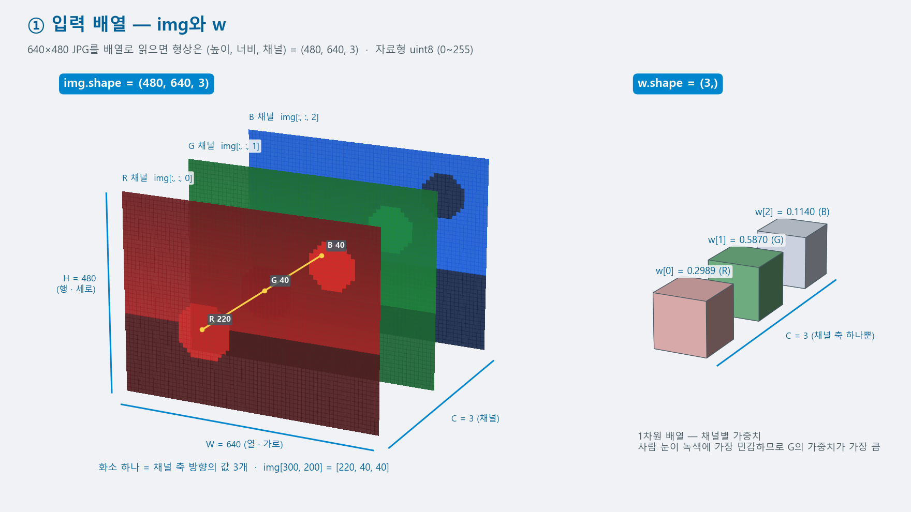
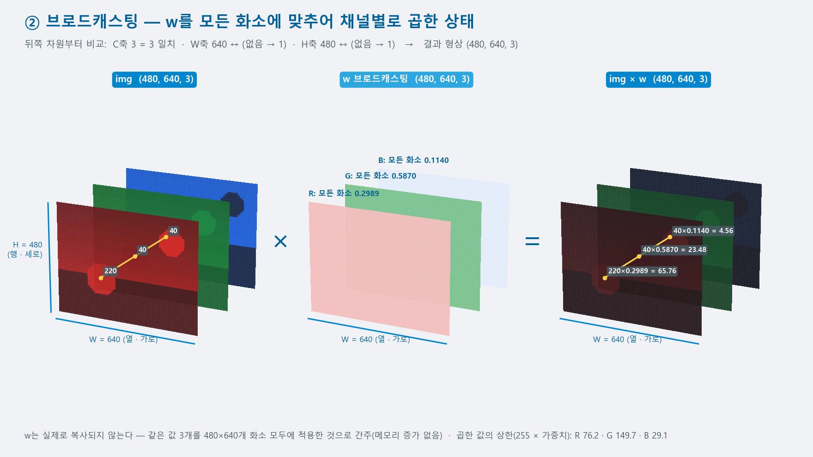
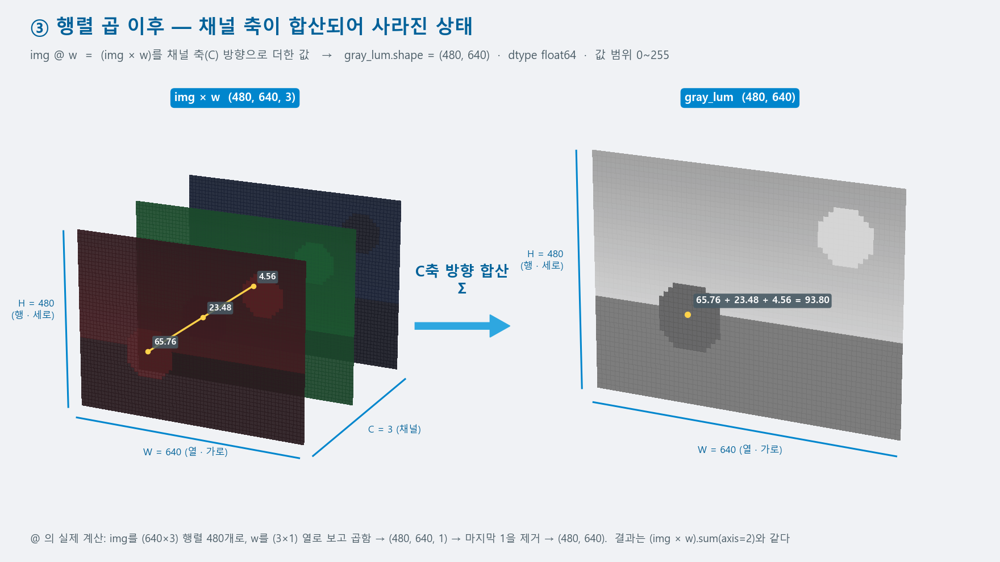

# Day 1 — AI 개관 · Colab 환경 · NumPy와 이미지 배열

**2026-10-02 · 한국폴리텍대학 하이테크과정 AI**

이 자료는 수업의 개념 설명과 실습 절차·코드를 복습용으로 정리한 문서입니다. 복습 기준 = 이 자료 + 수업 중 필기 + 각자의 실습 노트북.

---

## 목차

1. [과정 안내](#1-과정-안내)
2. [AI·ML·DL과 발전 과정](#2-aimldl과-발전-과정)
3. [학습 패러다임과 학습·추론](#3-학습-패러다임과-학습추론)
4. [머신러닝 워크플로우](#4-머신러닝-워크플로우)
5. [Colab 환경](#5-colab-환경)
6. [NumPy 기초](#6-numpy-기초)
7. [벡터화와 속도](#7-벡터화와-속도)
8. [이미지 = 배열](#8-이미지--배열)
9. [오늘의 산출물](#9-오늘의-산출물)
10. [요약과 복습문제](#10-요약과-복습문제)
11. [보충](#11-보충)
12. [다음 시간](#12-다음-시간)

---

## 1. 과정 안내

### 1.1 이 과정이 다루는 것과 다루지 않는 것

| 다루는 내용 | 다루지 않는 내용 |
|------|------|
| 머신러닝의 원리를 코드로 확인 | AI 도구 활용법 자체 |
| 직접 학습시킨 모델을 각자의 기기에서 실행 | 대규모 모델의 학습 |
| AI 반도체의 구조가 CPU와 다른 이유 | 반도체 공정·설계 실무 |
| 대규모 언어 모델의 동작 원리와 API(Application Programming Interface) 활용 | 프롬프트 기법 심화 |

- 도구의 사용법을 익히는 과정이 아니라 **원리와 하드웨어 접점**을 다루는 과정입니다
- 반도체학과의 전공 내용은 Day 4에서 집중적으로 다룹니다. 오늘은 4.4의 웨이퍼 맵 사례로 미리 한 번 살펴봅니다

### 1.2 5일 로드맵

| Day | 일자 | 내용 |
|:--:|:--:|------|
| 1 | 10/2 | 데이터가 배열이라는 것을 확인 |
| 2 | 10/16 | 배열에서 규칙을 학습하는 방법을 직접 구현 |
| 3 | 10/23 | 이미지를 분류하는 모델을 각자의 데이터로 제작 |
| 4 | 10/30 | 그 모델을 각자의 기기에서 실행 · 그것이 반도체 문제인 이유를 확인 |
| 5 | 11/6 | 언어 모델의 원리를 개관하고 API로 결과물을 제작 |

- **10/9(한글날)은 휴강**입니다 — 수업일은 10/2·16·23·30·11/6 다섯 번입니다

> **누적 구조 —** 각 Day의 산출물이 다음 Day의 입력이 됩니다.
>
> - Day 3에서 학습시킨 모델 파일이 **Day 4의 입력**입니다
> - Day 4에서 다루는 정밀도 축소가 **Day 5 도입**으로 이어집니다
> - 따라서 결과 파일을 매번 Google Drive에 저장하는 습관이 필요합니다(5.4)

### 1.3 하이테크 ROS2 과정과의 관계

- 같은 학기에 병행하는 하이테크 ROS2에서 **Teachable Machine(TM)으로 표지판 분류기를 이미 사용**했습니다(ROS2 Day 5)
- 그때는 분류기의 내부를 확인하지 않고 결과만 사용했습니다. 이 과정 **Day 3에서 그 내부 원리**를 다루고, 같은 표지판을 분류하는 모델을 직접 만듭니다

| | ROS2 과정 Day 5 | 이 과정 Day 3·4 |
|---|---|---|
| 분류기 | Teachable Machine — 웹에서 학습 | PyTorch — 코드로 정의·학습 |
| 내부 | 확인하지 않음 | 합성곱·풀링·학습 루프를 직접 작성 |
| 배포 형식 | TFLite(현 LiteRT) | ONNX(Open Neural Network Exchange) |
| 실행 | Raspberry Pi 5 | Raspberry Pi 5 — 지연·크기·정확도를 직접 측정 |

- **학습 데이터**(표지판 이미지)는 Day 3 수업에서 새로 만듭니다 — ROS2 Day 5의 촬영분은 사용하지 않습니다

### 1.4 평가·수업 방식·환경

| 항목 | 내용 |
|------|------|
| 평가 | **평소 태도 중심** — 출석·수업 참여·실습 수행 |
| 제출물·시험 | 없음 |
| 복습 자료 | 이 자료(GitHub `AI-Programming-with-Python`의 `Lectures/`) + 수업 중 필기 + 각자의 실습 노트북 |
| 학습 환경 | Google Colab(개인 Google 계정 필요) |
| 추론 환경 | Raspberry Pi 5 — Day 4에서 사용(ROS2 과정 장비) |

- **AI 코딩 도구 사용 규칙** — 코드 작성에 AI를 사용하는 것은 제한하지 않습니다. 다만 **받은 코드를 읽고 설명할 수 있어야** 합니다. 코드를 설명할 수 있는지 확인하는 것이 이 과정의 실습 목표입니다. 도구 설정 방법은 5.5에서 다룹니다

---

## 2. AI·ML·DL과 발전 과정

**학습목표**

- 인공지능·머신러닝·딥러닝의 포함 관계를 설명할 수 있다
- 딥러닝의 성장이 GPU(Graphics Processing Unit) 등 연산 하드웨어의 발전에 어떻게 의존하는지 설명할 수 있다

### 2.1 세 용어의 포함 관계

| 용어 | 정의 | 범위 |
|------|------|------|
| **AI**(Artificial Intelligence, 인공지능) | 학습·문제 해결·패턴 인식·판단·언어 이해 등 인간의 인지 기능을 컴퓨터가 수행하게 하는 기술 전반 | 가장 넓은 개념 |
| **ML**(Machine Learning, 머신러닝) | 사람이 작성한 규칙 대신 **데이터에서 찾아낸 규칙**을 사용하는 방법 | AI의 한 갈래 |
| **DL**(Deep Learning, 딥러닝) | 인공 신경망을 여러 층으로 쌓아 복잡한 패턴을 학습하는 방법 | ML의 한 갈래 |

- 포함 관계 = **AI ⊃ ML ⊃ DL**
- 기존 프로그래밍과 다른 점 = 규칙을 조건문으로 작성하는 대신 **데이터에서 도출**한다는 것
- **DL 중심 구성** — 이 과정은 DL을 주로 다루지만 Day 2에서는 ML의 회귀부터 시작합니다. 신경망의 한 층이 회귀와 같은 형태이기 때문입니다

### 2.2 주요 이정표

| 연도 | 이정표 | 의미 |
|:--:|------|------|
| 1956 | 다트머스 회의 — "인공지능" 명명 | 분야의 출발 |
| 1974\~80 · 1987\~93 | 두 차례의 AI 겨울 | 기대와 성과의 격차로 투자가 중단된 시기 |
| 2012 | **AlexNet** — ImageNet 오류율 26% → 15% | 딥러닝 부흥의 기점 |
| 2017 | Transformer 발표(*Attention Is All You Need*) | Day 5에서 다루는 원리 |
| 2022 | ChatGPT 공개 — 2개월 만에 사용자 1억 명 | 생성형 AI의 대중화 |

- 2012년 AlexNet의 성과는 알고리즘만이 아니라 GPU를 이용한 학습에서 비롯되었습니다 — 2.4와 직결됩니다
- 두 차례의 AI 겨울은 **11.2 보충**에서 다룹니다

### 2.3 2026년 현황 — 세 가지 수치

출처 — Stanford HAI, *AI Index Report 2026*

| 축 | 수치 | 해석 |
|------|------|------|
| **채택 속도** | 3년 만에 **미국 성인(18\~64세)의 53**%가 생성형 AI 사용 | 개인용 컴퓨터·인터넷보다 빠른 확산 |
| **능력의 불균형** | 박사급 과학 문제·수학 경시대회 문제에서는 인간 수준 초과 · **실제 가사 과업 성공률 12%** | 성능이 높은 과업과 낮은 과업이 뚜렷하게 구분됨 |
| **에너지** | 데이터센터 AI 용량 **29.6GW** · 대형 모델 1종의 학습 배출량 **72,816톤 CO₂e**(추정) | 승용차 약 1.7만 대의 연간 배출량 — Day 4에서 다시 다룸 |

- **CO₂e** = 이산화탄소 환산량 — 여러 온실가스의 배출을 이산화탄소 기준으로 나타낸 값

**두 과업 유형의 구분 기준**

| | 성능이 높은 과업 | 성능이 낮은 과업 |
|---|---|---|
| 조건 | 정답이 명확하고 데이터가 풍부 | 물리적 상호작용·암묵지(말로 표현하기 어려운 경험적 지식)·긴 맥락의 판단이 필요 |
| 예 | 수학·코드·시험 문제 | 집안일·현장 작업·장기간의 의사결정 |
| 이 과정에서 | Day 3 이미지 분류 = 성능이 높은 과업 | Day 5 환각(hallucination) = 성능이 낮은 과업에서 나타나는 오류 |

- 세 번째 수치(에너지)가 이 과정의 후반부와 직접 연결됩니다 — 모델을 **경량화해 각자의 기기에서 실행하는 온디바이스 추론**이 Day 4의 주제입니다

### 2.4 프로세서의 발전

| 구분 | 설계 목표 | AI 연산에서 차지하는 위치 |
|------|------|------|
| **CPU**(Central Processing Unit) | 복잡·순차 명령의 고속 처리 | 코어 수가 적어 병렬 연산에 한계 |
| **GPGPU**(General-Purpose computing on GPU — GPU를 이용한 범용 연산) | 단순 연산의 대규모 동시 처리 | 딥러닝의 핵심 연산인 **행렬 곱** 담당 |
| **AI 프로세서** | 딥러닝 연산에 특화 | 학습·추론 가속 — **NPU**(Neural Processing Unit) · **TPU**(Tensor Processing Unit) |

- NPU = 저전력 환경(모바일·엣지)용 · TPU = Google의 대규모 학습·추론용
- 딥러닝이 2012년에 도약한 직접적인 계기는 GPU였습니다. CPU로 몇 주가 걸리던 학습이 며칠로 단축되었습니다. 그 결과 더 크고 복잡한 모델을 실험할 수 있게 되었습니다
- **CPU·GPU·AI 프로세서의 구조가 왜 다른지는 Day 4에서 다룹니다.** Day 4에서는 학생이 직접 측정한 값을 근거로 삼습니다. 오늘은 이름과 위치만 확인합니다

### 2.5 확인 활동 — Day 2\~5의 영역 배치

2.1의 포함 관계에서 **Day 2\~5의 주제를 각각 어느 영역에 놓을지** 정합니다. 어느 영역에도 속하지 않는 주제도 있습니다.

| Day | 주제 | 영역 |
|:--:|------|:--:|
| 2 | 회귀·경사하강·신경망 학습 | ? |
| 3 | CNN(Convolutional Neural Network, 합성곱 신경망) 이미지 분류 | ? |
| 4 | 모델 경량화·온디바이스 추론 | ? |
| 5 | 대규모 언어 모델 | ? |

<details>
<summary>정리 보기</summary>

- Day 2 = **ML에서 DL로 넘어가는 지점** — 회귀는 ML, 신경망 학습은 DL
- Day 3·Day 5 = **DL에 속함** — CNN과 Transformer 모두 신경망 구조
- Day 4 = **어느 영역에도 속하지 않음** — 학습을 마친 모델을 적용하는 단계 · 학습과 추론의 구분 = 3.2

</details>

---

## 3. 학습 패러다임과 학습·추론

**학습목표**

- 지도·비지도·강화 학습을 데이터 형태로 구분할 수 있다
- 학습과 추론을 연산·메모리·빈도로 구분할 수 있다

### 3.1 세 가지 학습 패러다임

| 패러다임 | 데이터 | 목표 | 이 과정에서 |
|------|------|------|------|
| **지도 학습** | 입력 + 정답 라벨 | 새 입력의 정답을 예측 | Day 2 회귀 · Day 3 분류 — **이 과정의 전부** |
| 비지도 학습 | 입력만 | 숨어 있는 구조·패턴을 발견 | 개념만 — 4.4 사례에서 한 번 다룸 |
| 강화 학습 | 보상 신호 | 누적 보상을 최대화하는 행동 규칙 | 개념만 |

- 지도 학습의 두 유형 = **회귀**(연속값 예측)와 **분류**(범주 판별). Day 2가 회귀, Day 3이 분류입니다
- 신경망의 구조·손실 함수·역전파는 Day 2에서 본격적으로 다룹니다

### 3.2 학습과 추론의 구분

이 구분이 과정 전체를 관통하는 축입니다.

| | **학습**(training) | **추론**(inference) |
|---|---|---|
| 역할 | 데이터에서 규칙(가중치)을 찾음 | 찾아 둔 규칙을 새 입력에 적용 |
| 연산 | 순전파 + 역전파 | **순전파만** |
| 메모리 | 가중치 + 그래디언트 + 옵티마이저 상태 | 가중치 + 활성값 |
| 빈도 | 1회성 — 반복 실험은 하되 서비스 중에는 드묾 | 입력이 들어올 때마다 |
| 비용 | 높음 | 낮음 |
| 이 과정에서 | Colab의 GPU(Day 2·3) | **Raspberry Pi 5**(Day 4) |

- 학습과 추론의 요구 조건이 다르기 때문에 **실행하는 장치를 분리**할 수 있습니다
- Day 4에서 학습은 Colab에서, 추론은 각자의 Raspberry Pi 5에서 수행하는 구성은 이 구분에 근거합니다

### 3.3 이 과정의 위치

| 축 | 이 과정 |
|------|------|
| 패러다임 | 지도 학습 |
| 모델 계열 | 신경망(딥러닝) — Day 2 완전연결 · Day 3 합성곱 · Day 5 Transformer 개관 |
| 단계 | 학습(Day 2·3) → **추론 환경으로 이동**(Day 4) → 활용(Day 5) |
| 데이터 | 이미지 — 표지판(Day 3 수업에서 준비) |

### 3.4 확인 활동 — 학습인가 추론인가

아래 네 가지가 각각 학습에 해당하는지 추론에 해당하는지 답합니다.

| # | 상황 |
|:--:|------|
| ① | 표지판 사진 1,000장으로 분류기를 만드는 과정 |
| ② | 카메라가 찍은 사진 한 장을 분류기에 입력해 결과를 얻는 과정 |
| ③ | Colab에서 GPU 런타임이 필요한 과정 |
| ④ | Raspberry Pi 5에서 수행하는 과정 |

<details>
<summary>정리 보기</summary>

- ① **학습** — 역전파로 가중치를 갱신하므로 연산과 메모리 요구가 큽니다
- ② **추론** — 순전파만 수행합니다
- ③ **학습** — GPU가 필요한 과정은 학습입니다. 오늘 실습은 추론도 학습도 아닌 배열 조작이므로 GPU가 필요하지 않습니다
- ④ **추론** — 이 분리가 Day 4 구성의 전제입니다
- 판단 기준 = **가중치가 바뀌는가**. 바뀌면 학습, 바뀌지 않으면 추론입니다

</details>

---

## 4. 머신러닝 워크플로우

**학습목표**

- 머신러닝 프로젝트의 여섯 단계를 순서대로 설명할 수 있다
- 반도체 공정 데이터에 이 단계를 대응시킬 수 있다

### 4.1 여섯 단계

| 단계 | 내용 | 비고 |
|:--:|------|------|
| ① 문제 정의 | 무엇을 해결할 것인가 · 성공을 무엇으로 측정할 것인가 | 가장 중요한 첫 단계 |
| ② 데이터 수집·전처리 | 데이터를 모으고 모델이 학습할 수 있는 형태로 정리 | **가장 오래 걸리는 단계** |
| ③ 모델 선택 | 데이터와 문제에 맞는 구조를 선택 | 이미지 = CNN · 순차 데이터 = Transformer |
| ④ 학습 | 데이터를 입력해 내부 파라미터를 조정 | Day 2·3 |
| ⑤ 평가 | 학습에 사용하지 않은 데이터로 성능을 확인 | 정확도·정밀도 등 |
| ⑥ 배포·모니터링 | 실제 사용 환경에 배포하고 성능 유지를 관찰 | Day 4 |

### 4.2 워크플로우의 순환 구조

- 교과서의 그림은 직선형이지만 실무의 워크플로우는 **순환**합니다

```
수집 → 학습 → 평가 → 배포 → 모니터링 → 재학습 → (수집)
```

- **데이터 드리프트**(data drift) = 배포 후 입력의 분포가 학습 시점의 분포와 달라지는 현상
  - 예 — 여름 사진으로 학습시킨 표지판 분류기에 눈으로 덮인 겨울 표지판이 입력되는 경우
  - 실무에서는 통계 검정으로 분포 변화를 감지해 재학습 시점을 판단합니다
- **이 교육 과정에서는 순환을 한 번만 수행**합니다. 현장에서는 이 순환이 반복됩니다

### 4.3 데이터 중심 접근

- 성능이 기대에 미치지 못할 때는 모델 구조 변경보다 **데이터 교정**이 성능 향상에 크게 기여하는 경우가 많습니다
- 성과가 높은 팀의 작업 순서 = 모델 점검 → **데이터 교정** → 라벨 체계 정제 → 데이터 분포 변화 모니터링(성능 저하 방지)
- Day 3에서 직접 확인합니다 — 표지판 데이터의 수량과 품질이 분류기 성능을 좌우합니다

### 4.4 반도체 공정의 사례 — 웨이퍼 맵

이 절은 반도체 전공 내용을 직접 다룹니다.

| 항목 | 내용 |
|------|------|
| 데이터셋 | **WM-811K** — 실제 팹의 웨이퍼 맵 **811,457장**(47,543 로트) |
| 라벨 | 약 20%(172,950장)에 **결함 패턴 8종**을 부여 |
| 목적 | 결함 패턴 자동 분류 → **수율 이탈 조기 식별**·원인 공정 추적 |
| 보고된 성능 | 랜덤 포레스트 정확도 0.815 · CNN 계열 약 0.96 |

- 패턴 8종 = 중심 · 도넛 · 가장자리 국소 · 가장자리 링 · 국소 · 무작위 · 스크래치 · 거의 전면(Near-full)

**여섯 단계에 대응시키기**

| 단계 | WM-811K에서 |
|:--:|------|
| ① 문제 정의 | 웨이퍼 맵의 결함 패턴 8종 분류 |
| ② 데이터 수집·전처리 | 팹 검사 장비에서 81만 장 — **20%만 라벨이 있다는 것이 실무의 제약** |
| ③ 모델 선택 | 고전 머신러닝(랜덤 포레스트) ↔ CNN |
| ④ 학습·⑤ 평가 | 정확도 0.815 → 0.96 |
| ⑥ 배포 | 팹 검사 라인 — **장비 가까이에서 추론하는 구성이 적합**(Day 4) |

- 라벨이 20%뿐이라는 조건에서 3.1의 비지도 학습이 적용됩니다
- 이 사례는 Day 3(분류)과 Day 4(현장 추론)에서 다시 다룹니다

### 4.5 웨이퍼 맵의 배열 표현

- 웨이퍼 맵 = 다이 단위의 합격·불합격을 격자로 표시한 **2차원 배열**
- 이미지가 배열이듯 웨이퍼 맵도 배열이므로 6\~8장에서 다루는 조작이 그대로 적용됩니다
- 9장 「오늘의 산출물」에서 가상 웨이퍼 맵을 만들어 결함 위치를 표시하는 과제를 수행합니다

### 4.6 확인 활동 — 이 과정을 여섯 단계에 대응시키기

이 과정의 5일이 워크플로우의 어느 단계에 해당하는지 판단해 표를 채웁니다.

| 단계 | 이 과정에서 |
|:--:|------|
| ① 문제 정의 | ? |
| ② 데이터 수집·전처리 | ? |
| ③ 모델 선택 | ? |
| ④ 학습 | ? |
| ⑤ 평가 | ? |
| ⑥ 배포·모니터링 | ? |

<details>
<summary>정리 보기</summary>

| 단계 | 이 과정에서 |
|:--:|------|
| ① 문제 정의 | 표지판 세 종류 분류 — ROS2 과정에서 이미 설정된 문제 |
| ② 데이터 수집·전처리 | Day 3 수업에서 준비하는 표지판 이미지 · Day 3의 폴더 구성·변환 |
| ③ 모델 선택 | Day 3 — 이미지이므로 CNN |
| ④ 학습 | Day 3 — Colab |
| ⑤ 평가 | Day 3 — 학습 곡선·혼동 행렬 |
| ⑥ 배포·모니터링 | **Day 4** — Raspberry Pi 5에서 추론 |

- **모니터링은 이 과정의 범위 밖**입니다 — 배포 이후의 재학습까지가 4.2의 순환입니다

</details>

---

## 5. Colab 환경

**학습목표**

- Colab 노트북을 만들어 셀을 실행하고 Google Drive를 연결할 수 있다
- 런타임 전환과 세션 종료가 파일에 미치는 영향을 설명할 수 있다

### 5.1 첫 노트북과 셀 실행

- **Colab**(Colaboratory) = 브라우저만으로 Python 코드를 실행하는 Google의 클라우드 환경
- 설치가 필요 없고 주요 라이브러리가 미리 갖추어져 있습니다. 따라서 학생 모두가 같은 환경에서 실습할 수 있습니다

**① 노트북 만들기**

1. 브라우저에서 `colab.research.google.com`에 연결합니다
2. Google 계정으로 로그인합니다
3. 「새 노트」를 선택합니다

- **확인** — 빈 코드 셀이 하나 있는 노트북이 표시되면 정상입니다
- 로그인 화면에서 진행되지 않으면 → 브라우저의 다른 Google 계정으로 로그인되어 있는지 확인 → 계정을 전환한 뒤 **①-1부터 다시** 진행합니다

**② 첫 코드 실행**

```python
print("하이테크 AI — Day 1")
a = 10
b = 20
print(f"{a} + {b} = {a + b}")
```

- 실행 단축키 = `Ctrl+Enter`(현재 셀 실행) · `Shift+Enter`(실행 후 다음 셀로 이동) · `Alt+Enter`(실행 후 새 셀 생성)
- **확인** — 셀 바로 아래에 `하이테크 AI — Day 1`과 `10 + 20 = 30`이 출력되면 정상입니다
- 실행이 지연되면 → 첫 실행에는 가상 머신에 연결하는 시간이 필요합니다. 우측 상단에 「연결 중」이 표시되는 동안 기다린 뒤 다시 확인합니다
- 아무 반응이 없으면 → 셀을 클릭해 커서를 둔 뒤 **②를 다시** 실행합니다

**코드 읽기 — Python 문법 ① 출력과 문자열**

| 코드 | 뜻 |
|------|------|
| `print(...)` | 함수 호출 — 괄호 안의 값을 화면에 출력 |
| `a = 10` | 대입 — 변수 `a`에 값을 넣음. 자료형 선언이 없음(C와 다른 점) |
| `f"{a} + {b} = {a + b}"` | f-문자열 — 따옴표 앞의 `f`가 있으면 `{}` 안의 값이 계산되어 삽입됨 |
| `#` | 주석 — `#` 뒤의 내용은 실행되지 않음 |

- 이 표는 이후 자료에서도 해당 지점마다 다시 실립니다. 지금 모두 기억하지 않아도 됩니다. 코드를 읽을 때 표를 참조해 확인합니다

### 5.2 Google Drive 연결

- Colab에 직접 업로드한 파일은 **세션이 종료되면 소멸**합니다. Drive에 연결해 두면 결과가 보존됩니다

```python
from google.colab import drive
drive.mount('/content/drive')
```

**절차**

1. 위 셀을 실행합니다
2. Drive 파일 접근을 허용할지 묻는 창이 표시되면 연결 버튼(Connect to Google Drive)을 선택합니다
3. 계정 선택 창에서 **Colab에 로그인한 것과 같은 계정**을 선택하고 권한 요청 화면에서 접근을 허용합니다

- **확인** — `Mounted at /content/drive`가 출력되면 정상입니다. 좌측 파일 탭에 `drive` 폴더가 표시됩니다
- 권한 요청 화면이 표시되지 않으면 → 브라우저의 팝업 차단을 해제 → **1부터 다시** 실행합니다
- `Mounted`가 출력되지 않고 오류가 발생하면 → 로그인한 계정이 Colab 계정과 같은지 확인 → **1부터 다시** 실행합니다
- 이미 연결된 상태에서 다시 실행하면 → `Drive already mounted` 메시지가 출력됩니다. 정상입니다. 다음 단계로 진행합니다

### 5.3 런타임 전환과 파일 소멸

- **런타임**(runtime) = 코드가 실행되는 가상 컴퓨터. 런타임에는 CPU 또는 GPU가 배정됩니다
- 기본값은 CPU입니다. GPU를 사용하려면 런타임 유형을 직접 변경해야 합니다

**절차**

1. 상단 메뉴에서 「런타임 → 런타임 유형 변경」을 선택합니다
2. 하드웨어 가속기에서 GPU를 선택하고 저장합니다
3. 런타임이 다시 시작되며 새 환경에 연결됩니다

```python
import torch
if torch.cuda.is_available():
    print(f"GPU 사용 가능 — {torch.cuda.get_device_name(0)}")
else:
    print("GPU가 배정되지 않았습니다. CPU로 진행합니다.")
```

- **확인** — GPU 이름이 출력되면 GPU가 배정된 상태입니다
- 「GPU가 배정되지 않았습니다」가 출력되면 → 무료 한도의 영향입니다(5.4). **오늘 실습에는 GPU가 필요하지 않으므로 CPU로 그대로 진행**합니다

> **자주 하는 실수 —** **런타임 유형을 변경하면 런타임이 새로 시작됩니다.** 업로드한 파일이 소멸하고 Drive 연결도 해제됩니다. 작업 도중에 GPU로 전환하면 그때까지의 결과를 잃으므로 **작업을 시작하기 전에 런타임 유형을 전환**합니다. 전환한 뒤에는 5.2를 다시 실행해 Drive를 연결합니다.

### 5.4 무료 한도와 저장 습관

| 항목 | 내용 |
|------|------|
| GPU | T4(16GB)를 사용할 수 있으나 **배정이 보장되지 않음** |
| 세션 | 최대 약 12시간 · 사용하지 않으면 자동 종료 |
| 주간 사용량 | 15\~30 GPU시간 수준 — 수요에 따라 변동 |
| 기본 하드웨어 | CPU |

- **GPU 배정** — 여러 사용자가 동시에 GPU를 요청하면 일부는 배정받지 못할 수 있습니다. Day 2·3의 학습 과제도 **CPU로 끝까지 수행할 수 있는 규모**로 구성되어 있습니다. GPU는 속도를 높이는 수단이며 전제가 아닙니다

**저장 습관 두 가지**

| 습관 | 방법 |
|------|------|
| 결과물은 Drive에 저장 | 학습 결과·이미지 파일의 경로를 `/content/drive/MyDrive/` 아래로 지정 |
| 설치·다운로드 셀은 노트북 상단에 모아 둠 | 세션이 끊겨도 한 번의 실행으로 환경을 복구 |

- Day 3의 학습 결과 파일이 Day 4의 입력이므로 **저장 습관은 오늘 확립해 두어야** 합니다

### 5.5 AI 코딩 도구 사용 규칙

- Colab에는 Gemini 기능이 내장되어 있습니다

| 기능 | 내용 |
|------|------|
| **Learn Mode** | 답을 즉시 제시하지 않고 **단계별로 질문하며 안내**하는 방식 |
| Data Science Agent | 자연어 설명으로 분석 노트북을 생성 |
| Custom Instructions | 응답 방식을 미리 지정 |

- **이 과정의 권장 설정 = Learn Mode**
  - 코드를 받아 붙여 넣으면 실행은 빠르지만, 오류가 발생했을 때 학생은 어디를 확인해야 하는지 판단하기 어렵습니다
  - Learn Mode는 완성된 코드 대신 다음에 확인할 지점을 제시하므로 실습의 목표인 **코드 읽기**에 부합합니다
- **판단 기준** — 도구의 사용 여부가 아니라 **받은 코드를 설명할 수 있는지**로 정합니다. 5.1부터 각 실습에 「코드 읽기」 표를 두는 것도 같은 이유에서입니다

### 5.6 응용 실습 — 런타임 재시작과 파일 보존

- 런타임이 새로 시작될 때 어떤 파일이 남는지 확인하고, 셀 하나로 작업 환경을 복구하는 셀을 작성합니다
- 코드는 AI 코딩 도구(5.5)로 작성합니다. 각 단계의 조건을 요청 내용에 포함하고, 실행 결과는 「확인」 기준으로 판정합니다

**① 두 위치에 파일 저장**

- 같은 내용의 짧은 텍스트 파일을 런타임 공간(`/content`)과 Drive(`/content/drive/MyDrive/`)에 하나씩 저장하고, 두 파일이 있는지 출력합니다
- **확인** — 두 파일 모두 「있음」으로 출력되면 정상입니다
- Drive 파일만 「없음」이면 → Drive가 연결되지 않은 상태입니다 → 5.2를 실행한 뒤 **①부터 다시** 진행합니다

**② 런타임 전환 후 확인**

- 5.3 절차로 런타임 유형을 전환한 뒤, 두 파일이 있는지만 다시 출력합니다
- **확인** — 두 파일 모두 「없음」으로 출력됩니다

**③ Drive 다시 연결**

- 5.2의 연결 셀을 다시 실행하고, 두 파일이 있는지 출력합니다
- **확인** — Drive 파일만 「있음」으로 출력되면 정상입니다

**④ 복구 셀 작성**

- Drive 연결 · GPU 배정 여부 출력 · Drive 파일 내용 출력을 한 셀에 함께 작성하고, 그 셀을 노트북 맨 위로 옮깁니다
- **확인** — 런타임 유형을 한 번 더 전환한 뒤 복구 셀만 실행해 파일 내용이 출력되면 성공입니다
- 파일을 찾지 못한다는 오류가 출력되면 → 셀 안에서 Drive 연결이 파일 읽기보다 먼저 실행되는지 확인합니다 → **④부터 다시** 진행합니다

<details>
<summary>응용 실습 정리</summary>

- 런타임 공간(`/content`)의 파일은 런타임과 함께 소멸합니다
- Drive의 파일은 보존되지만, 런타임이 새로 시작되면 다시 연결해야 읽을 수 있습니다
- 복구 셀을 노트북 맨 위에 두면 세션이 끊겨도 한 번의 실행으로 작업을 이어 갈 수 있습니다(5.4 저장 습관)
- Day 3의 학습 결과 파일(`.pth`)도 같은 이유로 Drive에 저장합니다

</details>

---

## 6. NumPy 기초

**학습목표**

- 리스트와 배열의 차이를 메모리 배치로 설명할 수 있다
- 배열의 형상·자료형·스트라이드를 확인하고 해석할 수 있다

### 6.1 리스트와 배열의 차이

| | Python 리스트 | NumPy 배열(`ndarray`) |
|---|---|---|
| 자료형 | 여러 종류를 함께 저장 | **한 가지 자료형만** |
| 메모리 | 요소마다 객체를 참조 | **연속된 메모리에 값을 직접 저장** |
| 연산 | 반복문으로 요소를 하나씩 처리 | **벡터화** — 배열 전체에 한 번에 적용 |
| 100만 개 연산 | Python 반복문 100만 회 | 코드 한 줄(반복은 C 내부에서 처리) |

- **벡터화**(vectorization) = 반복문 없이 배열 전체에 연산을 적용하는 방식. 실제로는 Python의 반복문이 아니라 **C로 작성된 반복문**이 실행됩니다
- 속도 차이는 7장에서 직접 측정합니다
- **Day 4 연계** — 「같은 자료형이 연속 메모리에 놓여 있다」는 조건이 GPU와 NPU가 빠른 주요 이유 가운데 하나입니다

### 6.2 배열 만들기와 속성 확인

```python
import numpy as np

arr = np.array([[1, 2, 3], [4, 5, 6]])     # ① 리스트에서 생성
print(arr)
print(f"차원 수: {arr.ndim}")               # ② 2
print(f"형상: {arr.shape}")                 # ③ (2, 3)
print(f"자료형: {arr.dtype}")               # ④ int64
```

| 속성 | 뜻 |
|------|------|
| `ndim` | 차원 수 — 1차원·2차원 |
| `shape` | 각 차원의 크기를 튜플로 표시 — `(2, 3)` = 2행 3열 |
| `dtype` | 요소의 자료형 — `int64`·`float64`·`uint8` 등 |

**생성 함수 네 가지**

| 함수 | 결과 |
|------|------|
| `np.array(리스트)` | 리스트·튜플에서 배열 생성 |
| `np.zeros((2, 3))` | 모든 값이 0인 2행 3열 배열 — 가중치 초기화에 사용 |
| `np.ones((2, 3), dtype=np.int16)` | 모든 값이 1 · 자료형을 지정 |
| `np.arange(0, 1, 0.1)` | 0부터 1 직전까지 0.1 간격 — Python의 `range`와 달리 실수 간격을 허용 |

**코드 읽기 — Python 문법 ② 모듈과 속성 접근**

| 코드 | 뜻 |
|------|------|
| `import numpy as np` | 모듈을 가져오며 `np`라는 짧은 이름을 부여 — 이후 `np.`로 사용 |
| `np.array(...)` | 모듈 안의 함수 호출 — 점(`.`)이 소속 관계를 표시 |
| `arr.ndim` | 괄호가 없으면 **속성**(값) — 객체가 보유한 정보를 조회 |
| `arr.reshape(3, 4)` | 괄호가 있으면 **메서드**(동작) — 객체에 요청하는 작업 |
| `[[1, 2, 3], [4, 5, 6]]` | 리스트 안의 리스트 = 2차원 구조 |
| `dtype=np.int16` | 키워드 인자 — 이름을 붙여 전달하는 값 |

### 6.3 배열의 실체 — 1차원 메모리와 스트라이드

- 메모리는 본질적으로 **1차원**입니다. N차원 배열은 1차원 블록에 **배치 규칙**을 적용한 구조입니다
- **스트라이드**(strides) = 각 축에서 다음 요소로 이동할 때 건너뛰는 **바이트 수**

```python
arr = np.arange(12, dtype=np.float64).reshape(3, 4)
print(f"형상: {arr.shape}")        # (3, 4)
print(f"요소 크기: {arr.itemsize}") # 8 바이트
print(f"스트라이드: {arr.strides}") # (32, 8)
print(f"전체 크기: {arr.nbytes}")   # 96 바이트
```

| 값 | 해석 |
|------|------|
| `itemsize` 8 | `float64` 한 개가 8바이트 |
| `strides` 두 번째 값 8 | 같은 행에서 옆 열로 이동 = 8바이트 |
| `strides` 첫 번째 값 32 | 다음 행으로 이동 = 4열 × 8바이트 |

- 새 배열은 기본적으로 **행 우선**(C 순서)으로 배치됩니다
- `reshape`가 빠른 이유는 **데이터를 옮기지 않고 해석 규칙만 바꾸기 때문입니다**

### 6.4 뷰와 복사

- 기본 슬라이싱은 **뷰**(view)를 생성합니다 — 새 데이터를 만들지 않고 같은 메모리를 다른 규칙으로 참조합니다
- 따라서 **뷰를 수정하면 원본이 함께 바뀝니다**

```python
arr = np.arange(12).reshape(3, 4)
sub = arr[0:2, 1:3]      # ① 슬라이싱 = 뷰
sub[0, 0] = 999          # ② 뷰를 수정
print(arr)               # ③ 원본이 바뀌어 있음
```

- **확인** — `arr`의 0행 1열이 999로 바뀌어 있으면 정상입니다. 뷰가 원본과 같은 메모리를 참조하기 때문입니다
- 원본을 유지해야 하면 `arr[0:2, 1:3].copy()`로 복사본을 만듭니다

**코드 읽기 — Python 문법 ③ 인덱싱과 슬라이싱**

| 코드 | 뜻 |
|------|------|
| `arr[0, 2]` | 쉼표로 축을 구분 — 0행 2열의 요소 하나 |
| `arr[0:2, 1:3]` | 범위 지정 — **끝 번호는 포함되지 않음**(0·1행 / 1·2열) |
| `arr[:, 2]` | 콜론 단독 = 해당 축 전체 — 모든 행의 2열 |
| `arr[-1]` | 음수 = 뒤에서부터 — 마지막 행 |
| `sub[0, 0] = 999` | 대입으로 요소 수정 — 뷰이면 원본에 반영됨 |
| `.copy()` | 메서드 호출 — 독립된 복사본을 생성 |

> **자주 하는 실수 —** 슬라이싱으로 얻은 배열을 독립된 데이터로 간주하고 수정하면 원본이 손상됩니다. Day 3의 전처리에서 원본 이미지를 보존해야 하는 상황이 반복되므로, **이 실수를 의도적으로 한 번 경험하는 것**이 이 절의 목적입니다.

### 6.5 자료형과 비트 수

- 배열의 모든 요소는 **자료형이 같습니다**. 자료형은 `dtype`으로 확인합니다

| 자료형 | 비트 | 범위 | 주 용도 |
|------|:--:|------|------|
| `uint8` | 8 | 0 \~ 255 | 이미지 픽셀값 |
| `int64` | 64 | 약 ±9.2×10¹⁸ | 정수 기본값 |
| `float32` | 32 | 약 ±3.4×10³⁸ | 딥러닝 가중치의 기본값 |
| `float64` | 64 | 약 ±1.8×10³⁰⁸ | NumPy 실수 기본값 |

- `astype`으로 변환할 때 **정보가 손실될 수 있습니다** — `float32`를 `uint8`로 바꾸면 소수부가 절사됩니다. 범위를 벗어난 값은 0\~255 안으로 보정되지 않고 다른 값으로 바뀝니다

```python
x = np.array([300.7, -20.3, 128.9])
print(x.astype(np.uint8))   # 범위와 소수부가 함께 손실됨
```

> **Day 4와의 연결 —** **`float32`를 `int8`로 바꾸면 무엇이 손실되는가** — 이 질문을 다루는 주제가 **양자화**(quantization)입니다. 양자화는 모델의 가중치를 낮은 비트로 표현해 파일 크기를 줄이고 연산 속도를 높입니다. 정확도가 얼마나 낮아지는지는 Day 4에서 직접 측정합니다. 오늘 `dtype`을 확인해 두면 양자화를 수월하게 학습할 수 있습니다.

### 6.6 응용 실습 — 원본을 보존한 사본과 자료형별 크기

- 원본 배열은 바꾸지 않고 일부만 바꾼 사본을 만든 뒤, 자료형에 따라 메모리 크기가 어떻게 달라지는지 측정합니다
- 코드는 AI 코딩 도구로 작성합니다. 각 단계의 조건을 요청 내용에 포함하고, 실행 결과는 「확인」 기준으로 판정합니다

**① 가상 이미지와 사본 만들기**

- 0\~255 정수 난수로 (480, 640, 3) 형상의 `uint8` 배열을 만들고, 왼쪽 위 100×100 영역만 0으로 바꾼 사본을 만듭니다
- 요청 내용에 「원본은 바뀌지 않아야 한다」는 조건을 포함합니다

**② 원본 보존 확인**

- 원본과 사본에서 왼쪽 위 100×100 영역의 최댓값을 각각 출력합니다
- **확인** — 원본은 0보다 크고 사본은 0이면 정상입니다
- 원본도 0이면 → 사본이 원본과 같은 메모리를 참조하는 상태입니다(대입 · 슬라이싱 = 6.4 뷰) → 사본을 독립된 메모리로 만들도록 요청을 고쳐 **①부터 다시** 진행합니다

**③ 자료형별 크기 측정**

- 사본을 `float32`와 `float64`로 각각 변환하고, 원본과 함께 `dtype`·`nbytes`를 출력합니다
- **확인** — 921,600 · 3,686,400 · 7,372,800바이트(1 : 4 : 8)로 출력되면 정상입니다
- 비율이 다르면 → 출력된 `dtype`이 요청한 자료형인지 확인합니다 → **③부터 다시** 진행합니다

**④ 되돌린 값 비교**

- `float32` 배열을 다시 `uint8`로 변환하고, 변환 전의 사본과 값이 같은지 비교합니다
- **확인** — 모든 값이 같으면 정상입니다. 6.5의 예시(소수와 범위 밖 값)와 결과를 비교합니다

<details>
<summary>응용 실습 정리</summary>

- 사본을 독립된 메모리로 만들어야 원본이 보존됩니다(6.4)
- 배열의 메모리 크기는 요소 수 × 요소 하나의 바이트 수입니다
- 0\~255 정수는 `float32`를 거쳐도 값이 손실되지 않습니다. 소수부나 범위 밖 값이 있을 때 손실이 생깁니다(6.5)
- Day 4의 양자화는 반대 방향입니다 — `float32`를 `int8`로 바꾸면 크기가 1/4로 줄어듭니다

</details>

---

## 7. 벡터화와 속도

**학습목표**

- 리스트와 배열의 연산 속도 차이를 측정하고 원인을 설명할 수 있다

### 7.1 속도 비교 실행

```python
import time, numpy as np

n = 1_000_000
a_list = list(range(n))
b_list = list(range(n))

start = time.time()
result_list = [a_list[i] ** 2 + b_list[i] ** 2 for i in range(n)]
list_time = time.time() - start

a_np = np.arange(n, dtype=np.int64)
b_np = np.arange(n, dtype=np.int64)

start = time.time()
result_np = a_np ** 2 + b_np ** 2
numpy_time = time.time() - start

print(f"리스트: {list_time:.4f}초")
print(f"배열  : {numpy_time:.4f}초")
print(f"배수  : {list_time / numpy_time:.1f}배")
```

- **확인** — 두 방식의 소요 시간과 배수가 출력되면 정상입니다. 수치는 배정받은 런타임에 따라 달라집니다
- 결과가 출력되지 않아 실행이 멈춘 것처럼 보이면 → 리스트 연산 100만 회가 진행 중입니다. 셀 좌측의 실행 표시가 회전하는 동안 기다린 뒤 **결과를 확인**합니다

**같은 결과인지 확인**

```python
print(np.allclose(result_list, result_np))   # True
```

- 두 방식의 계산 결과는 동일하지만 **소요 시간은 다릅니다**

### 7.2 배열이 빠른 이유

| 원인 | 리스트 | 배열 |
|------|------|------|
| 자료형 확인 | 요소마다 자료형을 확인 | 전체가 한 자료형 — 확인이 1회 |
| 메모리 접근 | 객체 참조를 따라 흩어진 위치로 이동 | **연속된 메모리를 순서대로 읽음** |
| 반복 실행 | Python 인터프리터가 100만 회 반복 | **C로 컴파일된 반복문**이 실행됨 |

- 벡터화의 실체 = 반복문이 제거된 것이 아니라 **Python이 아닌 C 수준에서 실행되는 것**입니다
- 배열의 메모리 접근 방식은 CPU의 캐시 구조에도 부합합니다

> **Day 4와의 연결 —** Day 4에서 다루는 시스톨릭 어레이(systolic array)는 **데이터를 연속으로 전달하며 곱셈-누적을 반복**하는 구조입니다. 시스톨릭 어레이가 전제하는 조건이 오늘 확인한 연속 메모리 배치입니다.

### 7.3 확인 활동 — 스트라이드 해석

아래 출력값이 어떻게 계산되는지 설명합니다.

```python
arr = np.arange(24, dtype=np.float32).reshape(2, 3, 4)
print(arr.strides)    # (48, 16, 4)
```

<details>
<summary>정리 보기</summary>

- `float32` = 요소당 **4바이트** → 마지막 축의 스트라이드 = 4
- 두 번째 축에서 한 칸 이동 = 4개 요소를 건너뜀 → 4 × 4 = **16**
- 첫 번째 축에서 한 칸 이동 = 3 × 4 = 12개 요소 → 12 × 4 = **48**
- 계산 순서 = **뒤쪽 축부터**
- 규칙 = **각 축의 스트라이드 = 그 축보다 안쪽에 있는 요소 수 × 요소 크기**

</details>

### 7.4 응용 실습 — 빠른 결과와 정확한 결과

- 같은 계산을 두 방식으로 수행하고, 결과가 다르면 어느 결과가 정확한지 자료형의 표현 범위로 판정합니다
- 코드는 AI 코딩 도구로 작성합니다. 각 단계의 조건을 요청 내용에 포함하고, 실행 결과는 「확인」 기준으로 판정합니다

**① 리스트 방식**

- 0 이상 10,000,000 미만의 정수 가운데 3의 배수를 각각 제곱해 모두 더합니다. 반복문으로 계산하고 소요 시간도 출력합니다
- **확인** — 21자리 정수 `111111127777776111111`이 출력되면 정상입니다

**② 배열 방식**

- 같은 계산을 배열 연산으로 수행하고 결과와 소요 시간을 출력합니다. 요청 내용에 「자료형 `int64`」를 명시합니다
- **확인** — 배열 방식이 더 빠릅니다. 결과는 ①과 다른 값으로 출력됩니다. 오류 메시지는 표시되지 않습니다

**③ 범위 대조**

- `int64`가 표현할 수 있는 최댓값을 출력하고 ①의 결과와 자릿수를 비교합니다
- **확인** — 최댓값은 약 9.2×10¹⁸(19자리)로 ①의 결과(21자리)보다 작습니다. 배열 방식의 합이 표현 범위를 넘었습니다

**④ 자료형 변경**

- 배열 방식의 자료형을 `float64`로 바꾸어 다시 계산하고 ①과 비교합니다
- **확인** — 약 1.111111×10²⁰이 출력됩니다. 앞자리는 ①과 같지만 끝자리까지 일치하지는 않습니다(유효숫자의 한계)

**⑤ 범위 축소**

- 범위를 1,000,000 미만으로 줄여 두 방식의 결과를 비교합니다
- **확인** — 두 결과가 같으면 정상입니다

<details>
<summary>응용 실습 정리</summary>

- 정수 자료형은 표현 범위를 넘어도 경고 없이 다른 값을 저장합니다
- Python의 정수는 자릿수 제한이 없으므로 리스트 방식의 결과가 정확한 값입니다
- `float64`는 범위가 넓지만 유효숫자가 약 15\~16자리이므로 근삿값이 됩니다
- 계산 속도와 결과의 정확성은 별개입니다. 8.5에서 다루는 `uint8` 오버플로도 같은 원리입니다

</details>

---

## 8. 이미지 = 배열

**학습목표**

- 이미지를 배열로 읽어 형상·자료형·값 범위를 확인할 수 있다
- 브로드캐스팅 규칙으로 연산 결과의 형상을 예측할 수 있다

### 8.1 이미지의 배열 표현

| 구분 | 형상·자료형 | 설명 |
|------|------|------|
| 컬러 이미지 | **(높이, 너비, 3)** | 마지막 축이 R(Red)·G(Green)·B(Blue) 세 채널 |
| 그레이스케일(흑백) 이미지 | (높이, 너비) | 채널 축이 없음 |
| 자료형 | `uint8` | 값 범위 **0\~255** |

**① 사진 준비**

1. 휴대전화나 PC에 있는 **JPG 사진 1장**을 준비합니다
2. Colab 좌측의 파일 탭(폴더 아이콘)을 열고 사진을 끌어다 놓아 업로드합니다
3. 아래 ② 코드의 `'sample.jpg'`를 업로드한 파일 이름으로 고칩니다(확장자 포함)

- **확인** — 파일 탭 목록에 업로드한 사진이 표시되면 정상입니다
- 업로드한 파일은 세션이 끝나면 소멸합니다(5.2) — 다음 수업에서는 ①의 사진 준비를 다시 수행합니다

**② 배열로 읽기**

```python
from PIL import Image
import numpy as np

img = np.array(Image.open('sample.jpg'))
print(f"형상: {img.shape}")
print(f"자료형: {img.dtype}")
print(f"최솟값 {img.min()} / 최댓값 {img.max()}")
```

- **확인** — 형상이 세 개의 수로 출력되고, 자료형이 `uint8`이며, 값 범위가 0\~255 안에 들면 정상입니다
- `FileNotFoundError`가 출력되면 → 코드의 파일 이름과 파일 탭의 이름이 확장자까지 같은지 확인합니다 → **①-3부터 다시** 진행합니다
- 출력된 형상·자료형·최솟값·최댓값이 Day 3 전처리에서 가장 먼저 확인하는 항목입니다

### 8.2 브로드캐스팅 규칙

- **브로드캐스팅**(broadcasting) = 형상이 다른 두 배열의 연산을 허용하는 규칙

| 규칙 | 내용 |
|------|------|
| 비교 방향 | **뒤쪽 차원부터** 하나씩 비교 |
| 호환 조건 | ⓐ 두 크기가 같거나 ⓑ 한쪽이 **1** |
| 차원 수 불일치 | 부족한 앞쪽 차원을 크기 1로 간주 |
| 결과 형상 | 각 차원에서 **두 입력 중 큰 값** |
| 브로드캐스팅 불가 | `ValueError: operands could not be broadcast together` |

- 크기 1인 축을 「늘린다」는 것은 해석일 뿐입니다. 브로드캐스팅은 **실제로 데이터를 복사하지 않으므로** 메모리 사용이 증가하지 않습니다

**확인 활동 — 결과 형상 예측**

결과 형상을 먼저 적은 뒤 실행해 대조합니다.

| A | B | 결과 |
|:--:|:--:|:--:|
| 5×4 | 1 | ? |
| 5×4 | 4 | ? |
| 15×3×5 | 15×1×5 | ? |
| 15×3×5 | 3×5 | ? |
| 15×3×5 | 3×1 | ? |
| 3 | 4 | ? |
| 2×1 | 8×4×3 | ? |

<details>
<summary>정리 보기</summary>

| A | B | 결과 |
|:--:|:--:|:--:|
| 5×4 | 1 | 5×4 |
| 5×4 | 4 | 5×4 |
| 15×3×5 | 15×1×5 | 15×3×5 |
| 15×3×5 | 3×5 | 15×3×5 |
| 15×3×5 | 3×1 | 15×3×5 |
| **3** | **4** | ❌ 뒤쪽 차원 3 ≠ 4 |
| **2×1** | **8×4×3** | ❌ 뒤쪽 차원 1 ↔ 3은 가능하나 **2 ↔ 4**에서 불일치 |

- Day 2·Day 3에서 형상 불일치 오류가 발생하면 이 표를 다시 확인합니다

</details>

### 8.3 요소별 연산과 행렬 곱

| 연산자 | 이름 | 동작 |
|:--:|------|------|
| `*` | 요소별 곱 | 같은 위치의 요소끼리 곱함 — 형상 유지 |
| `@` · `np.dot()` | 행렬 곱 | (A, B) @ (B, C) → **(A, C)** |

```python
arr1 = np.array([[1, 2], [3, 4]])
arr2 = np.array([[5, 6], [7, 8]])

print(arr1 * arr2)      # 요소별
print(arr1 @ arr2)      # 행렬 곱
```

- 두 결과가 다르다는 것을 출력으로 확인합니다
- **Day 2 연계** — 신경망의 한 층은 `W @ x + b`입니다. 요소별 곱과 행렬 곱의 구분이 명확하지 않으면 Day 2의 진행이 어려워집니다

### 8.4 그레이스케일 변환

| 방법 | 식 | 특징 |
|------|------|------|
| 평균법 | (R + G + B) / 3 | 직관적이나 사람이 느끼는 밝기와 어긋남 |
| **휘도 가중** | 0.2989·R + 0.5870·G + 0.1140·B | 사람 눈이 **녹색에 가장 민감**하고 청색에 둔감한 특성을 반영 |

```python
gray_mean = img.mean(axis=2)                              # ① 평균법
gray_lum = img @ np.array([0.2989, 0.5870, 0.1140])       # ② 휘도 가중
```

- ②의 `@`는 마지막 축(채널 3)과 길이 3인 배열 사이의 **가중합**을 계산합니다 — 8.3의 행렬 곱이 여기에 적용됩니다







**결과 표시 — 원본과 두 그레이스케일 이미지 비교**

```python
import matplotlib.pyplot as plt

fig, axes = plt.subplots(1, 3, figsize=(12, 4))    # ① 1행 3열의 그림 칸
axes[0].imshow(img)                                # ② 원본
axes[0].set_title('original')
axes[1].imshow(gray_mean, cmap='gray')             # ③ 평균법
axes[1].set_title('mean')
axes[2].imshow(gray_lum, cmap='gray')              # ④ 휘도 가중
axes[2].set_title('luminance')
plt.show()
```

- **확인** — 원본 1장과 그레이스케일 이미지 2장이 가로로 표시되면 정상입니다. 두 그레이스케일 이미지의 밝기 차이를 관찰합니다
- 그래프 제목은 영문으로 작성합니다. Colab의 기본 글꼴에는 한글이 없어 제목이 사각형으로 표시되기 때문입니다
- 이후 결과를 표시할 때도 이 코드에서 `imshow`의 대상과 제목만 바꾸어 사용합니다

**코드 읽기 — Python 문법 ④ 그래프 표시**

| 코드 | 뜻 |
|------|------|
| `import matplotlib.pyplot as plt` | 그래프 모듈을 가져오며 `plt`라는 짧은 이름을 부여 — 6.2의 `np`와 같은 방식 |
| `fig, axes = plt.subplots(1, 3, ...)` | 1행 3열의 서브플롯(그림 안의 칸) 생성 — 반환값을 `fig`(그림 전체)·`axes`(칸 3개의 배열)로 받음 |
| `figsize=(12, 4)` | 그림의 가로·세로 크기(인치) — 키워드 인자 |
| `axes[0].imshow(img)` | 0번 칸에 배열을 이미지로 표시 — 칸 선택은 배열 인덱싱과 같음 |
| `cmap='gray'` | 채널 축이 없는 2차원 배열을 흑백으로 표시하도록 지정 |
| `plt.show()` | 완성된 그림을 출력 |

> **Day 2와의 연결 —** **가중합**(Σ wᵢxᵢ)이라는 연산이 8.4에서 처음 등장합니다. Day 2에서 다루는 신경망의 뉴런 하나가 정확히 같은 형태입니다 — 입력에 가중치를 곱해 더합니다. 그레이스케일의 세 계수는 사람이 정한 값입니다. 신경망의 가중치는 **학습으로 찾은 값**이라는 점만 다릅니다.

### 8.5 `uint8` 오버플로

```python
bright_wrong = img + 40          # ① uint8 그대로 더함
bright_right = np.clip(img.astype(np.int16) + 40, 0, 255).astype(np.uint8)   # ②
```

- 8.4의 표시 코드에서 `imshow`의 대상을 `bright_wrong`으로 바꾸어 실행하면 **밝아져야 할 부분이 어둡게 반전**됩니다
- 원인 — `uint8`의 최댓값은 255입니다. 따라서 `255 + 40`의 결과는 295가 아니라 295에서 256을 뺀 **39로 저장됩니다**
- ②의 순서 = **자료형 확장**(`int16`) → 연산 → **범위 제한**(`clip`) → **자료형 복원**(`uint8`)

**코드 읽기 — Python 문법 ⑤ 형변환과 메서드 연결**

| 코드 | 뜻 |
|------|------|
| `img.astype(np.int16)` | 자료형 변환 메서드 — 원본을 유지한 채 새 배열을 반환 |
| `np.clip(배열, 0, 255)` | 범위를 벗어난 값을 경계값으로 제한 |
| `.astype(np.uint8)` | 점을 이어 붙이면 **앞 결과에 다시 메서드를 적용** — 왼쪽에서 오른쪽 순서로 실행 |
| `img.mean(axis=2)` | `axis` = 어느 축을 따라 계산할지 지정 — 2 = 채널 축 |
| `img[:, :, 0]` | 모든 행·모든 열의 0번 채널 = R 채널만 추출 |

> **자주 하는 실수 —** 이미지 연산에서 자료형을 확인하지 않고 더하거나 곱하면 값이 넘치거나 소수부가 절사됩니다. **소수 연산이 필요하면 `float`로 변환해 계산하고, 저장 전에 `uint8`로 되돌립니다.** Day 3의 전처리에서 정규화(0\~1 범위로 변환)를 수행할 때 8.5의 순서를 사용합니다.

### 8.6 응용 실습 — 가로 방향 그라데이션

- 사진의 왼쪽 끝은 검게, 오른쪽 끝은 원래 밝기가 되도록 가로 방향으로 밝기가 점점 증가하는 효과를 반복문 없이 만듭니다
- 코드는 AI 코딩 도구로 작성합니다. 각 단계의 조건을 요청 내용에 포함하고, 실행 결과는 「확인」 기준으로 판정합니다

**① 형상 확인**

- 사진 배열의 `shape`를 출력하고 높이(H)와 너비(W)를 기록합니다

**② 1차원 가중치 적용**

- 0에서 1까지 W개의 값을 가진 1차원 가중치 배열을 만들어 사진에 곱합니다
- **확인** — `operands could not be broadcast together` 오류가 출력되면 정상입니다. 이 단계는 오류를 직접 확인하는 단계입니다
- 오류 메시지에 출력된 두 형상을 8.2 규칙(뒤쪽 차원부터 비교)으로 대조하고, 맞지 않는 차원을 기록합니다
- 오류 없이 실행되면 → 가중치 배열의 `shape`를 출력합니다. 1차원이 아니면 1차원 배열을 그대로 곱하도록 요청을 고쳐 **②를 다시** 실행합니다

**③ 가중치 형상 변경**

- 뒤쪽 차원이 호환되도록 가중치 배열에 크기 1인 축을 추가하고 다시 곱합니다. 요청 내용에 변경할 형상을 직접 지정합니다
- **확인** — 다음 두 가지를 모두 충족하면 정상입니다
  - 결과의 형상이 사진의 형상과 같음
  - 8.4의 표시 코드로 나타냈을 때 왼쪽은 어둡고 오른쪽은 원래 밝기
- 위에서 아래로 밝아지면 → 가중치가 높이 축에 맞추어진 상태입니다. 가로 방향은 두 번째 축(W)입니다 → **③부터 다시** 진행합니다

**④ 값 범위 확인과 표시**

- 결과를 `uint8`로 변환하기 전에 최솟값과 최댓값을 출력하고, 변환한 결과를 원본과 나란히 표시합니다
- **확인** — 최솟값과 최댓값이 0\~255 범위 안이면 정상입니다

**⑤ 세로 방향 변형**

- 가중치 배열의 형상만 바꾸어, 위쪽 끝은 검고 아래쪽 끝은 원래 밝기인 세로 그라데이션을 만듭니다

<details>
<summary>응용 실습 정리</summary>

- 브로드캐스팅은 뒤쪽 차원부터 비교하므로, 길이 W인 1차원 가중치는 채널 축(3)과 비교되어 오류가 발생합니다
- 크기 1인 축을 어디에 두는지에 따라 가중치가 적용되는 방향이 정해집니다 — 가로 `(W, 1)` · 세로 `(H, 1, 1)`
- 가중치가 0\~1이면 결과가 255를 넘지 않습니다. 가중치가 1을 넘는 효과(밝게 만들기)에는 8.5의 순서(자료형 확장 → 범위 제한 → 복원)가 필요합니다
- Day 3의 정규화와 데이터 증강에서도 같은 형상 판단을 합니다

</details>

---

## 9. 오늘의 산출물

**학습목표**

- 배열 조작 네 가지를 이미지에 적용해 결과를 확인할 수 있다

### 9.1 필수 — 이미지 조작 네 가지

- 이미지 1장을 읽어 아래 네 조작을 수행하고, **원본과 결과를 나란히 표시**합니다(8.4의 표시 코드)

| 조작 | 표현 | 사용한 원리 |
|------|------|------|
| 잘라내기 | `img[y0:y1, x0:x1]` | 슬라이싱 = 뷰(6.4) |
| 채널 분리 | `img[:, :, 0]` | 축 인덱싱 |
| 그레이스케일 | `img @ [0.2989, 0.5870, 0.1140]` | 브로드캐스팅 + 행렬 곱(8.2·8.3) |
| 밝기 조정 | `np.clip(img.astype(np.int16) + 40, 0, 255).astype(np.uint8)` | 자료형 확장 → 범위 제한 → 복원(8.5) |

- 결과는 **Google Drive에 저장**합니다(5.4) — 아래 코드

**결과 저장 — Google Drive**

```python
from PIL import Image

Image.fromarray(bright_right).save('/content/drive/MyDrive/day1_bright.jpg')   # ① 배열 → 이미지 → 파일
gray_u8 = gray_lum.astype(np.uint8)                                            # ② 흑백 결과는 uint8로 변환
Image.fromarray(gray_u8).save('/content/drive/MyDrive/day1_gray.jpg')
```

- `Image.fromarray(배열)` = 배열을 이미지 객체로 변환 · `.save(경로)` = 파일로 저장 — 8.5에서 다룬 메서드 연결과 같은 방식
- ②가 필요한 이유 — `gray_lum`은 가중합의 결과이므로 `float64`입니다. 이미지 파일은 `uint8`로 저장해야 합니다(8.5 「자주 하는 실수」)
- **확인** — Google Drive의 「내 드라이브」에 두 파일이 표시되면 정상입니다
- `FileNotFoundError`가 출력되면 → Drive 연결이 해제된 상태입니다 → 5.2의 연결 셀을 실행한 뒤 **위 저장 코드를 다시** 실행합니다

### 9.2 도달 — 가상 웨이퍼 맵 마스킹

- 4.5에서 확인한 대로 웨이퍼 맵도 2차원 배열입니다

```python
wafer = np.random.rand(50, 50)        # ① 0~1 값의 50×50 격자
defect = wafer < 0.15                 # ② 불리언 마스크
print(f"결함 판정: {defect.sum()}개 / 전체 {defect.size}개")
wafer_marked = wafer.copy()
wafer_marked[defect] = 0.0            # ③ 마스크 위치만 값 변경
```

- **불리언 마스킹**(boolean masking) = 비교 연산으로 True·False 배열을 만들고, 그것을 인덱스로 사용해 조건을 만족하는 위치만 선택하는 방식
- ②에서 만들어진 `defect`의 형상과 자료형을 출력해 확인합니다
- `wafer_marked`를 8.4의 표시 코드(`cmap='gray'`)로 나타내면 결함 위치가 검은색으로 구분된 웨이퍼 맵을 확인할 수 있습니다

### 9.3 도전 — 임계값으로 밝은 영역만 추출

- 그레이스케일 이미지에서 **임계값 이상인 픽셀만 남기고 나머지는 0으로** 만듭니다
- 조건 — 반복문을 사용하지 않고 마스킹과 브로드캐스팅으로만 작성합니다

<details>
<summary>도전 과제 참고 방향</summary>

```python
gray = (img @ np.array([0.2989, 0.5870, 0.1140])).astype(np.uint8)
threshold = 180
bright_only = np.where(gray >= threshold, gray, 0)
```

- `np.where(조건, 참일 때 값, 거짓일 때 값)` — 조건 배열의 각 위치마다 두 값 중 하나를 선택
- 임계값을 바꾸어 가며 결과가 어떻게 달라지는지 확인합니다
- Day 3의 전처리에서 이 방식이 **관심 영역만 남기는 용도**로 사용됩니다

</details>

### 9.4 응용 실습 — 원형 웨이퍼와 가장자리 결함

- 원형 웨이퍼 영역만 골라 결함 비율을 구하고, 결함이 가장자리에 집중된 웨이퍼와 비교합니다
- 코드는 AI 코딩 도구로 작성합니다. 각 단계의 조건을 요청 내용에 포함하고, 실행 결과는 「확인」 기준으로 판정합니다

**① 거리 배열 계산**

- 행 번호(0\~49)는 세로 방향 배열로, 열 번호(0\~49)는 가로 방향 배열로 만듭니다
- 두 배열을 브로드캐스팅해 각 칸에서 중심 (24.5, 24.5)까지의 거리를 50×50 배열로 계산합니다
- 요청 내용에 「반복문 없이 브로드캐스팅으로」를 명시합니다
- **확인** — 형상 `(50, 50)` · 최솟값 약 0.71 · 최댓값 약 34.65(모서리)이면 정상입니다
- 형상이 `(50,)`이거나 오류가 출력되면 → 두 번호 배열의 형상을 출력해 8.2 규칙으로 대조합니다 → **①부터 다시** 진행합니다

**② 웨이퍼 마스크**

- 거리가 25 이하인 칸을 웨이퍼 마스크로 정하고, 칸 수를 출력한 뒤 8.4의 표시 코드로 나타냅니다
- **확인** — 1,976칸(원의 넓이 π×25² ≈ 1,963과 근사)이 출력되고 원 모양이 표시되면 정상입니다

**③ 웨이퍼 안의 결함 비율**

- 9.2의 결함 마스크와 웨이퍼 마스크를 함께 사용해 웨이퍼 안의 결함 비율을 구하고, 비율 계산에 사용한 분모도 출력합니다
- **확인** — 분모가 1,976이고 비율이 약 0.15(0.13\~0.17)이면 정상입니다
- 분모가 2,500이면 → 웨이퍼 밖의 칸까지 포함한 상태입니다 → 분모를 웨이퍼 칸 수로 고쳐 **③부터 다시** 진행합니다

**④ 가장자리와 안쪽 비교**

- 가장자리(거리 20 초과 25 이하)와 안쪽(거리 20 이하)의 결함 비율을 각각 구합니다
- **확인** — 두 비율이 모두 약 0.15(0.12\~0.19)이면 정상입니다. 결함이 위치와 관계없이 분포한 상태입니다

**⑤ 가장자리 결함 맵**

- 원래 맵은 사본으로 보존하고(6.4), 가장자리 칸의 값에만 0.5를 곱한 가상 맵을 만들어 ④를 반복합니다
- **확인** — 가장자리 비율은 약 0.3(0.26\~0.35)으로 증가합니다. 안쪽 비율이 ④와 같으면 정상입니다

<details>
<summary>응용 실습 정리</summary>

- 행 번호 `(50, 1)`과 열 번호 `(1, 50)`을 브로드캐스팅하면 모든 칸의 거리가 `(50, 50)` 배열로 한 번에 계산됩니다
- 두 조건은 불리언 마스크의 요소별 AND로 결합합니다. 비율의 분모는 웨이퍼 칸 수입니다
- 균등 난수로 만든 맵은 4.4 결함 패턴 가운데 「무작위」에 해당하므로 위치에 따른 비율 차이가 없습니다
- 가장자리 값을 낮춘 맵은 「가장자리 링」과 같은 성격입니다. 영역별 결함 비율의 차이는 결함 패턴을 구분하는 단서가 됩니다

</details>

---

## 10. 요약과 복습문제

### 10.1 요약

| 항목 | 내용 |
|------|------|
| AI·ML·DL | AI ⊃ ML ⊃ DL — 데이터가 규칙을 결정하는 방식이 ML |
| 학습과 추론 | 학습 = 순전파 + 역전파·고비용·1회성 / **추론 = 순전파만·저비용·반복** |
| 워크플로우 | 여섯 단계이며 실무는 **순환** — 드리프트가 재학습을 유발 |
| Colab | 런타임 전환 = 새 환경 · 업로드 파일 소멸 · **결과는 Drive에 저장** |
| 배열의 실체 | 1차원 메모리 + 형상 + **스트라이드** — `reshape`는 해석만 변경 |
| 뷰와 복사 | 슬라이싱은 뷰 — 수정하면 원본이 함께 바뀜 |
| 벡터화 | 반복문이 **C 층에서 실행**되는 것 — 연속 메모리가 전제 |
| 브로드캐스팅 | 뒤쪽 차원부터 비교 · 같거나 한쪽이 1 |
| 이미지 | (높이, 너비, 3) · `uint8` · 0\~255 — **자료형을 확인하지 않으면 값이 넘침** |

### 10.2 복습문제

문제 (1) — 형상이 `(2, 3, 4)`인 `float32` 배열의 스트라이드를 적습니다.

<details>
<summary>문제 (1) 정답 및 풀이 보기</summary>

- **(48, 16, 4)**
- `float32` = 4바이트 → 마지막 축 4
- 두 번째 축 = 4개 요소 × 4바이트 = 16
- 첫 번째 축 = 3 × 4 = 12개 요소 × 4바이트 = 48

</details>

문제 (2) — `a.shape = (4, 1)`, `b.shape = (3,)`일 때 `a + b`의 형상은 무엇입니까.

<details>
<summary>문제 (2) 정답 및 풀이 보기</summary>

- **(4, 3)**
- 뒤쪽 차원 비교: 1 ↔ 3 → 한쪽이 1이므로 3으로 확장
- 앞쪽 차원: 4 ↔ (없음) → 1로 간주해 4로 확장

</details>

문제 (3) — 리스트 반복 연산과 배열 벡터화 연산의 속도 차이가 발생하는 이유를 두 가지 적습니다.

<details>
<summary>문제 (3) 정답 및 풀이 보기</summary>

- ① 리스트는 요소마다 자료형을 확인해야 하지만 배열은 전체가 한 자료형입니다
- ② 리스트의 요소는 흩어져 있어 객체 참조를 거쳐 접근하지만, 배열의 요소는 **연속된 메모리**에 있어 순서대로 읽힙니다
- 추가 — 반복문이 Python이 아니라 **C 층에서 실행**됩니다

</details>

문제 (4) — 컬러 이미지 배열에서 B(청색) 채널만 0으로 만드는 코드를 한 줄로 적습니다.

<details>
<summary>문제 (4) 정답 및 풀이 보기</summary>

```python
img[:, :, 2] = 0
```

- 마지막 축의 인덱스 2 = B 채널(0 = R · 1 = G · 2 = B)
- 원본을 보존해야 하면 `img.copy()`에 적용합니다(6.4)

</details>

문제 (5) — 학습과 추론의 차이를 연산·빈도·비용 세 축으로 구분합니다.

<details>
<summary>문제 (5) 정답 및 풀이 보기</summary>

| 축 | 학습 | 추론 |
|---|---|---|
| 연산 | 순전파 + 역전파 | 순전파만 |
| 빈도 | 1회성 | 입력마다 반복 |
| 비용 | 높음 | 낮음 |

- 이 차이가 Day 4에서 **학습은 Colab·추론은 Raspberry Pi 5**로 장치를 분리하는 근거입니다

</details>

문제 (6) — 웨이퍼 맵 데이터셋에서 라벨이 20%뿐이라는 사실은 워크플로우의 어느 단계에서 문제가 됩니까.

<details>
<summary>문제 (6) 정답 및 풀이 보기</summary>

- **② 데이터 수집·전처리** 단계
- 지도 학습에는 정답 라벨이 필요하므로 라벨이 없는 80%는 그대로 학습에 사용할 수 없습니다
- 대응 방향 = 라벨이 있는 부분만 사용 · 비지도 학습으로 구조를 탐색 · 일부에 라벨을 추가 부여

</details>

문제 (7) — 런타임 유형을 GPU로 변경한 뒤 업로드한 파일이 보이지 않는 이유는 무엇입니까.

<details>
<summary>문제 (7) 정답 및 풀이 보기</summary>

- 런타임 유형 변경은 **새 런타임을 시작**하는 동작이므로 이전 환경의 파일이 소멸합니다
- Drive 연결도 해제되므로 `drive.mount`를 다시 실행해야 합니다
- 대응 = 런타임 전환은 작업 시작 전에 수행합니다. 결과물은 Drive에 저장합니다

</details>

문제 (8) — 그레이스케일 휘도 가중 공식에서 녹색 계수가 가장 큰 이유는 무엇입니까.

<details>
<summary>문제 (8) 정답 및 풀이 보기</summary>

- 사람의 눈이 **녹색 파장에 가장 민감**하고 청색에 가장 둔감하기 때문입니다
- 세 채널을 동일하게 평균하면 사람이 느끼는 밝기와 어긋납니다
- 계수의 합이 1이므로 결과의 값 범위는 0\~255로 유지됩니다

</details>

---

## 11. 보충

진도에 여유가 있을 때 수업에서 다루는 독립 소재입니다. 다루지 못한 부분은 이 절로 확인합니다.

### 11.1 AI Index — 고용과 국가별 격차

| 축 | 내용 |
|------|------|
| **투자** | 2025년 세계 기업 AI 투자 5,817억 달러(전년 대비 +130%) · 생성형 AI 1,709억 달러(+404%) |
| 국가별 | 미국 2,859억 달러 ↔ 중국 124억 달러 — 투자액 기준 23.1배 |
| 모델 출처 | 2025년 주요 프런티어 모델의 **90% 이상이 민간 기업** 발표 |
| 투명성 | Foundation Model Transparency Index(모델 투명성 지수) 58점 → **40점**으로 하락 |

**고용 지표**

| 항목 | 내용 |
|------|------|
| 신입 개발자 | 22\~25세 소프트웨어 개발자 고용이 2024년 이후 약 **20% 감소** |
| 고연령층 | 같은 기간 증가 |
| 해석의 유의점 | 고용 감소를 AI 단독 원인으로 단정하기 어려움 — 경기·금리 등 동시 작용 요인 존재 |

- **미·중 격차** — 최상위 모델의 성능 격차는 2.7%까지 좁혀진 반면, 논문·인용·특허·산업용 로봇 설치는 중국이 선두입니다
- 투자액과 성과 지표가 같은 방향을 가리키지 않는다는 점이 11.1 두 표의 시사점입니다

### 11.2 두 차례의 AI 겨울

| 시기 | 배경 | 결과 |
|------|------|------|
| **1차** 1974\~1980 | 기계 번역·일반 문제 해결의 성과가 기대에 미치지 못함 · 연산 능력 부족 | 미국·영국의 연구비 대폭 삭감 |
| **2차** 1987\~1993 | 전문가 시스템의 유지 비용 문제 · 전용 하드웨어 시장의 붕괴 | 상업적 투자 중단 |

- **반복된 구조** — 기대 → 투자 집중 → 성과 부족 → 투자 중단
- 두 차례 모두 기술이 완전히 사라진 것이 아니라 **다른 이름으로 연구가 계속**되었습니다(신경망 연구는 겨울 동안에도 지속되어 2012년에 결실)
- **지금 시점의 함의** — 2.3의 채택 속도와 11.1의 투자 규모를 함께 살펴보면 과거와 다른 점은 **실사용 사례가 이미 대규모로 존재한다**는 것입니다. 다만 2.3의 능력 불균형(가사 과업 12%)처럼 기대와 성과의 격차가 남아 있는 영역도 확인됩니다

### 11.3 NumPy 2.x의 변경 사항

- 인터넷의 예제 다수가 1.x 기준이므로 그대로 실행하면 오류가 발생할 수 있습니다

| 항목 | 1.x | 2.x |
|------|------|------|
| `np.float_`·`np.int0` 등 별칭 | 사용 가능 | **제거** — `np.float64`·`np.intp`로 표기 |
| 스칼라 출력 | `1.0` | `np.float64(1.0)` — 표시 형식 변경 |
| 자료형 승격 규칙 | 값에 따라 자동 확대 | **피연산자의 자료형만으로 결정**(NEP 50 — NumPy Enhancement Proposal) |
| `np.NaN`·`np.Inf` | 사용 가능 | `np.nan`·`np.inf`로 통일 |

**영향이 가장 큰 변경 — 자료형 승격**

```python
np.uint8(250) + 10
# 1.x → 260 (int16으로 자동 확대)
# 2.x → 오버플로 경고 후 4 (uint8 유지)
```

- 2.x의 동작이 8.5에서 확인한 `uint8` 오버플로와 일치합니다 — **자료형을 명시적으로 관리하라는 방향**입니다
- 현재 Colab의 버전은 `np.__version__`으로 확인합니다

### 11.4 통합 실습 — 성적 배열 분석

학생 4명의 3과목(수학·영어·과학) 점수입니다.

| | 수학 | 영어 | 과학 |
|:--:|:--:|:--:|:--:|
| A | 80 | 85 | 90 |
| B | 75 | 92 | 88 |
| C | 95 | 80 | 78 |
| D | 88 | 88 | 92 |

**과제**

1. 위 데이터를 4×3 배열 `scores`로 만듭니다
2. **과목별** 평균을 계산합니다
3. **학생별** 평균을 계산하고, 90점 이상인 학생의 번호를 출력합니다
4. 전체 점수 중 80점 미만이 몇 개인지 구합니다
5. 수학에서 90점 이상인 학생의 전 과목 점수를 출력합니다

<details>
<summary>통합 실습 정답 및 풀이 보기</summary>

```python
scores = np.array([[80, 85, 90], [75, 92, 88], [95, 80, 78], [88, 88, 92]])

print(scores.mean(axis=0))              # ② 과목별 = 행 방향으로 집계
print(scores.mean(axis=1))              # ③ 학생별 = 열 방향으로 집계
print(np.where(scores.mean(axis=1) >= 90)[0])
print((scores < 80).sum())              # ④ 불리언 마스크의 합 = 개수
print(scores[scores[:, 0] >= 90])       # ⑤ 조건에 맞는 행 전체
```

**세 가지 확인 지점**

- **`axis`의 방향** — `axis=0`은 행을 따라 내려가며 집계하므로 **열(과목)별** 결과가 도출됩니다. 축 번호와 결과의 대상이 반대로 대응하므로 처음에는 혼동하기 쉽습니다
- **`(scores < 80).sum()`** — True를 1로 계산하므로 마스크의 합이 곧 개수입니다(9.2에서 사용한 방식)
- **⑤는 행 단위 선택** — 조건 배열의 길이가 행 수와 같으면 해당 행 전체가 선택됩니다

</details>

---

## 12. 다음 시간

**Day 2 — 학습의 원리 · PyTorch (10/16)**

- 오늘 확인한 배열 위에서 **규칙을 찾는 방법**을 다룹니다
- 손실 함수·경사하강·역전파를 개념에서 코드까지 세 단계로 다룹니다
- 8.4의 가중합이 신경망의 뉴런으로 이어집니다

10/9(한글날)은 휴강이므로 다음 수업은 10/16입니다.
