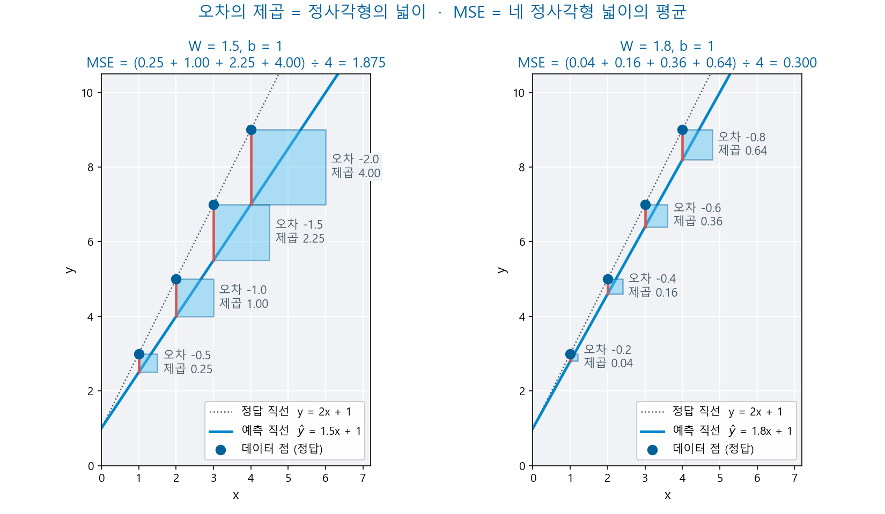
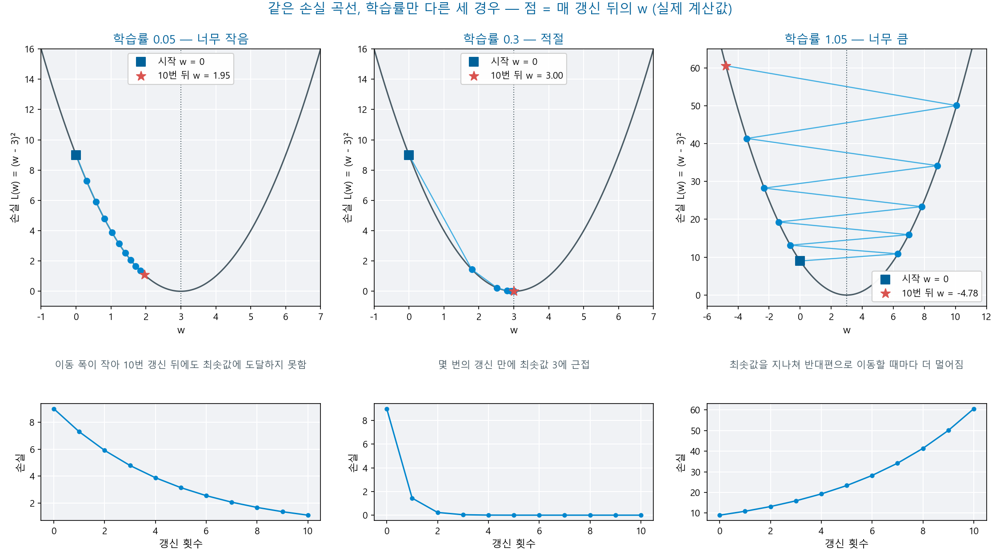
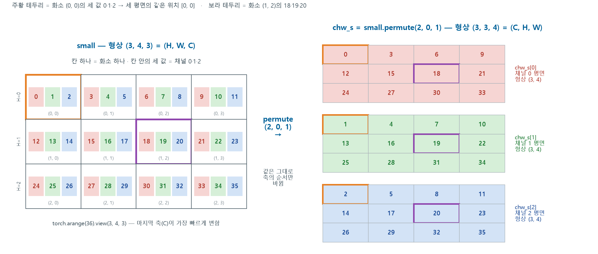
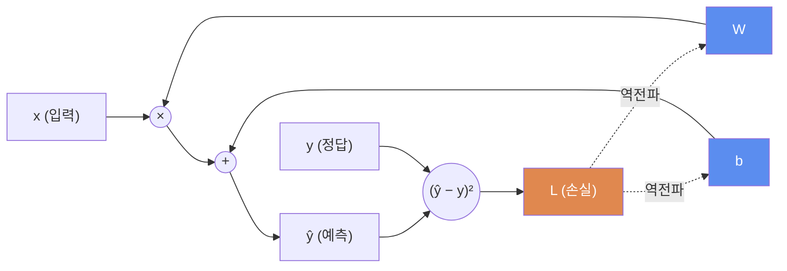
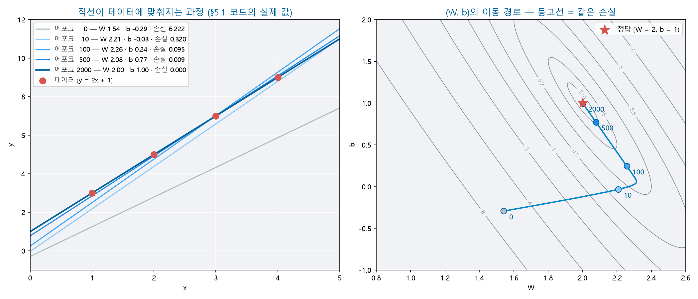
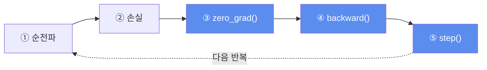
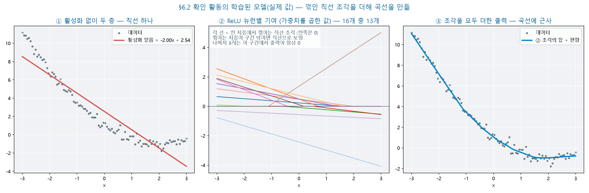

# Day 2 — 학습의 원리 · 경사하강 · PyTorch 텐서와 학습 루프

**2026-10-16 · 한국폴리텍대학 하이테크과정 AI**

이 자료는 수업의 개념 설명과 실습 절차·코드를 복습용으로 정리한 문서입니다. 복습 기준 = 이 자료 + 수업 중 필기 + 각자의 실습 노트북.

---

## 목차

1. [복습과 오늘의 목표](#1-복습과-오늘의-목표)
2. [회귀와 손실 함수](#2-회귀와-손실-함수)
3. [경사하강](#3-경사하강)
4. [텐서 기초](#4-텐서-기초)
5. [autograd와 역전파](#5-autograd와-역전파)
6. [학습 루프 5단](#6-학습-루프-5단)
7. [nn.Module·활성화·옵티마이저](#7-nnmodule활성화옵티마이저)
8. [Day 산출물 — 곡선 피팅 신경망](#8-day-산출물--곡선-피팅-신경망)
9. [요약과 복습문제](#9-요약과-복습문제)
10. [보충](#10-보충)
11. [다음 시간](#11-다음-시간)

---

## 1. 복습과 오늘의 목표

### 1.1 지난 시간 복습

| 항목 | 내용 |
|------|------|
| 배열 | 형상·자료형·스트라이드 — `reshape`는 해석만 변경 |
| 브로드캐스팅 | 뒤쪽 차원부터 비교 · 같거나 한쪽이 1 |
| 곱의 두 종류 | `*` = 같은 위치끼리 · `@` = (A, B) @ (B, C) → (A, C) |
| 가중합 | 그레이스케일 = 세 채널에 계수를 곱해 더함 — 계수는 사람이 정한 값 |
| 학습과 추론 | 학습 = 순전파 + 역전파 · 추론 = 순전파만 |
| Colab | 결과는 Drive에 저장 · 런타임 전환 = 새 환경 |

- 오늘은 가중합의 계수를 사람이 정하지 않고 **데이터에서 찾는 방법**에서 시작합니다

### 1.2 오늘의 목표 — 같은 문제를 푸는 세 단계

오늘은 회귀 문제 하나를 **세 단계**로 반복해 풉니다. 단계가 진행될수록 PyTorch가 대신 처리하는 부분이 늘어납니다.

| 단계 | 방법 | 절 |
|:--:|------|:--:|
| ① 개념 | 직선·손실·경사하강을 식과 NumPy로 확인 | 2절·3절 |
| ② 직접 구현 | 텐서와 autograd(자동 미분)로 기울기를 구하고 W·b를 직접 갱신 | 4절·5절·6절 |
| ③ 표준 도구 | `nn.Module`·옵티마이저로 같은 계산을 표준 형식으로 작성 | 7절 |

- 세 단계를 거치면 PyTorch 코드의 각 줄이 **어떤 계산을 대신하는지** 확인할 수 있습니다

**오늘 완성할 것** — 세 가지가 Day 2의 산출물입니다.

| 산출물 | 형태 | 용도 |
|------|------|------|
| 오늘의 Colab 노트북 | Drive에 저장 | **Day 3 준비물** — 학습 루프·`nn.Module`의 기본 구조 |
| 곡선 피팅 그래프 | 데이터 점 + 학습한 곡선 | 신경망이 곡선을 학습했는지 확인 |
| 손실 곡선 비교 | 학습률별 손실 변화 | 학습률의 영향 확인 |

> **오늘의 핵심 —** 학습은 **예측 → 손실 → 기울기 → 갱신**의 반복입니다. 이 네 단계를 식으로 한 번, 직접 작성한 코드로 한 번, PyTorch의 표준 도구로 한 번 확인합니다.

### 1.3 오늘의 흐름

| 단계 | 절 | 내용 | 산출물 |
|:--:|:--:|------|------|
| ① 원리 | 2절·3절 | 회귀와 손실 → 경사하강 | 손실 곡선·학습률 비교 |
| ② 도구 | 4절·5절 | 텐서 → autograd | 수기 계산과 기울기 대조 |
| ③ 학습 루프 | 6절 | 직접 갱신 → 표준 5단 | W ≈ 2 · b ≈ 1 |
| ④ 신경망 | 7절 | `nn.Module`·활성화·옵티마이저 | 2층 신경망 정의 |
| ⑤ 산출물 | 8절 | 곡선 피팅 | 노트북·그래프 |

- **10절 보충**은 진도에 여유가 있을 때 다루는 독립 소재 — Day 3은 10절 없이도 이어집니다

> **진행 방식 —** 각 절에서 설명과 실습을 단계별로 번갈아 진행합니다.
> - 실습은 단계마다 결과를 확인한 뒤 다음 단계로 넘어갑니다. 「예측」이 있는 단계에서는 실행 전에 결과를 먼저 적습니다
> - 절 끝의 「응용 실습」은 코드를 제공하지 않습니다 — AI 코딩 도구로 작성하며, 조건을 이해해야 해결할 수 있는 과제입니다

### 1.4 준비물 확인

| 품목 | 확인 사항 |
|------|----------|
| Colab | **GPU(그래픽 처리 장치) 런타임 권장** — 4.3에서만 사용 · 미배정이면 CPU(중앙 처리 장치)로 전 과정 진행 |
| 런타임 전환 | **수업 시작 전에** 완료 — 도중에 전환하면 변수가 모두 삭제됨(Day 1 5.3) |
| Google Drive | 연결(Day 1 5.2) — 오늘의 노트북은 Day 3 준비물 |
| Day 1 노트북 | 브로드캐스팅 표 — 형상 오류가 발생하면 참조 |
| 필기구 | 수기 계산 3회(2.4·3.1·5.7) · 실행 전 예측 기록 |
| AI 코딩 도구 | 응용 실습과 일부 실습의 코드 작성 — Day 1 5.5의 사용 규칙 |

---

## 2. 회귀와 손실 함수

**학습목표**

- 회귀 문제를 직선의 식으로 표현할 수 있다
- 평균 제곱 오차를 계산하고 그 값의 의미를 설명할 수 있다
- 회귀식이 신경망의 뉴런 하나와 같은 형태임을 설명할 수 있다

### 2.1 직선 하나로 여러 점을 설명하기

- **회귀**(regression) = 연속값을 예측하는 지도 학습 — Day 1 3.1의 두 유형 중 하나(다른 하나는 Day 3의 분류)
- 예 — 공부 시간으로 시험 점수를 예측 · 면적으로 집값을 예측

가장 단순한 모델은 **직선**입니다.

$$H(x) = Wx + b$$

| 기호 | 이름 | 뜻 |
|:--:|------|------|
| $x$ | 입력 | 예측에 사용하는 값 |
| $W$ | 가중치(weight) | 직선의 기울기 — $x$가 결과에 미치는 영향의 크기 |
| $b$ | 편향(bias) | 직선의 절편 — $x = 0$일 때의 값 |
| $H(x)$ · $\hat{y}$ | 예측 | 모델이 계산한 값 |

- **학습** = 데이터에 가장 잘 부합하는 $W$와 $b$를 찾는 과정

**손실 곡선 실습 1단계 — 데이터와 산점도**

- 이 실습은 2.5까지 네 단계로 이어집니다. 코드는 AI 코딩 도구로 작성합니다. 각 단계의 조건을 요청 내용에 포함하고, 실행 결과는 「확인」 기준으로 판정합니다
- $x$ = 1, 2, 3, 4를 실수 배열로 만들고, 정답 $y = 2x + 1$을 계산해 출력합니다. 두 배열로 산점도를 그립니다
- **확인** — 출력된 $y$가 3·5·7·9이고 점 네 개가 한 직선 위에 놓이면 정상입니다

<details>
<summary>참고 코드</summary>

```python
import numpy as np
import matplotlib.pyplot as plt

x = np.array([1.0, 2.0, 3.0, 4.0])
y = 2 * x + 1
print(y)
plt.scatter(x, y)
plt.show()
```

</details>

### 2.2 예측과 정답의 거리 — 손실 함수

- **손실 함수**(loss function) = 예측이 정답에서 얼마나 떨어져 있는지 수치로 나타내는 함수
- 학습의 목표 = 이 값을 **최소화**하는 것
- 회귀의 대표 손실 함수 = **MSE**(Mean Squared Error, 평균 제곱 오차)

$$L = \frac{1}{n}\sum_{i=1}^{n}\left(\hat{y}_i - y_i\right)^2$$

| 기호 | 뜻 |
|:--:|------|
| $\hat{y}_i$ | $i$번째 데이터의 예측 |
| $y_i$ | $i$번째 데이터의 정답 |
| $n$ | 데이터 개수 |

**오차를 제곱하는 이유**

| 이유 | 설명 |
|------|------|
| 부호 제거 | +오차와 −오차가 더해져 상쇄되지 않음 |
| 큰 오차에 큰 벌점 | 오차 2는 4, 오차 10은 100 — 크게 틀린 예측을 우선 줄임 |
| 매끄러운 곡선 | 어디서나 미분할 수 있어 경사하강(3절)을 적용하기 적합 |

- 과업에 따라 손실 함수가 다릅니다 — 회귀 = MSE(오늘) · 분류 = 교차 엔트로피(Day 3)



- 빨간 막대 = 오차 · 파란 정사각형 = 오차의 제곱(넓이) — MSE는 네 정사각형 넓이의 평균입니다
- 직선이 정답에 가까워지면($W$ = 1.5 → 1.8) 정사각형이 모두 작아지고 MSE가 1.875에서 0.300으로 줄어듭니다
- 오차가 클수록 정사각형이 빠르게 커집니다 — 오차 2의 넓이는 오차 0.5의 16배입니다

**손실 곡선 실습 2단계 — 모델 하나의 손실**

- 1단계의 데이터에 $W = 1$, $b = 1$인 직선을 적용해 예측 `y_pred`를 계산하고, MSE를 출력합니다

> **예측** — 실행하기 전에 두 가지를 적습니다.
> - `y_pred`의 형상과 값 — `x`에는 값이 몇 개 있습니까? `W * x + b`는 값 하나하나에 계산됩니까?
> - MSE 값 — 예측과 정답의 차이를 값마다 구하면 몇입니까? 그 차이를 제곱해 평균하면 몇입니까?

- **확인** — 출력을 예측과 대조합니다
- 예측과 다르면 → 아래 「예측 대조」를 펼쳐 예측·오차·제곱·평균 가운데 값이 어긋난 계산을 찾음 → **2단계를 다시** 실행합니다

<details>
<summary>예측 대조</summary>

- `y_pred` = `[2. 3. 4. 5.]` · 형상 `(4,)` — $x$의 네 값에 같은 계산을 각각 적용(Day 1 벡터화)
- 오차 = −1, −2, −3, −4 · 제곱 = 1, 4, 9, 16
- MSE = (1 + 4 + 9 + 16) ÷ 4 = **7.5**

</details>

<details>
<summary>참고 코드</summary>

```python
W, b = 1.0, 1.0
y_pred = W * x + b
print(y_pred.shape, y_pred)
print(np.mean((y_pred - y) ** 2))
```

</details>

### 2.3 파라미터 W·b — 회귀식은 뉴런 하나

| 구분 | 예 | 정하는 주체 |
|------|------|------|
| **파라미터**(parameter) | $W$·$b$ | 학습으로 결정됨 |
| **하이퍼파라미터**(hyperparameter) | 학습률·에포크 수·은닉 뉴런 수 | 사람이 정함 |

입력이 여러 개이면 입력마다 가중치가 하나씩 대응합니다.

$$\hat{y} = w_1x_1 + w_2x_2 + \cdots + w_nx_n + b$$

- Day 1 8.4의 **가중합**과 같은 형태입니다

> **Day 1 연계 —** 그레이스케일 변환의 세 계수(0.2989·0.5870·0.1140)는 **사람이 정한 값**이었습니다. 회귀에서는 같은 역할을 하는 $W$를 **데이터로 찾습니다**.
>
> - 회귀식의 가중합에 활성화 함수(7.2)를 더하면 **신경망의 뉴런 하나**가 됩니다
> - 뉴런 여러 개를 묶으면 **한 층** = `W @ x + b`(Day 1 8.3의 행렬 곱)입니다

### 2.4 확인 활동 — 손실 수기 계산

데이터 세 점으로 두 모델의 MSE를 수기로 구합니다.

| $x$ | 1 | 2 | 3 |
|:--:|:--:|:--:|:--:|
| $y$ | 3 | 5 | 7 |

| 모델 | 예측 3개 | 오차 3개 | MSE |
|------|------|------|:--:|
| ① $W = 1$, $b = 1$ | ? | ? | ? |
| ② $W = 2$, $b = 1$ | ? | ? | ? |

<details>
<summary>확인 활동 정리</summary>

| 모델 | 예측 | 오차 | MSE |
|------|------|------|:--:|
| ① | 2, 3, 4 | −1, −2, −3 | (1 + 4 + 9) ÷ 3 ≈ **4.67** |
| ② | 3, 5, 7 | 0, 0, 0 | **0** |

- 이 데이터는 $y = 2x + 1$에서 만든 값입니다 — 손실이 0인 모델이 정답 모델입니다

</details>

### 2.5 실습 — W를 바꾸며 손실 곡선 그리기

| 항목 | 내용 |
|------|------|
| 데이터 | 1단계와 같음 — $x$ = 1, 2, 3, 4 · 정답 $y = 2x + 1$ |
| 고정 | $b = 1$ |
| 변화 | $W$를 −1부터 5까지 61가지로 변경 |
| 결과 | $W$별 MSE 그래프 · 손실이 가장 작은 $W$ |

**3단계 — W 61가지의 손실**

- $W$를 −1부터 5까지 같은 간격으로 61개 만들고, 각 $W$로 2단계의 MSE를 계산해 리스트에 기록합니다
- 기록이 끝나면 리스트의 길이와 첫 값·마지막 값을 출력합니다

> **예측** — $W = -1$과 $W = 5$ 가운데 손실이 큰 것은 어느 $W$입니까?
> - 두 $W$는 정답 $W = 2$에서 각각 얼마나 떨어져 있습니까?
> - 그 차이가 오차의 부호와 크기에 어떻게 나타납니까?

- **확인** — 길이 61이 출력되면 정상입니다. 첫 값과 마지막 값을 예측과 대조합니다
- 길이가 61이 아니면 → $W$의 개수 조건(61개)이 요청에 포함되었는지 확인 → **3단계를 다시** 실행합니다

**4단계 — 손실 곡선과 최소 W**

- 3단계의 기록으로 $W$(가로축)와 MSE(세로축)의 그래프를 그리고, 손실이 가장 작은 $W$를 출력합니다

> **예측** — 그래프의 모양과 손실이 가장 작은 $W$를 적습니다. 2.4에서 손실이 0이었던 모델은 무엇이었습니까?

- **확인** — U자 곡선이 표시되고 손실이 가장 작은 $W$로 `2.0`이 출력되면 정상입니다
- 그래프가 표시되지 않으면 → 셀 마지막에 그래프 표시 명령(`plt.show()`)이 있는지 확인 → **4단계를 다시** 실행합니다
- 출력이 `2.0`과 다르면 → 1단계의 정답 식과 2단계의 `b` 값을 확인 → **3단계부터 다시** 실행합니다

<details>
<summary>실습 정리</summary>

| 관찰 | 해석 |
|------|------|
| 아래로 볼록한 U자 곡선 | $W$에 따라 손실이 달라짐 — **손실 곡선**(loss curve) |
| 가장 낮은 지점의 $W$ = 2 | 손실이 최소인 지점이 정답 모델 |
| 양 끝의 손실이 모두 67.5 | 두 $W$ 모두 정답에서 3만큼 떨어짐 — 오차의 부호만 반대이고 제곱하면 같아짐 |

</details>

<details>
<summary>참고 코드 — 3·4단계</summary>

```python
W_list = np.linspace(-1, 5, 61)            # ③ -1부터 5까지 61개
losses = []
for W in W_list:                           # ④ W 하나마다 손실 계산
    y_pred = W * x + b
    losses.append(np.mean((y_pred - y) ** 2))   # ⑤ MSE
print(len(losses), losses[0], losses[-1])

plt.plot(W_list, losses)
plt.xlabel("W")
plt.ylabel("MSE")
plt.show()
print(f"손실이 가장 작은 W: {W_list[np.argmin(losses)]:.1f}")   # ⑥
```

</details>

**코드 읽기 — Python 문법 ① 반복·리스트·그래프**

| 코드 | 뜻 |
|------|------|
| `import numpy as np` | 모듈을 가져오며 짧은 이름을 부여 — 이후 `np.`로 사용(Day 1 재등장) |
| `import matplotlib.pyplot as plt` | 점으로 하위 모듈을 지정 — 그래프 도구를 `plt`로 사용 |
| `np.linspace(-1, 5, 61)` | 구간을 같은 간격으로 61개 — **끝값 5를 포함**(`arange`와 차이) |
| `losses = []` | 빈 리스트를 생성 |
| `for W in W_list:` | 배열의 원소를 하나씩 `W`에 담아 반복 — 콜론 뒤 들여쓴 줄이 반복 범위 |
| `losses.append(...)` | 리스트 끝에 값 하나를 추가 |
| `** 2` | 거듭제곱 — 원소별로 제곱(Day 1 벡터화) |
| `np.argmin(losses)` | 가장 작은 값의 **위치 번호** |

**코드 읽기 — Python 문법 ① (계속) 대입과 리스트 확인**

| 코드 | 뜻 |
|------|------|
| `W, b = 1.0, 1.0` | 두 변수에 값을 동시에 대입 |
| `len(losses)` | 리스트의 원소 개수 |
| `losses[0]` · `losses[-1]` | 첫 원소 · 마지막 원소(Day 1 인덱싱 재등장) |

> **코드 읽기 표 —** 오늘 이후 Day에도 같은 문법을 표에 다시 싣습니다. 지금 모두 암기할 필요는 없습니다. 코드를 읽을 때마다 표를 참조합니다.

### 2.6 응용 실습 — 고정한 b와 최소 W

- 같은 데이터($x$ = 1\~4 · $y = 2x + 1$)로 손실 곡선을 그렸더니 손실이 가장 작은 $W$가 2.0이 아니라 **2.5**로 출력되었습니다
- 데이터와 $W$의 범위·개수(−1\~5 · 61개)는 변하지 않았고, 사람이 정한 조건 하나만 바뀌었습니다. 그 조건과 값을 찾습니다
- 코드는 AI 코딩 도구로 작성합니다. 각 단계의 조건을 요청 내용에 포함하고, 실행 결과는 「확인」 기준으로 판정합니다

**① 바뀐 조건의 후보**

- 2.5 코드에서 사람이 정한 값 가운데 데이터와 $W$의 범위·개수를 뺀 값을 적습니다

**② b를 바꾸며 최소 W 기록**

- 2.5의 3·4단계를 $b$ = 0 · 1 · 2로 각각 실행해 손실이 가장 작은 $W$를 표로 기록합니다

> **예측** — $b$를 1에서 2로 늘리면 손실이 가장 작은 $W$는 커집니까, 작아집니까? 직선이 위로 올라간 상태에서 같은 점들에 가까워지려면 기울기는 어떻게 달라져야 합니까?

- **확인** — $b$ = 1일 때 `2.0`이 출력되고, $b$가 커질수록 손실이 가장 작은 $W$가 작아지면 정상입니다
- $b$를 바꾸어도 결과가 변하지 않으면 → 예측 계산에 바뀐 $b$가 사용되는지 확인 → **②를 다시** 실행합니다

**③ 최소 W = 2.5가 되는 b**

- ②의 경향으로 $b$를 바꿀 방향(증가·감소)을 정하고, 손실이 가장 작은 $W$가 2.5가 되는 $b$를 찾습니다
- **확인** — `2.5`가 출력되면 정상입니다

**④ 두 값을 함께 찾기**

- ③의 $b$에서 최소 손실을 출력해 $b = 1$일 때와 비교합니다. 손실이 0이 되는 $W$·$b$ 조합이 몇 개인지 적습니다

<details>
<summary>응용 실습 정리</summary>

- $b$를 고정하면 그 $b$에서 **가장 나은** $W$만 찾을 수 있습니다 — 출력(간격 0.1 기준) = $b$ 0 → 2.3 · $b$ 1 → 2.0 · $b$ 2 → 1.7
- 직선이 위로 올라가면($b$ 증가) 기울기를 줄여야 점들에 가까워집니다
- 손실이 가장 작은 $W$가 2.5가 되는 조건 = **$b = -0.5$** — 이때의 최소 손실은 0.375로, 0이 되지 않습니다
- 손실이 0인 조합은 $W = 2$, $b = 1$ 하나뿐입니다 — 학습에서는 $W$와 $b$를 **함께** 찾아야 합니다. 3절 경사하강과 6절 학습 루프가 두 값을 동시에 갱신하는 이유입니다

</details>

### 2.7 응용 실습 — 손실이 0인데 맞지 않는 직선

- 어떤 학생이 손실을 아래 한 줄로 계산했습니다. 2.5의 데이터에서는 손실 곡선과 최소 $W$가 정상으로 출력되었습니다

```python
loss = np.mean(y_pred - y) ** 2
```

- 이 줄의 문제를 실행 결과로 확인하고 원인을 찾습니다. 코드는 AI 코딩 도구로 작성합니다

**① 같은 결과 확인**

- 2.5의 3·4단계에서 MSE 계산을 위의 한 줄로 바꾸어 실행합니다
- **확인** — 손실이 가장 작은 $W$로 `2.0`이, 그 손실로 0이 출력되면 정상입니다. 이 데이터에서는 두 계산의 결과가 같습니다

**② 이상치 하나 추가**

- 넷째 점의 정답을 9에서 **15**로 바꿉니다. 다른 점들과 크게 벗어난 값을 **이상치**(outlier)라 합니다
- 두 계산(위의 한 줄 · 2.5의 MSE)으로 각각 손실이 가장 작은 $W$와 그 손실을 출력합니다

> **예측** — 네 점이 이제 한 직선 위에 있습니까? 그렇다면 어떤 직선이든 손실이 0이 될 수 있습니까?

- **확인** — 두 계산의 최소 $W$가 서로 다르게 출력되면 정상입니다
- 두 결과가 같으면 → `y`를 출력해 넷째 정답이 15로 바뀌었는지 확인 → **②를 다시** 실행합니다

**③ 원인 찾기**

- 위의 한 줄과 2.2의 MSE 식을 대조해 **계산 순서**의 차이를 적습니다
- 2.2 「오차를 제곱하는 이유」 표의 첫 행과 연결해 설명합니다

**④ 수정과 대조**

- 한 줄을 MSE 식의 계산 순서대로 고치고, 최소 $W$와 그 손실을 ②의 결과와 대조합니다

<details>
<summary>응용 실습 정리</summary>

- 이상치 데이터의 결과 — 위의 한 줄 = 최소 $W$ **2.6** · 손실 **0** / MSE = 최소 $W$ **2.8** · 손실 **4.2**
- 네 점이 한 직선 위에 있지 않으므로 손실이 0일 수 없습니다. 0이 출력된 것이 결함의 증거입니다
- 원인 = **평균을 먼저 구한 뒤 제곱** — $W$ = 2.6에서 오차는 0.6 · 1.2 · 1.8 · −3.6이고 합이 0입니다. +오차와 −오차가 상쇄되어 평균이 0이 됩니다(2.2 표 「부호 제거」)
- 2.5의 데이터에서는 두 계산의 결과가 같아 결함이 드러나지 않았습니다 — 계산을 검증할 때는 **결과가 달라질 수 있는 데이터**로 확인합니다

</details>

**다음 질문** — 파라미터가 $W$ 하나일 때는 61가지를 모두 계산할 수 있습니다. 파라미터가 수백만 개인 신경망에서는 모든 조합을 계산할 수 없습니다.

- 곡선 전체를 계산하지 않고 **현재 위치의 기울기만으로** 최솟값을 향해 이동하는 방법이 필요합니다 → 3절

---

## 3. 경사하강

**학습목표**

- 경사하강의 갱신 규칙을 식으로 나타내고 한 단계를 수기로 계산할 수 있다
- 학습률이 너무 크거나 작을 때 나타나는 현상을 설명할 수 있다
- 전체 데이터 대신 배치를 사용하는 이유를 설명할 수 있다

### 3.1 손실을 줄이는 방향

- **경사하강**(gradient descent) = 현재 위치에서 손실이 가장 빠르게 줄어드는 방향으로 파라미터를 조금씩 이동하는 방법
- 경사하강을 짙은 안개 속에서 산의 가장 낮은 지점을 찾는 상황에 대응시켜 이해할 수 있습니다

| 산에서 | 학습에서 |
|------|------|
| 산의 높이 | 손실 |
| 현재 위치 | 현재 $W$·$b$ 값 |
| 가장 가파른 내리막 방향 | **기울기의 반대 방향** |
| 한 걸음의 크기 | 학습률 |

- **기울기**(gradient) = 손실을 파라미터로 미분한 값 — 손실이 가장 빠르게 **증가**하는 방향과 크기
- 따라서 기울기의 **반대 방향**으로 이동합니다

$$W \leftarrow W - \alpha\,\frac{\partial L}{\partial W}, \qquad b \leftarrow b - \alpha\,\frac{\partial L}{\partial b}$$

| 기울기 | 뜻 | 이동 |
|:--:|------|------|
| 양수 | $W$를 늘리면 손실이 증가 | $W$ 감소 |
| 음수 | $W$를 늘리면 손실이 감소 | $W$ 증가 |
| 0 | 평평한 지점 | 이동 없음 |

- $\alpha$ = **학습률**(learning rate) — 한 번에 이동하는 크기를 정하는 하이퍼파라미터

**한 단계 수기 계산** — 손실이 $L(w) = (w - 3)^2$인 경우

| 갱신 횟수 | 기울기 $2(w-3)$ | 갱신 $w - 0.1 \times$ 기울기 |
|:--:|:--:|:--:|
| 1 (시작 $w = 0$) | −6 | 0 − 0.1 × (−6) = **0.6** |
| 2 | ? | ? |
| 3 | ? | ? |

- 학습률 $\alpha = 0.1$ · 손실이 최소가 되는 지점은 $w = 3$입니다

<details>
<summary>수기 계산 정리</summary>

| 갱신 횟수 | $w$ | 기울기 | 갱신 결과 |
|:--:|:--:|:--:|:--:|
| 1 | 0 | −6 | 0.6 |
| 2 | 0.6 | −4.8 | **1.08** |
| 3 | 1.08 | −3.84 | **1.464** |

- 최솟값 3에 가까워질수록 기울기가 작아져 **이동 폭도 줄어듭니다**

</details>

**경사하강 실습 1단계 — 수기 계산을 코드로 대조**

- $w = 0$에서 시작해 학습률 0.1로 갱신을 3번 반복하고, 매번 $w$를 출력합니다. 기울기는 위의 도함수 $2(w - 3)$으로 계산합니다
- 코드는 AI 코딩 도구로 작성합니다(2.1 실습과 같은 방식). 위의 수기 계산 표가 이 단계의 예측입니다
- **확인** — 세 값이 수기 계산 표의 0.6 · 1.08 · 1.464와 같으면 정상입니다
- 첫 값이 −0.6이면 → 갱신 식의 부호(기울기의 **반대 방향** = 빼기)를 확인 → **1단계를 다시** 실행합니다

<details>
<summary>참고 코드</summary>

```python
w = 0.0
for step in range(3):
    w = w - 0.1 * 2 * (w - 3)
    print(f"{step + 1}번째 갱신 후 w = {w:.3f}")
```

</details>

### 3.2 학습률의 두 실패

| 학습률 | 현상 | 손실 곡선의 모습 |
|------|------|------|
| 너무 큼 | 최솟값을 지나쳐 반대편으로 이동 — 진동하거나 발산 | 요동하거나 증가 |
| 너무 작음 | 이동 폭이 작아 수렴이 매우 느림 | 거의 내려가지 않음 |
| 적절 | 안정적으로 하강 | 서서히 감소한 뒤 수렴 |

- 학습률은 사람이 정하는 하이퍼파라미터입니다. 옵티마이저를 바꾸어도 **결과에 가장 큰 영향을 주는 설정**으로 남습니다(7.4)



- 같은 손실 곡선 $L(w) = (w - 3)^2$에서 학습률만 0.05 · 0.3 · 1.05로 바꾸어 10번 갱신한 실제 계산값입니다
- 10번 뒤의 $w$ — 0.05 = 1.95(아직 도달하지 못함) · 0.3 = 3.00(최솟값에 근접) · 1.05 = −4.78(최솟값을 넘나들며 멀어짐)
- 아래 그래프 = 갱신 횟수에 따른 손실 — 3.2 표의 「손실 곡선의 모습」 열과 대응합니다

### 3.3 손실 지형 — 국소 최솟값과 안장점

- 2.5의 손실 곡선은 최솟값이 하나인 U자 모양이었습니다 — 파라미터가 하나이고 식이 단순했기 때문입니다
- 신경망의 손실 지형은 수백만 차원의 공간에 놓입니다. 이 지형에는 굴곡이 많습니다

| 지점 | 뜻 | 경사하강에 미치는 영향 |
|------|------|------|
| 전역 최솟값 | 전체에서 가장 낮은 지점 | 경사하강으로 찾으려는 지점 |
| **국소 최솟값**(local minimum) | 주변보다 낮지만 가장 낮지는 않은 지점 | 기울기 0 — 이동이 멈춤 |
| **안장점**(saddle point) | 한 방향은 골짜기·다른 방향은 능선 | 기울기가 0에 가까워 학습이 정체 |

> **자주 하는 실수 —** **기울기가 0이면 학습이 완료되었다고 판단하는 것**입니다. 안장점에서도 기울기는 0에 가깝습니다. 모멘텀과 적응 학습률이 필요한 이유가 여기에 있습니다. 모멘텀은 과거의 기울기를 누적합니다. 적응 학습률은 파라미터마다 이동 폭을 조절합니다(7.4 · 보충 10.3).

### 3.4 배치를 사용하는 이유

- 전체 데이터로 기울기를 계산하면 정확하지만 **느리고 메모리 부담이 큽니다**
- **미니배치**(mini-batch) = 일부 표본으로 기울기를 근사하는 방식 — 계산이 빠릅니다. 또한 근사에 따르는 작은 오차가 있어 학습이 안장점을 벗어나는 데 도움이 됩니다

| 용어 | 뜻 |
|------|------|
| **에포크**(epoch) | 전체 데이터를 한 번 모두 사용 |
| **배치 크기**(batch size) | 한 번 갱신에 사용하는 표본 수 |
| **스텝**(step) | 갱신 1회 |

- 1 에포크의 스텝 수 = 데이터 수 ÷ 배치 크기 — 1,000개 · 배치 100 → **10스텝**
- 오늘은 데이터가 적어 전체를 한 번에 사용합니다. 배치로 나누는 도구(`DataLoader`)는 Day 3 5절에서 다룹니다

### 3.5 실습 — 경사하강을 직접 실행하고 학습률 비교하기

| 항목 | 내용 |
|------|------|
| 손실 함수 | $L(w) = (w - 3)^2$ · 도함수 $2(w - 3)$ |
| 시작 | $w = 0$ |
| 학습률 | 0.01 · 0.1 · 1.1 |
| 반복 | 20스텝 |
| 결과 | 학습률별 손실 곡선 3개 · 최종 $w$ |

**2단계 — 학습률 0.1로 20스텝**

- 1단계(3.1)의 반복을 20번으로 늘리고, 매 스텝의 손실 $(w - 3)^2$을 리스트에 기록합니다. 손실 함수와 도함수는 함수로 정의해 사용합니다
- 마지막에 최종 $w$를 출력합니다

> **예측** — 20스텝 뒤의 $w$를 적습니다.
> - 3.1 수기 계산에서 3까지 남은 거리는 3 → 2.4 → 1.92로 줄었습니다. 한 번 갱신할 때마다 남은 거리는 몇 배가 됩니까?
> - 그 배수를 20번 곱하면 남은 거리는 얼마입니까?

- **확인** — 최종 $w$를 예측과 대조합니다
- `NameError`가 발생하면 → 손실 함수·도함수를 정의한 줄이 먼저 실행되었는지 확인 → **셀 전체를 다시** 실행합니다

**3단계 — 학습률 세 가지 비교**

- 2단계를 학습률 0.01 · 0.1 · 1.1로 각각 실행하고, 세 손실 곡선을 한 그래프에 표시합니다. 손실의 차이가 크므로 세로축은 로그 눈금으로 둡니다

> **예측** — 아래 표의 「배수」와 「최종 $w$(예측)」를 먼저 채웁니다.
> - 갱신 식 $w - \alpha \cdot 2(w - 3)$을 남은 거리 $w - 3$에 대해 정리하면, 배수는 학습률 $\alpha$로 어떻게 나타납니까?
> - 배수가 음수이면 $w$는 3의 어느 쪽으로 이동합니까?

| 학습률 | 배수 | 최종 $w$(예측) | 최종 $w$(실행) | 구분 |
|:--:|:--:|:--:|:--:|:--:|
| 0.01 | ? | ? | ? | ? |
| 0.1 | ? | ? | ? | ? |
| 1.1 | ? | ? | ? | ? |

- 구분 칸에 **느림·수렴·발산** 중 하나를 적습니다
- **확인** — 세 줄의 최종 $w$가 출력되고 곡선 3개가 표시되면 정상입니다
- 곡선이 하나만 표시되면 → 그래프를 그리는 명령이 학습률 반복 안에 있는지 확인 → **3단계를 다시** 실행합니다

<details>
<summary>실습 정리</summary>

| 학습률 | 배수 $1 - 2\alpha$ | 최종 $w$ | 구분 |
|:--:|:--:|:--:|:--:|
| 0.01 | 0.98 | 약 0.997 | **느림** — 20스텝 뒤에도 3에서 멀리 떨어짐 |
| 0.1 | 0.8 | 약 2.965 | **수렴** — 최솟값 3에 근접 |
| 1.1 | −1.2 | 약 −112.0 | **발산** — 최솟값을 지나쳐 멀어짐 |

- 남은 거리 $w - 3$은 한 번 갱신할 때마다 $(1 - 2\alpha)$배가 됩니다 — 20번 뒤 = 처음 거리 × $(1 - 2\alpha)^{20}$
- 학습률 0.1이면 $3 \times 0.8^{20} \approx 0.035$만 남아 $w \approx 2.965$입니다
- 학습률 1.1에서는 배수가 음수이므로 $w$가 매 스텝 3의 반대편으로 넘어갑니다. 배수의 크기가 1보다 커서 넘어갈 때마다 이전보다 **더 먼 반대편**으로 이동합니다

</details>

<details>
<summary>참고 코드 — 2·3단계</summary>

```python
import numpy as np
import matplotlib.pyplot as plt

def loss(w):                          # ① 손실 함수
    return (w - 3) ** 2

def grad(w):                          # ② 수기로 구한 도함수
    return 2 * (w - 3)

for lr in [0.01, 0.1, 1.1]:           # ③ 학습률 세 가지
    w = 0.0
    history = []
    for step in range(20):
        w = w - lr * grad(w)          # ④ 갱신 규칙 — 3.1의 식
        history.append(loss(w))
    plt.plot(history, label=f"lr={lr}")
    print(f"lr={lr}: 최종 w = {w:.3f}")

plt.yscale("log")                     # ⑤ 손실 차이가 커서 로그 눈금
plt.xlabel("step")
plt.ylabel("loss")
plt.legend()
plt.show()
```

</details>

**코드 읽기 — Python 문법 ② 함수 정의와 중첩 반복**

| 코드 | 뜻 |
|------|------|
| `def loss(w):` | 함수 정의 — 이름 `loss` · 입력 `w` · 콜론 뒤 들여쓴 줄이 함수 내용 |
| `return (w - 3) ** 2` | 계산 결과를 호출한 곳으로 반환 |
| `for lr in [0.01, 0.1, 1.1]:` | 리스트를 직접 순회 — 원소 세 개를 차례로 `lr`에 담음 |
| 들여쓰기 두 단계 | 바깥 `for` 안에 안쪽 `for` — 학습률마다 20스텝 반복 |
| `range(20)` | 0부터 19까지 20개 — 끝 번호는 포함되지 않음(Day 1 슬라이싱과 같은 규칙) |
| `label=f"lr={lr}"` | 키워드 인자 + f-문자열 — 그래프 선의 이름 |
| `plt.legend()` | 선 이름(범례)을 표시 |

### 3.6 응용 실습 — 진동하는 학습의 학습률

- 손실 $L(w) = (w - 3)^2$을 $w = 0$에서 시작해 학습했더니, $w$가 0과 6을 번갈아 오가고 손실은 9에서 변하지 않았습니다
- 이 결과를 만든 학습률을 찾고, 수렴하는 학습률의 범위를 정합니다
- 코드는 AI 코딩 도구로 작성합니다. 각 단계의 조건을 요청 내용에 포함하고, 실행 결과는 「확인」 기준으로 판정합니다

**① 배수로 학습률 예측**

> **예측** — 학습률을 계산으로 먼저 구합니다.
> - $w$가 0 → 6 → 0으로 움직이면 3까지 남은 거리는 −3 → +3 → −3입니다. 한 번 갱신할 때 남은 거리는 몇 배가 됩니까?
> - 3.5에서 정리한 배수와 학습률의 관계에 그 값을 넣으면 학습률은 얼마입니까?

**② 실행으로 확인**

- ①의 학습률로 3.5의 2단계를 실행하고, 처음 4스텝의 $w$와 20스텝 뒤의 손실을 출력합니다
- **확인** — $w$가 6, 0, 6, 0으로 출력되고 손실이 9이면 정상입니다
- 다른 값이 출력되면 → 배수 계산을 다시 확인 → **①부터 다시** 진행합니다

**③ 한 번에 도달하는 학습률**

- 한 번의 갱신으로 $w = 3$에 도달하려면 배수가 얼마여야 하는지 정하고, 그 학습률로 실행해 확인합니다

**④ 수렴하는 범위**

- 배수의 크기를 기준으로 수렴하는 학습률의 범위를 적습니다
- 경계 근처의 학습률 0.99 · 1.01로 실행해 20스텝 뒤의 $w$와 손실을 확인합니다

<details>
<summary>응용 실습 정리</summary>

- ① 배수 = −1 → $1 - 2\alpha = -1$ → 학습률 **1.0**
- ③ 배수 = 0 → 학습률 **0.5** — $w$가 한 번에 3이 됩니다
- ④ 배수의 크기가 1보다 작아야 수렴합니다 → $|1 - 2\alpha| < 1$ → **0 < 학습률 < 1**
- 0.99는 느리게 수렴하고(20스텝 뒤 $w \approx 0.997$), 1.01은 발산합니다(20스텝 뒤 $w \approx -1.458$ · 손실은 9보다 커짐)
- 0.99의 결과는 0.01과 같습니다 — 배수의 크기가 0.98로 같아 남은 거리가 같은 비율로 줄기 때문입니다. 0.99는 매번 반대편으로 넘어가며 줄어듭니다

</details>

### 3.7 응용 실습 — 같은 학습률, 다른 손실

- 손실 $L(w) = 10(w - 3)^2$의 최솟값을 경사하강으로 찾습니다
- 조건은 3.5와 같습니다 — 시작 $w = 0$ · 학습률 0.1 · 20스텝
- 코드는 AI 코딩 도구로 작성합니다. 각 단계의 조건을 요청 내용에 포함하고, 실행 결과는 「확인」 기준으로 판정합니다

**① 결과 예측**

> **예측** — 실행하기 전에 적습니다.
> - 이 손실의 도함수는 3.5 도함수의 몇 배입니까? 같은 학습률이면 한 번의 이동 폭은 어떻게 됩니까?
> - 남은 거리의 배수를 구하면 학습은 느림·수렴·진동·발산 가운데 어느 것에 해당합니까?

**② 실행으로 확인**

- 조건 그대로 실행해 처음 4스텝의 $w$와 20스텝 뒤의 손실을 출력합니다
- **확인** — 출력을 ①의 예측과 대조합니다
- 결과가 3.5의 학습률 0.1과 같으면(최종 $w \approx 2.965$) → 도함수에 계수 10이 반영되었는지 확인 → 요청을 고쳐 **②를 다시** 실행합니다

**③ 수렴하는 학습률**

- 이 손실에서 수렴하는 학습률의 범위와 한 번에 도달하는 학습률을 구하고, 실행해 확인합니다

**④ 실제로 생기는 경우**

- 회귀의 손실 $(wx - y)^2$에서 입력 $x$가 10배 커지면 $w$에 대한 손실 곡선의 모양이 어떻게 바뀌는지 적습니다
- 학습률을 정할 때 무엇을 함께 확인해야 하는지 정리합니다

<details>
<summary>응용 실습 정리</summary>

- 도함수 = $20(w - 3)$ — 3.5의 10배 · 배수 = $1 - 20 \times 0.1 = -1$
- 결과 = **진동** — $w$가 6, 0, 6, 0을 번갈아 오가고 손실은 90에서 변하지 않습니다. 코드에는 오류가 없습니다
- 수렴 범위 = $|1 - 20\alpha| < 1$ → **0 < 학습률 < 0.1** · 한 번에 도달 = **0.05**
- 손실 곡선이 가파를수록 사용할 수 있는 학습률이 작아집니다. 입력이 10배 커지면 $w$에 대한 손실 곡선은 100배 가팔라집니다 — 입력의 크기를 맞추는 **정규화**(보충 10.1)가 학습률 설정과 함께 필요한 이유입니다
- 3.5에서 적절했던 학습률 0.1도 손실 함수가 바뀌면 적절하지 않습니다 — 학습률은 손실 함수와 함께 정하는 값입니다

</details>

---

## 4. 텐서 기초

**학습목표**

- NumPy 배열과 텐서의 공통점과 차이를 설명할 수 있다
- 텐서를 생성하고 형상·자료형·장치를 확인할 수 있다
- 형상 조작 명령으로 원하는 형상의 텐서를 만들 수 있다.

### 4.1 NumPy ↔ 텐서 대응표

- **텐서**(tensor) = PyTorch의 기본 데이터 단위 — 스칼라(0차원)·벡터(1차원)·행렬(2차원)과 그 이상을 모두 텐서로 표현

| 단계 | 형태 | 역할 |
|:--:|------|------|
| 1 | 파일(CSV·이미지) | 저장 |
| 2 | NumPy 배열 | 읽기·전처리 |
| 3 | **텐서** | 모델 입력 — GPU 연산·학습 |

| 작업 | NumPy (Day 1) | PyTorch |
|------|------|------|
| 생성 | `np.array([...])` | `torch.tensor([...])` |
| 0으로 채움 | `np.zeros((2, 3))` | `torch.zeros(2, 3)` |
| 정규분포 난수 | `np.random.randn(2, 3)` | `torch.randn(2, 3)` |
| 형상 | `a.shape` | `t.shape` |
| 형상 변경 | `a.reshape(3, 4)` | `t.view(3, 4)` · `t.reshape(3, 4)` |
| 행렬 곱 | `a @ b` | `t @ u` · `torch.matmul(t, u)` |
| NumPy → 텐서 | — | `torch.from_numpy(a)` |
| 텐서 → NumPy | — | `t.numpy()` |

**텐서가 NumPy 배열과 다른 점은 두 가지뿐입니다.**

| 차이 | 내용 | 다루는 곳 |
|------|------|:--:|
| GPU 연산 | GPU로 옮겨 수천 개 코어로 병렬 계산 | 4.3 |
| 기울기 기록 | 연산 과정을 기록해 기울기를 자동 계산 | 5절 |

- 그 밖의 사용법은 NumPy와 거의 같습니다 — Day 1에서 익힌 인덱싱·슬라이싱·브로드캐스팅이 그대로 적용됩니다

### 4.2 텐서 생성과 속성

```python
import torch
import numpy as np

x = torch.tensor([[1.0, 2.0, 3.0], [4.0, 5.0, 6.0]])   # ① 리스트에서
z = torch.zeros(2, 3)                                  # ② 0으로 채움
r = torch.randn(2, 3)                                  # ③ 표준정규분포 난수
o = torch.ones_like(x)                                 # ④ x와 같은 형상·자료형

a = np.array([7, 8, 9])
t = torch.from_numpy(a)                                # ⑤ NumPy에서 — 메모리 공유

print(x.shape, x.dtype, x.device)                      # ⑥ 속성 세 가지
print(x.numel())                                       # ⑦ 원소 개수
```

| 속성·메서드 | 결과 | 뜻 |
|------|------|------|
| `x.shape` | `torch.Size([2, 3])` | 각 축의 크기 |
| `x.dtype` | `torch.float32` | 자료형 — 딥러닝의 기본값 |
| `x.device` | `cpu` | 텐서가 저장된 장치 |
| `x.numel()` | `6` | **원소 개수** — Day 3에서 모델의 파라미터 수를 계산할 때 사용 |

**⑤의 메모리 공유 확인**

- 위 코드에 이어 `a[0] = 100`을 실행하고 `t`를 출력합니다

> **예측** — `t`의 첫 원소는 7입니까, 100입니까? `t`는 `a`의 값을 복사했습니까, `a`의 메모리를 함께 사용합니까?(⑤의 주석 · Day 1 6.4)

- **확인** — 출력을 예측과 대조합니다

<details>
<summary>예측 대조</summary>

- `tensor([100,   8,   9])` — `t`의 첫 원소도 100으로 바뀝니다
- `from_numpy`는 메모리를 **공유**합니다 — Day 1 6.4의 **뷰**와 같은 성질

</details>

**모듈을 가져오는 두 가지 형태**

```python
import torch.nn as nn        # 형태 ① import 모듈 as 별칭
from torch import nn         # 형태 ② from 모듈 import 이름
```

- 두 줄의 결과는 같습니다 — 둘 다 `nn`이라는 이름으로 사용합니다
- 형태 ②는 모듈 안의 **이름 하나만** 가져옵니다. Day 3·4의 코드에서 `from torch.utils.data import DataLoader`처럼 자주 사용합니다

**코드 읽기 — Python 문법 ③ 모듈 가져오기와 속성**

| 코드 | 뜻 |
|------|------|
| `import torch` | 모듈 전체를 가져옴 — `torch.`로 사용 |
| `import numpy as np` | 별칭을 붙여 가져옴 — `np.`로 사용(재등장) |
| `from torch import nn` | 모듈 안의 이름 하나만 가져옴 — 접두어 없이 `nn`으로 사용 |
| `torch.tensor([[...], [...]])` | 리스트 안의 리스트 = 2차원 구조(Day 1 재등장) |
| `x.shape` | 괄호가 없으면 **속성**(값) — 재등장 |
| `x.numel()` | 괄호가 있으면 **메서드**(동작) — 재등장 |
| `print(a, b, c)` | 쉼표로 구분한 여러 값을 한 줄에 출력 |

> **자주 하는 실수 —** **정수로 만든 텐서의 자료형은 `int64`입니다.** `torch.tensor([1, 2, 3])`처럼 소수점 없이 만들면 정수 텐서가 됩니다. 이 텐서를 실수 가중치와 연산하면 **자료형 불일치 오류**가 발생합니다. 학습에 사용하는 데이터에는 `[1.0, 2.0, 3.0]`처럼 소수점을 붙이거나 `dtype=torch.float32`를 지정합니다. 이미 만든 텐서는 `.float()`로 변환합니다.

### 4.3 GPU 이동과 연산 시간 비교

- **GPU** = 단순한 계산을 수천 개의 작은 코어로 **동시에** 처리하는 장치
- **CPU** = 소수의 강력한 코어로 복잡한 명령을 **차례로** 처리하는 장치
- 딥러닝의 계산은 대부분 행렬 곱 — 서로 독립된 곱셈·덧셈의 반복이므로 GPU에 적합합니다(Day 1 2.4)

**절차**

1. 사용할 장치를 확인합니다

```python
device = "cuda" if torch.cuda.is_available() else "cpu"
print(f"현재 장치: {device}")
```

- `cuda`가 출력되면 → GPU가 배정된 상태입니다 → **2로 진행**
- `cpu`가 출력되면 → GPU가 배정되지 않은 상태입니다. 지금 런타임을 전환하면 앞서 만든 변수가 모두 삭제되므로 그대로 둡니다 → **2를 실행해 CPU 시간만 측정**하고, GPU 시간 칸에는 강사 화면의 결과를 기록 → **3.4로 진행**

2. 같은 행렬 곱을 CPU와 GPU에서 각각 실행해 시간을 비교합니다

```python
import time
size = 5000
a = torch.randn(size, size)
b = torch.randn(size, size)

start = time.time()
torch.matmul(a, b)                          # ① CPU에서 계산
print(f"CPU: {time.time() - start:.3f}초")

if device == "cuda":
    a_gpu = a.to(device)                    # ② GPU로 복사
    b_gpu = b.to(device)
    torch.cuda.synchronize()                # ③ 이전 작업이 끝날 때까지 대기
    start = time.time()
    torch.matmul(a_gpu, b_gpu)
    torch.cuda.synchronize()
    print(f"GPU: {time.time() - start:.3f}초")
```

- 두 시간이 출력되면 → 4.3 끝의 결과 표에 기록 → **3으로 진행**

3. GPU의 결과를 CPU로 되돌립니다

```python
back = a_gpu.cpu()          # ④ CPU로 복사
arr = back.numpy()          # ⑤ NumPy 배열로 변환
print(type(arr), arr.shape)
```

- `<class 'numpy.ndarray'> (5000, 5000)`이 출력되면 정상입니다 → **3.4로 진행**
- `NameError: name 'a_gpu' is not defined`가 발생하면 → 2에서 GPU 구간이 실행되지 않은 상태입니다(CPU 장치) → 이 단계는 생략하고 **3.4로 진행**

| 항목 | 기록 |
|------|:--:|
| CPU 시간(초) | |
| GPU 시간(초) | |
| 배수(CPU ÷ GPU) | |

- GPU의 첫 실행 시간에는 초기화 시간이 포함될 수 있습니다 — 2를 한 번 더 실행해 두 번째 값을 함께 기록합니다
- `torch.cuda.synchronize()` — GPU 연산은 명령이 대기열에 등록된 뒤 실행됩니다. 측정 구간의 앞뒤에서 이 함수로 연산 완료를 확인해야 실제 계산 시간을 얻습니다

> **Day 4 연계 —** **같은 연산의 소요 시간이 하드웨어에 따라 몇 배 차이가 나는가** — 오늘 기록한 표가 Day 4 실측 표(Colab ↔ Raspberry Pi 5 ↔ INT8 변환)의 원형입니다. Day 4에서는 속도에 더해 모델 크기와 정확도까지 함께 측정합니다.

> **자주 하는 실수 —**
>
> - **서로 다른 장치의 텐서끼리 연산**하면 `Expected all tensors to be on the same device` 오류가 발생합니다 — 연산에 참여하는 텐서를 모두 `.to(device)`로 같은 장치에 둡니다
> - **GPU 텐서에 곧바로 `.numpy()`를 호출**하면 오류가 발생합니다 — NumPy는 CPU 메모리만 다루므로 `.cpu()`를 먼저 호출합니다

**코드 읽기 — Python 문법 ④ 조건부 표현식과 장치 이동**

| 코드 | 뜻 |
|------|------|
| `"cuda" if 조건 else "cpu"` | 조건이 참이면 앞의 값, 거짓이면 뒤의 값 — 한 줄로 작성하는 `if` |
| `torch.cuda.is_available()` | GPU 사용 가능 여부를 참·거짓으로 반환 |
| `if device == "cuda":` | `a == b`는 같은지 비교 · `a = b`는 대입 |
| `a.to(device)` | 지정 장치로 복사한 **새 텐서**를 반환 — 원본 `a`는 CPU에 유지 |
| `time.time()` | 현재 시각(초) — 두 시각의 차이 = 경과 시간(Day 1 재등장) |
| `f"{값:.3f}초"` | 소수 셋째 자리까지 표시하는 f-문자열(재등장) |
| `type(arr)` | 값의 종류(자료형)를 확인 |

### 4.4 형상 조작

| 명령 | 동작 | 예 |
|------|------|------|
| `view` · `reshape` | 원소 순서를 유지하며 형상 변경 | (3, 4) → (2, 6) |
| `unsqueeze(축)` | 크기 1인 축을 추가 | (3, 4) → (1, 3, 4) |
| `squeeze(축)` | 크기 1인 축을 제거 | (1, 3, 4) → (3, 4) |
| `permute(순서)` | 축의 순서 자체를 교체 | (H, W, C) → (C, H, W) |
| `torch.cat` | 기존 축을 따라 이어 붙임 | (2, 3) + (2, 3) → (4, 3) |
| `torch.stack` | 새 축을 만들어 쌓음 | (2, 3) + (2, 3) → (2, 2, 3) |

**1단계 — 형상 바꾸기와 축 추가·제거**

- 아래 코드를 실행해 출력된 형상을 각 줄의 주석과 대조합니다. 형상을 먼저 예측하는 연습은 4.5에서 합니다

```python
t = torch.arange(12, dtype=torch.float32).view(3, 4)   # ① 0~11을 3행 4열로
print(t.view(2, 6).shape)                  # ② (2, 6)
print(t.view(-1, 2).shape)                 # ③ -1 = 자동 계산 → (6, 2)
print(t.unsqueeze(0).shape)                # ④ (1, 3, 4)
print(t.unsqueeze(0).squeeze(0).shape)     # ⑤ (3, 4)
```

- **확인** — `torch.Size([2, 6])` · `torch.Size([6, 2])` · `torch.Size([1, 3, 4])` · `torch.Size([3, 4])`가 차례로 출력되면 정상입니다

**2단계 — 이미지의 축 순서 바꾸기**

```python
img = torch.rand(10, 12, 3)                # ⑥ (H, W, C) 순서의 가상 이미지
chw = img.permute(2, 0, 1)                 # ⑦ (C, H, W)로 축 순서 교체
batch = chw.unsqueeze(0)                   # ⑧ (1, C, H, W) — 배치 축 추가
print(chw.shape, batch.shape)

small = torch.arange(36).view(3, 4, 3)     # ⑨ 값으로 위치를 추적하는 작은 (H, W, C)
chw_s = small.permute(2, 0, 1)
print(small[0, 0])
print(chw_s[:, 0, 0])
print(chw_s[0])
```

> **예측** — ⑨의 세 출력을 실행하기 전에 적습니다.
> - `small[0, 0]` — `arange`는 0부터 차례로 값을 채웁니다. 형상 (3, 4, 3)에서 가장 빠르게 바뀌는 축은 어느 축입니까?
> - `chw_s[:, 0, 0]` — `permute`는 값을 바꿉니까, 축의 순서만 바꿉니까?
> - `chw_s[0]` — 채널 0 평면에는 각 화소의 몇 번째 값이 모입니까?

- **확인** — `torch.Size([3, 10, 12]) torch.Size([1, 3, 10, 12])`가 출력되면 ⑥\~⑧은 정상입니다. ⑨의 출력은 예측과 대조한 뒤 아래 그림으로 위치를 확인합니다



- 왼쪽 = 화소마다 채널 값 세 개가 붙어 있는 (H, W, C) · 오른쪽 = 채널마다 평면 하나인 (C, H, W)
- 화소 (0, 0)의 값 0·1·2는 세 평면의 같은 위치 [0, 0]으로 옮겨집니다 — 값은 바뀌지 않고 놓이는 축만 바뀝니다

<details>
<summary>예측 대조</summary>

- `small[0, 0]` = `tensor([0, 1, 2])` — 마지막 축(C)이 가장 빠르게 바뀝니다
- `chw_s[:, 0, 0]` = `tensor([0, 1, 2])` — 같은 화소의 같은 세 값입니다
- `chw_s[0]` = 각 화소의 첫 값(채널 0)만 모은 3×4 평면 — `[[0, 3, 6, 9], [12, 15, 18, 21], [24, 27, 30, 33]]`

</details>

**이미지 텐서의 축 순서** — Day 3에서 모든 이미지가 아래 표의 네 축으로 모델에 입력됩니다.

| 기호 | 축 | 뜻 |
|:--:|------|------|
| N | 배치 | 한 번에 처리하는 이미지 수 |
| C | 채널 | 컬러 = 3 · 흑백 = 1 |
| H | 높이 | 세로 화소 수 |
| W | 너비 | 가로 화소 수 |

- 이미지 파일·NumPy = **(H, W, C)** · PyTorch 모델 입력 = **(N, C, H, W)**
- 두 순서를 연결하는 것이 ⑦ `permute`와 ⑧ `unsqueeze`입니다

**3단계 — 이어 붙이기와 축 방향 계산**

```python
t1 = torch.ones(2, 3)
t2 = torch.zeros(2, 3)
print(torch.cat([t1, t2], dim=0).shape)     # (4, 3) — 0번 축으로 이어 붙임
print(torch.cat([t1, t2], dim=1).shape)     # (2, 6) — 1번 축으로 이어 붙임
print(torch.stack([t1, t2], dim=0).shape)   # (2, 2, 3) — 새 축을 만들어 쌓음

print(t.sum())                              # 전체 합
print(t.sum(dim=0))                         # 0번 축을 따라 — 열마다 합
print(t.mean(dim=1))                        # 1번 축을 따라 — 행마다 평균
print(t.argmax(dim=1))                      # 행마다 가장 큰 값의 위치
```

> **예측** — 뒤의 네 줄(합·평균·위치)의 출력 형상과 값을 먼저 적습니다. `t`는 1단계에서 0\~11을 3행 4열로 놓은 텐서입니다.
> - `dim=0`을 따라 계산하면 크기 3인 0번 축이 사라집니다. 결과의 형상은 무엇이고, 각 열의 합은 얼마입니까?
> - `argmax`는 값을 돌려줍니까, 위치를 돌려줍니까?

- **확인** — 출력을 예측과 대조합니다
- Day 3에서는 "**어느 클래스의 점수가 가장 큰가**"를 판정할 때 `argmax`를 사용합니다

<details>
<summary>예측 대조 — 형상·값 변화</summary>

| 계산 | 결과 형상 | 값 |
|------|:--:|------|
| `t` | (3, 4) | 행 [0 1 2 3] · [4 5 6 7] · [8 9 10 11] |
| `t.sum()` | () — 스칼라 | 66 |
| `t.sum(dim=0)` | (4,) | 12 · 15 · 18 · 21 — 열마다 세 값의 합 |
| `t.mean(dim=1)` | (3,) | 1.5 · 5.5 · 9.5 — 행마다 네 값의 평균 |
| `t.argmax(dim=1)` | (3,) | 3 · 3 · 3 — 행마다 가장 큰 값의 위치(열 번호) |

- `dim`으로 지정한 축이 **계산되어 사라집니다** — Day 1 `axis`와 같은 규칙입니다

</details>

> **자주 하는 실수 —** **`permute` 뒤에 `view`를 사용하면 오류가 발생할 수 있습니다.** `chw.view(-1)`을 실행하면 `view size is not compatible`로 시작하는 오류가 나타납니다. `permute`는 데이터를 옮기지 않고 **스트라이드만 바꾸기** 때문에(Day 1 6.3) 메모리 순서가 형상과 일치하지 않습니다. 이 경우 `chw.reshape(-1)`을 사용합니다 — `reshape`는 필요하면 데이터를 복사해 형상을 맞춥니다.

**코드 읽기 — Python 문법 ⑤ 형상 메서드와 인자**

| 코드 | 뜻 |
|------|------|
| `torch.arange(12, dtype=torch.float32)` | 0\~11 · `dtype` = 키워드 인자로 자료형 지정(재등장) |
| `.view(3, 4)` | 점을 이어 붙이면 앞 결과에 다시 메서드를 적용(Day 1 재등장) |
| `-1` | 나머지 축의 크기로 자동 계산 |
| `unsqueeze(0)` | 0번 위치에 크기 1인 축을 추가 |
| `permute(2, 0, 1)` | 새 순서를 기존 축 번호로 지정 — 2번 축(C)을 맨 앞으로 |
| `torch.cat([t1, t2], dim=0)` | 여러 텐서를 **리스트로 묶어** 전달 · `dim` = 이어 붙일 축 |
| `t.sum(dim=0)` | 축을 따라 계산 — Day 1 `axis`와 같은 역할 |

**코드 읽기 — Python 문법 ⑤ (계속) 인덱싱**

| 코드 | 뜻 |
|------|------|
| `small[0, 0]` | 0번 축의 0번 · 1번 축의 0번 — 남은 축(C)의 값 전체(Day 1 인덱싱 재등장) |
| `chw_s[:, 0, 0]` | `:` = 그 축 전체 — 모든 채널에서 위치 [0, 0]의 값(Day 1 슬라이싱 재등장) |
| `chw_s[0]` | 0번 축의 0번 하나만 선택 — 채널 0 평면 |

### 4.5 확인 활동 — 형상 예측

결과 형상을 먼저 적은 뒤 실행해 대조합니다.

| # | 코드 | 결과 형상 |
|:--:|------|:--:|
| 1 | `torch.zeros(3, 4).view(2, -1)` | ? |
| 2 | `torch.zeros(10, 12, 3).permute(2, 0, 1)` | ? |
| 3 | `torch.zeros(3, 32, 32).unsqueeze(0)` | ? |
| 4 | `torch.cat([torch.ones(2, 3), torch.zeros(2, 3)], dim=0)` | ? |
| 5 | `torch.stack([torch.ones(2, 3), torch.zeros(2, 3)], dim=0)` | ? |

<details>
<summary>확인 활동 정리</summary>

| # | 결과 | 이유 |
|:--:|:--:|------|
| 1 | (2, 6) | 원소 12개 ÷ 2 = 6 |
| 2 | (3, 10, 12) | 2번 축(3)이 맨 앞으로 |
| 3 | (1, 3, 32, 32) | 앞에 배치 축 — **Day 3 입력 형상** |
| 4 | (4, 3) | 기존 0번 축으로 이어 붙임 |
| 5 | (2, 2, 3) | 새 축을 만들어 쌓음 |

</details>

### 4.6 응용 실습 — 형상만 맞춘 축 교체

- Day 1에서 사용한 사진을 Day 1 8.1의 방법으로 다시 불러와 모델 입력 순서 (C, H, W)로 바꾸고, 채널 0만 흑백으로 표시합니다
- 코드는 AI 코딩 도구로 작성합니다. 각 단계의 조건을 요청 내용에 포함하고, 실행 결과는 「확인」 기준으로 판정합니다

**① 형상만 지정한 요청**

- 사진 배열을 텐서로 바꾸고 「형상이 (3, H, W)가 되도록 바꾸라」고만 요청합니다. 사용할 명령은 지정하지 않습니다
- 결과의 형상을 출력하고, 채널 0을 원본 사진의 빨강 채널(`img[:, :, 0]`)과 나란히 흑백으로 표시합니다

> **예측** — 형상이 (3, H, W)로 출력되면 채널 0은 원본의 빨강 채널과 같은 그림입니까? 생성된 코드는 `permute`와 `reshape`·`view` 가운데 어느 명령을 사용했습니까?

- **확인** — 두 그림을 비교합니다
- 두 그림이 같으면 → 생성된 코드가 `permute`를 사용한 상태입니다 → ②에서 `reshape`의 결과를 직접 확인합니다
- 채널 0이 줄무늬처럼 뒤섞여 보이면 → 생성된 코드가 `reshape` 또는 `view`를 사용한 상태입니다 → **②로 진행**합니다

**② 두 방법 비교**

- 같은 사진에 `reshape(3, H, W)`와 `permute(2, 0, 1)`을 각각 적용하고, 두 결과의 형상과 채널 0을 나란히 표시합니다

**③ 원인 찾기**

- 4.4 2단계의 `small`에 `reshape(3, 3, 4)`를 적용하고, 채널 0 평면을 그림 3의 `chw_s[0]`과 대조합니다
- 원소를 1차원으로 늘어놓은 순서(Day 1 6.3)를 기준으로 두 명령의 차이를 적습니다

**④ 값으로 검증**

- 채널 0이 원본의 빨강 채널과 같은지를 그림이 아니라 **값**으로 확인하는 한 줄을 작성합니다
- **확인** — `permute` 결과는 `True`, `reshape` 결과는 `False`가 출력되면 정상입니다

<details>
<summary>응용 실습 정리</summary>

- `reshape`·`view`는 원소의 메모리 순서를 유지한 채 **같은 순서의 원소를 새 형상으로 다시 나눕니다**. (H, W, C) 순서로 놓인 값을 앞에서부터 H×W개씩 나누어 채널 평면으로 삼으므로, 한 평면에 세 채널의 값이 섞입니다
- `small.reshape(3, 3, 4)[0]` = `[[0, 1, 2, 3], [4, 5, 6, 7], [8, 9, 10, 11]]` — 채널 0·1·2의 값이 섞임 / `permute` = `[[0, 3, 6, 9], …]` — 채널 0의 값만
- 두 방법 모두 오류 없이 같은 형상 (3, H, W)를 만듭니다. 형상만으로는 결과가 맞는지 판정할 수 없습니다
- 값으로 확인하는 한 줄 = `torch.equal(img_chw[0], img_t[:, :, 0])` (`img_t` = 사진 텐서 · `img_chw` = 축을 바꾼 결과)
- AI에게는 「형상」이 아니라 「축의 순서를 (H, W, C)에서 (C, H, W)로 바꾸라」고 요청해야 합니다

</details>

### 4.7 응용 실습 — 사진 한 장을 모델 입력으로

- Day 1의 사진(`uint8` 배열 · 형상 (H, W, 3))을 Day 3 모델이 받는 입력 형태로 바꿉니다
- 목표 = 형상 (1, 3, H, W) · 자료형 `float32` · 값 범위 0\~1
- 코드는 AI 코딩 도구로 작성합니다. 단계마다 하나씩 요청하고 「확인」 기준으로 판정합니다

**① 텐서로 변환**

- 사진 배열을 `torch.from_numpy`로 텐서로 바꾸고, 형상과 자료형을 출력합니다

> **예측** — 텐서의 자료형은 무엇입니까? Day 1 6.5에서 사진 배열의 자료형은 무엇이었습니까?

**② 값 범위 바꾸기**

- 텐서를 255로 나누고, 결과의 자료형과 최솟값·최댓값을 출력합니다

> **예측** — 나눗셈 결과의 자료형은 무엇입니까? `uint8`로 남는다면 0\~1 사이의 값을 표현할 수 있습니까?

- **확인** — 자료형이 `float32`이고 값이 0\~1 사이이면 정상입니다
- 값이 0과 1로만 출력되면 → 정수 나눗셈(`//`)이 사용된 상태입니다 → 실수 나눗셈으로 요청을 고쳐 **②를 다시** 실행합니다

**③ 축 순서와 배치 축**

- ②의 결과에 축 순서 교체와 배치 축 추가를 차례로 적용하고, 단계마다 형상을 출력합니다
- **확인** — 최종 형상이 (1, 3, H, W)이고 원소 개수가 H × W × 3이면 정상입니다

**④ 원본과의 관계**

- ①의 텐서와 ②의 결과가 원본 배열과 메모리를 공유하는지 확인하는 방법을 정하고 실행합니다

<details>
<summary>응용 실습 정리</summary>

- ① `torch.uint8` — 사진 배열의 자료형이 그대로 유지됩니다
- ② `uint8` 텐서를 `/`로 나누면 `float32`가 됩니다 — 0\~1 사이의 값은 정수형으로 표현할 수 없습니다
- ③ `permute(2, 0, 1)` → (3, H, W) · `unsqueeze(0)` → (1, 3, H, W) — 4.4 2단계와 같은 순서
- ④ ①의 텐서는 원본과 메모리를 공유합니다(4.2). ②의 나눗셈은 새 텐서를 만들므로 공유하지 않습니다 — 원본 배열의 값을 바꾸면 ①의 텐서만 함께 바뀝니다
- ①\~③에서 배치 축을 뺀 부분(0\~1 범위 · (C, H, W) · `float32`)은 Day 3에서 사용하는 변환 `ToTensor()`가 한 번에 수행합니다

</details>

---

## 5. autograd와 역전파

**학습목표**

- 계산 그래프와 역전파의 역할을 설명할 수 있다
- `requires_grad`·`backward()`·`.grad`로 기울기를 구하고 수기 계산 결과와 대조할 수 있다
- 기울기가 누적되는 이유와 초기화 방법을 설명할 수 있다

### 5.1 계산 그래프와 역전파

| 단계 | 이름 | 역할 |
|:--:|------|------|
| 1 | **순전파**(forward propagation) | 입력과 현재 $W$·$b$로 예측을 계산 |
| 2 | 손실 계산 | 예측과 정답을 비교해 손실을 계산 |
| 3 | **역전파**(backpropagation) | 각 파라미터가 손실에 기여한 정도 = 기울기를 계산 |
| 4 | 갱신 | 기울기의 반대 방향으로 $W$·$b$를 이동(3.1) |

- **계산 그래프**(computational graph) = 텐서에 적용한 연산의 순서와 관계를 담은 구조 — PyTorch는 순전파 중에 이 그래프를 자동으로 기록합니다



- 실선 = 순전파(기록되는 연산) · 점선 = 역전파(손실에서 $W$·$b$로 거꾸로 계산)

- 역전파는 **연쇄 법칙**(chain rule)으로 그래프를 거꾸로 따라가며 기울기를 계산합니다

$$\frac{\partial L}{\partial W} = \frac{\partial L}{\partial \hat{y}} \cdot \frac{\partial \hat{y}}{\partial W} = 2(\hat{y} - y)\cdot x$$

| 부분 | 값 | 뜻 |
|------|:--:|------|
| $\partial L / \partial \hat{y}$ | $2(\hat{y} - y)$ | 예측이 변할 때 손실의 변화 |
| $\partial \hat{y} / \partial W$ | $x$ | $W$가 변할 때 예측의 변화 |

- 층이 많아도 원리는 같습니다 — 각 연산의 변화율이 **차례로 곱해집니다**
- 이 계산은 **autograd**(automatic differentiation, 자동 미분)가 수행합니다. 오늘은 무엇을 계산하는지 수기로 한 번 확인합니다

**값으로 따라가기** — $x = 3$, $y = 4$, $W = 2$, $b = -1$일 때 그래프의 각 노드에 놓이는 값입니다.

| 노드 | 순전파 값 (위 → 아래) | 역전파 기울기 $\partial L/\partial(\text{노드})$ (아래 → 위) |
|------|:--:|:--:|
| $W$ | 2 | $2 \times x = 6$ |
| $b$ | −1 | $2 \times 1 = 2$ |
| $W \cdot x$ | 6 | 2 |
| $\hat{y} = Wx + b$ | 5 | $2(\hat{y} - y) = 2$ |
| $L = (\hat{y} - y)^2$ | 1 | 1 (출발점) |

- 순전파는 입력에서 손실로 값을 계산하고, 역전파는 손실에서 출발해 $\hat{y}$ → $W$·$b$ 순서로 기울기를 계산합니다
- $W$의 기울기 6 = $\hat{y}$의 기울기 2 × $W$가 바뀔 때 $\hat{y}$가 바뀌는 비율 $x$(3) — 연쇄 법칙의 곱셈입니다

### 5.2 `requires_grad`와 `backward()` — 수기 계산과 대조

```python
import torch

x = torch.tensor(1.0)                       # 입력 — 학습 대상 아님
y = torch.tensor(2.0)                       # 정답 — y = 2x
w = torch.tensor(1.0, requires_grad=True)   # ① 학습할 가중치 — 기울기 추적

y_pred = w * x                              # ② 순전파
loss = (y_pred - y) ** 2                    # ③ 손실

manual = 2 * (w * x - y) * x                # ④ 수기로 구한 도함수
print(f"수기 계산: {manual.item():.2f}")
loss.backward()                             # ⑤ 역전파
print(f"autograd: {w.grad.item():.2f}")     # ⑥ 계산된 기울기

w_new = w.item() - 0.1 * w.grad.item()      # ⑦ 경사하강 한 단계
print(f"갱신 후 w: {w_new:.2f}")
```

> **예측** — 실행하기 전에 세 출력을 적습니다. 5.1 「값으로 따라가기」 표와 같은 순서로 $\hat{y}$ → 손실 → 기울기 → 갱신(학습률 0.1)을 계산합니다

- **확인** — 수기 계산과 autograd의 값이 같고 세 출력이 예측과 같으면 정상입니다

<details>
<summary>예측 대조</summary>

- $\hat{y} = 1$ · 손실 = 1 · 기울기 = $2(1 - 2) \times 1 = -2$ → `-2.00` 두 줄
- 갱신 = $1 - 0.1 \times (-2) = 1.2$ → `1.20`
- 정답 $w = 2$를 향해 1.0 → 1.2로 이동했습니다 — 3.1의 규칙이 그대로 적용된 결과입니다

</details>

| 코드 | 역할 |
|------|------|
| `requires_grad=True` | 기울기를 계산할 대상으로 표시 — **학습할 파라미터에만** 지정 |
| `loss.backward()` | 그래프를 거꾸로 따라가며 기울기를 계산 |
| `w.grad` | 계산된 기울기가 저장되는 속성 |

- 입력 `x`와 정답 `y`는 학습 대상이 아니므로 `requires_grad`를 지정하지 않습니다

### 5.3 기울기의 누적과 초기화

```python
w = torch.tensor(2.0, requires_grad=True)
for i in range(2):
    loss = w * w
    loss.backward()
    print(f"{i + 1}번째 backward 후 w.grad: {w.grad}")
```

- **확인** — 첫 줄에는 `tensor(4.)`가, 둘째 줄에는 `tensor(8.)`이 출력됩니다
- $w^2$의 기울기는 $2w = 4$입니다. 둘째 값이 8인 것은 새 기울기 4가 **기존 값에 더해졌기** 때문입니다

| 사실 | 내용 |
|------|------|
| 기본 동작 | `backward()`는 기울기를 덮어쓰지 않고 **누적** |
| 이유 | 여러 계산의 기울기를 합산해야 하는 모델을 위한 설계 |
| 대응 | 매 갱신 전에 기울기를 0으로 초기화 |

- 반복문 안의 `loss.backward()` 바로 앞에 다음 두 줄을 추가하고 다시 실행합니다

```python
    if w.grad is not None:
        w.grad.zero_()
```

- 출력 두 줄 모두 `tensor(4.)`이면 초기화가 적용된 상태입니다
- 옵티마이저를 사용하면 이 두 줄이 `optimizer.zero_grad()` 한 줄이 됩니다(6.2)

> **자주 하는 실수 —** **초기화를 누락해도 오류가 발생하지 않습니다.** 누적된 기울기로 학습이 잘못된 방향으로 진행될 뿐입니다. 결과만으로는 원인을 찾기 어려운 실수이므로 6.5에서 초기화를 제거한 학습을 직접 실행해 증상을 확인합니다.

### 5.4 잎 노드·스칼라 손실·`.item()`

```python
a = torch.tensor(1.0, requires_grad=True)   # 잎 노드 — 사용자가 직접 생성
h = a * 2                                   # 중간 노드 — 연산 결과
z = h * 3
z.backward()
print(a.grad)       # tensor(6.)
print(h.grad)       # None
```

- `h.grad`는 `None`입니다. 경고 문구가 함께 출력될 수 있으나 이는 정상 동작입니다

| 항목 | 내용 |
|------|------|
| **잎 노드**(leaf node) | 사용자가 직접 만든 텐서 — 기울기가 저장됨 |
| 중간 노드 | 연산의 결과 — 메모리 절약을 위해 기울기를 저장하지 않음 |
| `backward()`의 대상 | 원소가 하나인 텐서(**스칼라**)에만 호출 — 손실은 `mean()`으로 하나의 값으로 요약 |
| `.item()` | 원소 하나인 텐서에서 **Python 수**를 추출 — 그래프 연결이 끊어짐 |

- 학습 중 손실을 기록할 때는 `.item()`으로 수를 추출해 저장합니다 — 텐서를 그대로 누적하면 그래프가 함께 유지되어 메모리가 낭비됩니다

```python
loss_history = []
loss_history.append(loss.item())    # 6절·8절에서 사용하는 기록 방식
```

**코드 읽기 — Python 문법 ⑥ 속성·제자리 연산·None**

| 코드 | 뜻 |
|------|------|
| `torch.tensor(1.0, requires_grad=True)` | 값 + 키워드 인자 — 기울기 추적 여부 지정 |
| `w.grad` | 괄호가 없으므로 **속성** — 저장된 기울기(재등장 규칙) |
| `w.grad.zero_()` | 이름이 밑줄로 끝나는 메서드 = **제자리 연산** — 새 텐서를 만들지 않고 값 자체를 변경 |
| `if w.grad is not None:` | 값이 존재하는지 확인 — 첫 `backward()` 전에는 `None` |
| `f"{i + 1}번째"` | 중괄호 안에 식을 작성하면 계산 결과가 표시됨(재등장) |
| `loss.item()` | 텐서 → Python 수 |
| `list.append(값)` | 리스트 끝에 추가(2.5 재등장) |

### 5.5 `requires_grad`의 세 가지 용도 — 예고

| # | 용도 | 설정 | 다루는 시점 |
|:--:|------|:--:|------|
| ① | **학습** — 기울기를 계산해 파라미터를 갱신 | `True` | 오늘 |
| ② | **동결** — 이미 학습된 층을 학습하지 않음 | `False` | Day 3 전이 학습 |
| ③ | **설명** — 모델이 이미지의 어느 부분을 근거로 판단했는지 확인 | `True` | Day 3 Grad-CAM |

- 기울기 **기록 자체를 끄는** `torch.no_grad()`도 함께 기억합니다 — 오늘 6절의 갱신 단계와 Day 4의 추론에서 사용합니다
- 하나의 속성이 Day 2\~4에 걸쳐 다른 목적으로 사용됩니다

### 5.6 확인 활동 — 출력 예측

실행하기 전에 두 `print`의 출력을 먼저 적습니다.

```python
w = torch.tensor(3.0, requires_grad=True)
loss = (w - 1) ** 2
loss.backward()
print(w.grad)       # (가)
loss = (w - 1) ** 2
loss.backward()
print(w.grad)       # (나)
```

- 추가 질문 — (나)가 (가)와 같은 값이 되려면 어느 위치에 어떤 코드를 추가해야 합니까

<details>
<summary>확인 활동 정리</summary>

- (가) = **`tensor(4.)`** — 도함수 $2(w - 1)$에 $w = 3$을 대입
- (나) = **`tensor(8.)`** — 새 기울기 4가 기존 값에 누적
- 추가 질문 — 둘째 `loss.backward()` 앞에 `w.grad.zero_()`를 추가합니다

</details>

### 5.7 실습 — 두 파라미터의 기울기 수기 계산과 대조

| 항목 | 내용 |
|------|------|
| 모델 | $\hat{y} = wx + b$ · 손실 $L = (\hat{y} - y)^2$ |
| 데이터 | $x = 2$ · $y = 5$ |
| 시작 | $w = 1$ · $b = 0$ · 학습률 0.05 |
| 과제 | ① $\partial L/\partial w$·$\partial L/\partial b$를 수기로 계산 ② 코드로 대조 ③ 한 단계 갱신 후 손실 비교 |

**① 수기 계산**

- $\partial L/\partial w$와 $\partial L/\partial b$를 수기로 구합니다. 5.1 「값으로 따라가기」 표의 순서(예측 → 오차 → 기울기)를 따릅니다

**② 코드로 대조**

- 표의 조건으로 텐서를 만들고, 손실의 기울기를 autograd로 구해 출력합니다. 코드는 AI 코딩 도구로 작성합니다
- **확인** — 출력이 ①의 수기 계산과 같으면 정상입니다
- 다르면 → 연쇄 법칙의 두 부분(5.1 표)을 다시 확인 → **①부터 다시** 계산합니다

**③ 한 단계 갱신**

- 학습률 0.05로 $w$·$b$를 한 번 갱신하고, 갱신 전후의 손실을 출력합니다

> **예측** — 갱신 후의 $w$·$b$와 손실을 먼저 계산합니다. 두 파라미터는 각각 어느 방향으로 이동합니까? 손실은 몇 분의 1로 줄어듭니까?

- **확인** — 출력을 예측과 대조합니다

<details>
<summary>실습 정리</summary>

- 예측 = 1 × 2 + 0 = 2 · 오차 = 2 − 5 = −3
- $\partial L/\partial w = 2 \times (-3) \times 2 =$ **−12** · $\partial L/\partial b = 2 \times (-3) =$ **−6**
- 갱신 = $w$ 1 → **1.6** · $b$ 0 → **0.3**
- 손실 = 9 → **2.25** — 한 단계로 손실이 4분의 1로 감소
- 이 갱신을 여러 번 반복하는 것이 6절의 **학습 루프**입니다

</details>

<details>
<summary>참고 코드</summary>

```python
x = torch.tensor(2.0)
y = torch.tensor(5.0)
w = torch.tensor(1.0, requires_grad=True)
b = torch.tensor(0.0, requires_grad=True)

loss = (w * x + b - y) ** 2
loss.backward()
print(w.grad, b.grad)                          # ② 수기 계산 결과와 대조

w_new = w.item() - 0.05 * w.grad.item()        # ③ 한 단계 갱신
b_new = b.item() - 0.05 * b.grad.item()
print(f"갱신 후 w = {w_new:.2f}, b = {b_new:.2f}")
new_loss = (w_new * 2 + b_new - 5) ** 2
print(f"손실 {loss.item():.2f} → {new_loss:.2f}")    # 갱신 전후 손실
```

</details>

**코드 읽기 — Python 문법 ⑥ (계속) 수 추출과 계산 순서**

| 코드 | 뜻 |
|------|------|
| `w.grad.item()` | 기울기 텐서 → Python 수 — 이후 계산은 일반 수로 수행 |
| `w.item() - 0.05 * w.grad.item()` | 곱셈을 먼저, 뺄셈을 나중에 계산(일반 수식과 같은 순서) |
| `(w_new * 2 + b_new - 5) ** 2` | 괄호 안을 먼저 계산한 뒤 제곱 |
| `print(w.grad, b.grad)` | 여러 값을 한 줄에 출력(재등장) |
| `f"... {w_new:.2f}"` | 소수 둘째 자리까지 표시 — 실수 계산의 미세 오차(0.30000000000000004 등)가 표시되지 않음 |

### 5.8 응용 실습 — 기울기에서 데이터 찾기

- 모델 $\hat{y} = wx + b$ · 손실 $L = (\hat{y} - y)^2$에서 $w = 2$, $b = 1$일 때 autograd가 다음 기울기를 출력했습니다
  - `w.grad` = −18 · `b.grad` = −6
- 이 기울기를 만든 데이터 $x$·$y$를 찾습니다. 계산은 수기로 하고, 검증 코드는 AI 코딩 도구로 작성합니다

**① 오차 구하기**

> **예측** — `b.grad`는 5.1 연쇄 법칙의 어떤 두 부분을 곱한 값입니까? $b$가 바뀔 때 $\hat{y}$가 바뀌는 비율은 얼마입니까?

- `b.grad`로 오차 $\hat{y} - y$를 구합니다

**② x 구하기**

- `w.grad`와 `b.grad`의 비율로 $x$를 구합니다

**③ y 구하기**

- $w$·$b$·$x$로 $\hat{y}$를 계산하고, ①의 오차로 $y$를 구합니다

**④ 코드로 검증**

- 구한 $x$·$y$로 기울기를 autograd로 계산해 출력합니다
- **확인** — 두 기울기로 −18 · −6이 출력되면 정상입니다
- 다르게 출력되면 → ①의 오차 부호를 확인 → **①부터 다시** 계산합니다

**⑤ 기울기가 하나만 주어지면**

- `w.grad` = −18만 주어졌다면 $x$·$y$가 하나로 정해지는지 판단합니다
- 이 조건을 만족하는 다른 $(x, y)$를 하나 찾아 코드로 검증합니다

<details>
<summary>응용 실습 정리</summary>

- ① `b.grad` = $2(\hat{y} - y) \times 1$ → 오차 = **−3**
- ② `w.grad` = $2(\hat{y} - y) \times x$ → $x$ = −18 ÷ −6 = **3**
- ③ $\hat{y} = 2 \times 3 + 1 = 7$ → $y = 7 - (-3) =$ **10**
- ⑤ `w.grad`만으로는 정해지지 않습니다 — 예: $(x, y) = (9, 20)$도 `w.grad` = −18입니다(이때 `b.grad` = −2). 두 기울기가 함께 있어야 오차와 입력을 분리할 수 있습니다

</details>

### 5.9 응용 실습 — 셀을 다시 실행했을 때

- 한 학생이 5.2의 코드를 두 셀로 나누어 작성했습니다. 셀 A에서 `x`·`y`·`w`를 만들고, 셀 B에서 손실과 `backward()`를 실행해 기울기를 출력합니다
- 셀 B를 한 번 더 실행했더니 기울기가 수기 계산(−2)과 다르게 출력되었습니다. 원인을 찾고 해결합니다
- 코드는 AI 코딩 도구로 작성합니다

**① 재현**

- 위의 두 셀을 만들고 셀 A를 한 번, 셀 B를 세 번 실행해 매번 기울기를 기록합니다

> **예측** — 셀 B를 실행할 때마다 `w`의 값은 바뀝니까? 출력되는 기울기는 어떻게 변합니까?

- **확인** — 세 출력이 서로 다르면 결함이 재현된 상태입니다

**② 원인**

- 세 값의 규칙을 적고, 5.3의 내용과 연결해 원인을 설명합니다

**③ 두 가지 해결**

- ⓐ 셀 B 안에서 `backward()` 앞에 기울기를 0으로 초기화
- ⓑ 셀 A와 셀 B를 한 셀로 합침(6.4 Tip)
- 두 방법을 각각 적용하고 셀 B(또는 합친 셀)를 세 번 실행합니다
- **확인** — 세 번 모두 기울기로 −2가 출력되면 정상입니다

<details>
<summary>응용 실습 정리</summary>

- ① 출력 = −2 → −4 → −6 · `w`는 바뀌지 않았으므로 매번 같은 기울기 −2가 계산되어 **더해집니다**
- ② `backward()`는 기울기를 누적합니다(5.3) — Colab에서 셀을 다시 실행하는 것도 반복 계산입니다
- ③ ⓐ 계산 전마다 초기화 · ⓑ 셀 A가 함께 실행되어 `w`가 새로 만들어지면, 새 `w`의 기울기는 비어 있는 상태(`None`)에서 다시 계산됩니다
- 오류 메시지가 없으므로 수기 계산과 대조해야 찾을 수 있는 결함입니다 — 6절에서 학습 루프에 초기화가 들어가는 이유입니다

</details>

---

## 6. 학습 루프 5단

**학습목표**

- 경사하강으로 W·b를 직접 갱신하는 학습 루프를 작성할 수 있다
- `zero_grad → backward → step`의 역할을 각각 설명할 수 있다
- 기울기 초기화를 누락했을 때의 증상을 실행 결과로 확인할 수 있다

### 6.1 직접 작성하는 학습 루프

5.7의 한 단계 갱신을 **2,000번 반복**합니다. 데이터는 2.4와 같은 $y = 2x + 1$입니다.

| 항목 | 내용 |
|------|------|
| 데이터 | $x$ = 1, 2, 3, 4 · $y = 2x + 1$ |
| 시작값 | W·b = 무작위 |
| 학습률 · 에포크 | 0.01 · 2,000 |
| 목표 | $W \approx 2$ · $b \approx 1$ |

**1단계 — 데이터와 시작값**

```python
import torch
torch.manual_seed(0)

x_train = torch.tensor([[1.0], [2.0], [3.0], [4.0]])
y_train = torch.tensor([[3.0], [5.0], [7.0], [9.0]])
W = torch.randn(1, requires_grad=True)
b = torch.randn(1, requires_grad=True)
print(x_train.shape, W.shape)
print(W.item(), b.item())
y_pred = x_train * W + b
print(y_pred.shape)
```

> **예측** — 마지막 줄의 형상을 먼저 적습니다. `x_train`은 (4, 1), `W`는 (1,)입니다. Day 1 브로드캐스팅 규칙(뒤쪽 차원부터 비교)을 적용하면 결과의 형상은 무엇입니까?

- **확인** — 시작값으로 1.541… · −0.293…이 출력되면 정상입니다(시드 고정). 마지막 줄은 예측과 대조합니다

<details>
<summary>예측 대조</summary>

- `torch.Size([4, 1])` — (4, 1)과 (1,)은 뒤쪽 차원 1끼리 비교되므로 `W` 하나가 네 표본에 모두 곱해집니다

</details>

**2단계 — 갱신 한 번**

```python
loss = torch.mean((y_pred - y_train) ** 2)    # 손실(MSE)
loss.backward()                               # 역전파
print(loss.item(), W.grad.item(), b.grad.item())
with torch.no_grad():                         # 갱신 — 그래프에 기록하지 않음
    W -= 0.01 * W.grad
    b -= 0.01 * b.grad
print(W.item(), b.item())
```

> **예측** — 갱신 뒤 W와 b는 커집니까, 작아집니까?
> - 시작 직선(W ≈ 1.54 · b ≈ −0.29)은 네 점보다 위에 있습니까, 아래에 있습니까?
> - 오차가 음수이면 기울기의 부호는 무엇이고, 갱신은 어느 방향입니까?(3.1)

- **확인** — 출력을 예측과 대조합니다
- `a leaf Variable that requires grad is being used in an in-place operation` 오류가 발생하면 → `with torch.no_grad():` 줄과 그 아래 들여쓰기를 확인 → **1단계부터 다시** 실행합니다

<details>
<summary>예측 대조</summary>

- 손실 6.22 · `W.grad` −13.35 · `b.grad` −4.88 — 시작 직선이 네 점보다 모두 아래에 있어 오차가 모두 음수입니다
- 갱신 = W 1.541 → **1.674** · b −0.293 → **−0.245** — 두 값 모두 커집니다(기울기의 반대 방향)
- 갱신 뒤 손실 = 4.37 — 한 번의 갱신으로 6.22에서 줄었습니다

</details>

**3단계 — 2,000번 반복**

- 1·2단계를 반복문으로 감쌉니다. 같은 시작값에서 출발하도록 시드부터 한 셀에서 실행합니다(6.4 Tip)

```python
import torch
torch.manual_seed(0)                              # 난수 고정 — 실행마다 같은 결과

x_train = torch.tensor([[1.0], [2.0], [3.0], [4.0]])
y_train = torch.tensor([[3.0], [5.0], [7.0], [9.0]])   # y = 2x + 1

W = torch.randn(1, requires_grad=True)            # ① 무작위 시작값
b = torch.randn(1, requires_grad=True)
lr = 0.01

for epoch in range(2000):
    y_pred = x_train * W + b                      # ② 순전파
    loss = torch.mean((y_pred - y_train) ** 2)    # ③ 손실(MSE)

    if W.grad is not None:                        # ④ 기울기 초기화
        W.grad.zero_()
        b.grad.zero_()
    loss.backward()                               # ⑤ 역전파

    with torch.no_grad():                         # ⑥ 갱신 — 그래프에 기록하지 않음
        W -= lr * W.grad
        b -= lr * b.grad

    if (epoch + 1) % 200 == 0:                    # ⑦ 200회마다 출력
        print(f"epoch {epoch + 1:4d} | 손실 {loss.item():.4f} | W {W.item():.3f} | b {b.item():.3f}")
```

- **확인** — 10줄이 출력됩니다. 손실이 줄어들고 마지막 줄의 W·b가 각각 2와 1에 가까우면 정상입니다
- `a leaf Variable that requires grad is being used in an in-place operation` 오류가 발생하면 → ⑥의 `with torch.no_grad():` 줄과 그 아래 들여쓰기를 확인 → **셀을 다시** 실행합니다
- 손실이 줄지 않고 W·b가 변하지 않으면 → ①에 `requires_grad=True`가 있는지 확인 → **셀을 다시** 실행합니다

| 줄 | 5단 | 역할 |
|:--:|------|------|
| ② | 순전파 | 현재 W·b로 예측 |
| ③ | 손실 | 예측과 정답의 MSE |
| ④ | 기울기 초기화 | 이전 반복의 기울기를 0으로 |
| ⑤ | 역전파 | 새 기울기 계산 |
| ⑥ | 갱신 | 기울기의 반대 방향으로 이동(3.1의 식) |

- ⑥을 `torch.no_grad()` 안에 두는 이유 — 갱신 연산 자체는 학습 대상이 아니어서 계산 그래프에 기록할 필요가 없기 때문입니다



- 왼쪽 = 에포크 0·10·100·500·2000의 직선 · 오른쪽 = 같은 시점의 $(W, b)$ 위치와 이동 경로(등고선 = 손실이 같은 지점)
- 처음 10에포크에는 $W$가 주로 바뀝니다(1.54 → 2.21). 그 뒤 $b$가 천천히 1에 다가가고, $W$는 2를 지나쳤다가(100에포크 2.26) 돌아옵니다
- 등고선이 비스듬히 긴 타원이므로 $W$와 $b$가 서로 영향을 주며 함께 움직입니다 — 2.6 「W와 b를 함께 찾는다」의 실제 모습입니다

### 6.2 옵티마이저 3단 호출 — `zero_grad → backward → step`

- 파라미터가 두 개이므로 6.1의 ④·⑥을 직접 작성할 수 있었습니다. 파라미터가 수백만 개이면 한 줄씩 작성할 수 없습니다
- **옵티마이저**(optimizer) = 파라미터 갱신을 자동으로 수행하는 객체

| 6.1의 직접 작성 | 옵티마이저 사용 |
|------|------|
| `W.grad.zero_()` · `b.grad.zero_()` | `optimizer.zero_grad()` |
| `loss.backward()` | `loss.backward()`(동일) |
| `with torch.no_grad():` + `W -= lr * W.grad` … | `optimizer.step()` |

```python
torch.manual_seed(0)
W = torch.randn(1, requires_grad=True)
b = torch.randn(1, requires_grad=True)
optimizer = torch.optim.SGD([W, b], lr=0.01)      # 갱신할 파라미터 목록 · 학습률

for epoch in range(2000):
    y_pred = x_train * W + b                      # ① 순전파
    loss = torch.mean((y_pred - y_train) ** 2)    # ② 손실
    optimizer.zero_grad()                         # ③ 기울기 초기화
    loss.backward()                               # ④ 역전파
    optimizer.step()                              # ⑤ 갱신

print(f"W {W.item():.3f} | b {b.item():.3f}")
```

- **확인** — 6.1의 마지막 줄과 같거나 거의 같은 W·b가 출력되면 정상입니다. 같은 시작값·같은 규칙으로 계산하기 때문입니다
- **SGD**(Stochastic Gradient Descent, 확률적 경사하강) = 3.1의 갱신 규칙을 그대로 수행하는 가장 기본적인 옵티마이저



- 이 다섯 줄이 **학습 루프 5단**입니다. Day 3·Day 4의 학습 코드도 모두 이 구조입니다

### 6.3 `zero_grad`가 필요한 이유

- 5.3에서 확인한 대로 `backward()`는 기울기를 **누적**합니다
- 초기화하지 않으면 매 반복의 기울기가 계속 더해집니다

| 반복 | 초기화함 | 초기화하지 않음 |
|:--:|------|------|
| 1 | $g_1$ | $g_1$ |
| 2 | $g_2$ | $g_1 + g_2$ |
| 3 | $g_3$ | $g_1 + g_2 + g_3$ |

- 이미 지나간 위치의 기울기가 계속 반영되므로 파라미터가 **현재 위치와 맞지 않는 방향과 크기**로 이동합니다
- 오류는 발생하지 않습니다 — 증상은 결과에서만 확인됩니다(6.5)

### 6.4 순환 1회와 반복의 구조

- **5단 1회** = 파라미터 갱신 1회 = 1스텝
- 오늘은 데이터 전체를 한 번에 사용하므로 **1스텝 = 1에포크**입니다

| 구조 | 오늘(Day 2) | Day 3 |
|------|------|------|
| 바깥 반복 | 에포크 | 에포크 |
| 안쪽 반복 | 없음 — 전체 데이터 1회 | 배치마다(`DataLoader`) |
| 5단 1회 | = 1에포크 | = 1배치 |

- Day 3에서는 에포크 반복 안에 배치 반복이 하나 더 들어갑니다. 5단 자체는 변하지 않습니다

> **Tip —** **파라미터 생성과 학습 루프를 같은 셀에 둡니다.** 학습 루프만 따로 두면 셀을 다시 실행할 때 이전에 학습된 W·b에서 학습이 이어집니다. 조건을 바꾸어 비교할 때는 매번 같은 시작값에서 출발해야 하므로 `torch.manual_seed(0)`부터 한 셀에서 실행합니다.

### 6.5 실습 — 초기화 제거와 학습률 변경

6.2의 셀을 복사해 아래 세 가지를 차례로 수행합니다. 매번 `torch.manual_seed(0)`부터 실행합니다.

| # | 변경 | 기록 |
|:--:|------|------|
| ① | `optimizer.zero_grad()` 줄 앞에 `#`을 붙여 주석 처리 | 최종 W·b · 손실의 변화 |
| ② | 주석을 해제하고 학습률을 **0.001**로 | 최종 W·b |
| ③ | 학습률을 **0.2**로 | 손실 값 |

- ①에서는 200회마다 손실을 출력하도록 6.1의 ⑦ 두 줄을 반복문 안에 추가합니다

> **예측** — 세 경우를 실행하기 전에 결과를 적습니다.
> - ① 초기화를 빼면 매 반복의 기울기는 어떻게 됩니까(6.3 표)? 이동 폭이 계속 커지면 W·b는 2·1에 머무를 수 있습니까?
> - ② 학습률이 1/10이면 같은 2,000번 동안 이동하는 거리는 어떻게 됩니까? 6.1 출력에서 200에포크 때의 W·b는 얼마였습니까?
> - ③ 3.6에서 학습률이 수렴 범위를 넘으면 어떻게 되었습니까?

- **확인** — 세 결과를 예측과 대조합니다

<details>
<summary>실습 정리</summary>

| # | 결과 | 원인 |
|:--:|------|------|
| ① | 손실이 감소와 증가를 반복하며 수렴하지 않음 · W·b가 정답과 먼 값과 가까운 값을 번갈아 나타냄 | 지나간 위치의 기울기가 계속 합산됨(6.3) |
| ② | W·b가 2·1에 아직 도달하지 못함(W 약 2.19 · b 약 0.44) — 6.1의 200에포크 출력과 거의 같음 | 이동 폭이 1/10이므로 2,000스텝의 이동이 학습률 0.01의 200스텝과 비슷함 |
| ③ | 손실이 매우 큰 값·`inf`로 증가하다가 `nan`이 됨 | 학습률 과대로 발산 → 값이 표현 범위를 넘음 |

- ①에서는 **오류 없이 잘못된 결과**가 출력됩니다. 학습 코드를 작성할 때 가장 먼저 확인하는 줄이 `zero_grad()`입니다
- ③의 `nan`(Not a Number, 수가 아닌 값)은 발산의 대표 증상입니다 — 원인 1순위는 학습률입니다(보충 10.1)

</details>

**코드 읽기 — Python 문법 ⑦ `with`·복합 대입·나머지 연산**

| 코드 | 뜻 |
|------|------|
| `torch.manual_seed(0)` | 난수의 시작점을 고정 — 실행할 때마다 같은 난수 |
| `with torch.no_grad():` | 들여쓴 블록 안에서만 설정이 유효 — 블록을 벗어나면 자동 해제 |
| `W -= lr * W.grad` | `W = W - lr * W.grad`의 줄임 — 값 자체를 변경 |
| `(epoch + 1) % 200 == 0` | `%` = 나머지 · 200의 배수일 때만 참 |
| `{epoch + 1:4d}` | 정수를 4자리 폭으로 정렬해 표시 |
| `torch.optim.SGD([W, b], lr=0.01)` | 파라미터를 **리스트로** 전달 + 키워드 인자(재등장) |
| `# optimizer.zero_grad()` | 줄 앞의 `#` = 주석 — 실행되지 않음 |

### 6.6 응용 실습 — 형상 하나가 다른 정답

- 한 학생이 정답을 `torch.tensor([3.0, 5.0, 7.0, 9.0])`으로 만들어 6.2의 학습을 실행했습니다. 오류 없이 2,000번 학습되었지만 W·b가 2·1이 아니었습니다
- 원인을 찾고 해결합니다. 코드는 AI 코딩 도구로 작성합니다

**① 재현**

- 6.2의 셀에서 정답만 위의 1차원 텐서로 바꾸어 실행하고, 최종 W·b와 손실을 기록합니다

> **예측** — `y_pred`와 바꾼 정답의 형상은 각각 무엇입니까? 두 텐서를 빼면 Day 1 브로드캐스팅 규칙에 따라 어떤 형상이 됩니까?

- **확인** — W·b가 2·1과 크게 다르게 출력되면 결함이 재현된 상태입니다

**② 원인 확인**

- `(y_pred - y_train).shape`을 출력해 ①의 예측과 대조합니다

**③ 학습된 직선의 의미**

- ①의 W·b로 직선을 그려 네 점과 비교하고, 그 직선이 무엇을 예측하는지 적습니다

**④ 수정과 예방**

- 정답의 형상을 (4, 1)로 바꾸어 다시 학습하고 W·b를 확인합니다
- 손실 계산 앞에 두 텐서의 형상이 같은지 검사하는 한 줄을 넣습니다

<details>
<summary>응용 실습 정리</summary>

- ① 결과 = W ≈ 0.005 · b ≈ 5.98 · 손실 5.0 — 오류 메시지는 없습니다
- ② (4, 1) − (4,) → **(4, 4)** — 예측 4개가 정답 4개와 하나씩 모두 비교됩니다(16쌍)
- ③ 모든 예측이 네 정답 모두에 가까워야 하므로, 기울기 0으로 정답의 평균 6을 출력하는 수평선이 최적이 됩니다
- ④ `y_train.view(-1, 1)` 또는 `unsqueeze(1)` → W ≈ 2 · b ≈ 1 · 예방 = `assert y_pred.shape == y_train.shape`(`assert 조건` = 조건이 거짓이면 실행을 멈추는 검사)
- 형상 오류는 **오류 없이 잘못된 결과**를 만드는 대표 원인입니다 — 학습 전에 형상을 출력해 확인합니다

</details>

### 6.7 응용 실습 — 잡음이 있는 데이터

- 실제 데이터에는 측정 잡음이 섞입니다. 직선 $y = 2x + 1$에 잡음을 더한 100개 데이터로 6.2의 학습을 실행하고, 손실이 어디까지 내려가는지 확인합니다
- 코드는 AI 코딩 도구로 작성합니다. 단계마다 하나씩 요청하고 「확인」 기준으로 판정합니다

**① 데이터 만들기**

- 시드 0을 고정하고, $x$ = 0\~5 구간의 100개 값과 정답 $y = 2x + 1 + 0.5 \times$(표준정규분포 잡음)을 만듭니다. 두 텐서의 형상을 출력합니다
- **확인** — 두 형상이 모두 (100, 1)이면 정상입니다
- (100,)이 출력되면 → 4.4의 축 추가로 (100, 1)을 만들도록 요청을 고쳐 → **①을 다시** 실행합니다(6.6의 결함 예방)

**② 최종 손실 예측**

> **예측** — 학습이 끝나면 손실은 0까지 내려갑니까? 직선이 정답 직선 $2x + 1$과 같아졌을 때 남는 오차는 무엇이며, 그 오차를 제곱해 평균하면 대략 얼마입니까?

**③ 학습**

- 6.2의 학습 루프(SGD · 학습률 0.01 · 2,000에포크)로 학습하고 W·b와 최종 손실을 출력합니다. 산점도에 학습한 직선을 함께 그립니다
- **확인** — 출력을 ②의 예측과 대조합니다

**④ 잡음의 크기 바꾸기**

- 잡음의 계수를 0.5에서 1.0으로 바꾸어 ①\~③을 반복하고 최종 손실을 비교합니다

<details>
<summary>응용 실습 정리</summary>

- ③ W ≈ 2.00 · b ≈ 1.02 · 최종 손실 ≈ **0.26** — 0까지 내려가지 않습니다
- 남는 오차 = 잡음 · 잡음의 표준편차 0.5 → 제곱 평균(분산) ≈ 0.25 — 직선 모델의 손실은 **잡음의 분산** 근처에서 멈춥니다
- ④ 계수 1.0 → 최종 손실 ≈ **1.05**(분산 ≈ 1)
- 손실이 잡음의 분산 근처에서 멈추면 모델이 데이터의 규칙을 학습한 상태입니다. 더 유연한 모델에서 손실이 그보다 크게 내려가면 잡음까지 학습한 것일 수 있습니다(과적합 — Day 3). 8.2의 「0.1 부근」도 같은 원리입니다

</details>

---

## 7. nn.Module·활성화·옵티마이저

**학습목표**

- `nn.Module`을 상속해 모델 클래스를 정의할 수 있다
- 활성화 함수가 필요한 이유와 대표 함수의 특징을 설명할 수 있다
- SGD와 Adam(Adaptive Moment Estimation)의 차이를 설명하고 학습 결과로 비교할 수 있다

### 7.1 `nn.Module`의 구조

- 6절에서는 W·b를 직접 만들고 목록(`[W, b]`)으로 관리했습니다. 층이 수십 개가 되면 이 방식으로는 다루기 어렵습니다
- **`nn.Module`** = PyTorch의 모든 신경망 모델이 상속하는 기본 클래스 — 층·파라미터·계산 순서를 하나의 객체로 묶음

| 부분 | 역할 |
|------|------|
| `__init__` | 모델의 구성 요소(층)를 정의 — 객체를 만들 때 한 번 실행 |
| `forward` | 입력이 층에 전달되는 순서를 정의 — 모델을 호출할 때마다 실행 |
| `nn.Linear(입력 수, 출력 수)` | `W @ x + b`를 수행하는 층 — W·b를 자동으로 생성하고 `requires_grad=True`로 설정 |

```python
import torch.nn as nn

class LinearModel(nn.Module):                 # ① nn.Module을 상속
    def __init__(self):
        super().__init__()                    # ② 부모 클래스의 준비 작업 실행
        self.linear = nn.Linear(1, 1)         # ③ 입력 1 → 출력 1

    def forward(self, x):                     # ④ 데이터가 지나는 순서
        return self.linear(x)

model = LinearModel()                         # ⑤ 객체 생성
print(model)
print(model.linear.weight, model.linear.bias)
```

- **확인** — `Linear(in_features=1, out_features=1, bias=True)`와 무작위 가중치·편향이 출력되면 정상입니다

| 6절의 직접 작성 | `nn.Module` |
|------|------|
| `W = torch.randn(1, requires_grad=True)` | `nn.Linear(1, 1)`이 자동 생성 |
| `x_train * W + b` | `model(x_train)` |
| `[W, b]` | `model.parameters()` |

**모델에 데이터 넣기**

- 이어서 `print(model(x_train).shape)`을 실행합니다(`x_train` = 6.1의 (4, 1) 텐서)

> **예측** — `nn.Linear(1, 1)`은 표본마다 특징 1개를 받아 값 1개를 출력합니다. 표본 4개를 한 번에 넣으면 출력의 형상은 무엇입니까?

- **확인** — 출력을 예측과 대조합니다

<details>
<summary>예측 대조</summary>

- `torch.Size([4, 1])` — 표본 수 4는 변하지 않고, 특징 축만 입력 1 → 출력 1로 바뀝니다
- `nn.Linear`는 첫 축을 **표본 축**으로 보고 표본마다 같은 계산을 적용합니다 — Day 3에서 이미지 여러 장을 한 번에 넣을 때도 같습니다

</details>

**코드 읽기 — Python 문법 ⑧ 클래스·상속·`self`**

| 코드 | 뜻 |
|------|------|
| `class LinearModel(nn.Module):` | 클래스 정의 — **괄호 = 상속**: `nn.Module`의 기능을 물려받음 |
| `def __init__(self):` | 객체를 만들 때 한 번 실행되는 특수 메서드 — 층 준비 |
| `super().__init__()` | 부모 클래스(`nn.Module`)의 준비 작업을 먼저 실행 |
| `self.linear = ...` | `self` = 만들어진 객체 자신 — 객체에 층을 저장 |
| `def forward(self, x):` | 입력 `x`가 모델에서 처리되는 경로 |
| `model = LinearModel()` | 클래스로 객체를 생성 — 이때 `__init__` 실행 |
| `model(x)` | 객체를 함수처럼 호출 — 내부에서 `forward` 실행 |

| 용어 | 뜻 |
|------|------|
| 클래스 | 모델의 **구조 정의** — 어떤 층이 어떤 순서로 연결되는가 |
| 객체 | 그 정의로 만든 **실제 모델** — 자신의 파라미터 값을 보유 |

- 같은 클래스로 객체를 두 번 만들면 두 객체의 파라미터 값은 서로 다릅니다

> **자주 하는 실수 —** **`super().__init__()`을 빠뜨리면** 층을 저장하는 줄에서 `cannot assign module before`로 시작하는 오류가 발생합니다. 층 정의보다 **먼저** `super().__init__()`을 둡니다.

### 7.2 비선형이 필요한 이유 — 활성화 없이 쌓기

선형 층 두 개를 연결하면 **선형 층 하나와 같아집니다.**

$$W_2(W_1x + b_1) + b_2 = (W_2W_1)\,x + (W_2b_1 + b_2)$$

- 괄호를 풀면 결국 $W'x + b'$ 형태의 선형 식 하나입니다 — 층을 몇 개 쌓아도 **직선**만 표현합니다
- **활성화 함수**(activation function) = 층 사이에서 출력을 **비선형**으로 변환하는 함수 — 곡선을 표현할 수 있게 함
- 뉴런 하나 = **가중합 + 활성화 함수**(2.3)

**확인 활동 — 활성화 유무 비교**

- 같은 곡선 데이터를 활성화가 없는 2층 모델과, 두 층 사이에 ReLU(Rectified Linear Unit)를 둔 2층 모델로 각각 학습합니다

```python
import matplotlib.pyplot as plt
torch.manual_seed(0)
x = torch.linspace(-3, 3, 100).unsqueeze(1)                   # (100, 1)
y = 0.5 * x ** 2 - 2 * x + 1 + 0.3 * torch.randn(100, 1)      # 곡선 + 잡음

def train(model, epochs=1000):                                 # 학습 함수
    opt = torch.optim.Adam(model.parameters(), lr=0.01)       # Adam = 7.4
    for _ in range(epochs):
        loss = torch.mean((model(x) - y) ** 2)
        opt.zero_grad()
        loss.backward()
        opt.step()
    return loss.item()

no_act = nn.Sequential(nn.Linear(1, 16), nn.Linear(16, 1))
with_act = nn.Sequential(nn.Linear(1, 16), nn.ReLU(), nn.Linear(16, 1))
print(f"활성화 없음: {train(no_act):.3f} · ReLU 포함: {train(with_act):.3f}")

plt.scatter(x, y, s=8)
plt.plot(x, no_act(x).detach(), label="no activation")
plt.plot(x, with_act(x).detach(), label="ReLU")
plt.legend()
plt.show()
```

> **예측** — 실행하기 전에 적습니다. 활성화가 없는 모델의 그래프는 어떤 모양입니까? 그 손실은 0에 가까워질 수 있습니까?(7.2 식 — 두 층을 풀면 어떤 식이 됩니까?)

- **확인** — 두 손실을 비교하고, 그래프에서 두 선의 모양을 예측과 대조합니다

<details>
<summary>확인 활동 정리</summary>

- **활성화 없음** — 손실이 약 1.8 부근에서 더 내려가지 않습니다. 그래프는 **직선**입니다. 층이 두 개여도 직선 하나와 같기 때문입니다
- **ReLU 포함** — 손실은 약 0.1로 훨씬 작습니다. 그래프는 데이터 점을 따라 **꺾이며 휘는 선**입니다
- 약 1.8은 실습 데이터를 직선 하나로 근사할 때 남는 오차의 크기입니다(최소제곱 직선의 계산값 1.825). 학습된 두 층을 하나로 합친 식은 $-2.00x + 2.54$로, 이 직선과 같습니다. 선형 층을 더 쌓아도 이 값 아래로 내려가지 않습니다

</details>



- 확인 활동에서 학습한 두 모델의 실제 값입니다
- ② 은닉 뉴런 하나의 출력에 가중치를 곱하면 **한 지점에서 꺾이는 직선 조각**이 됩니다 — ReLU가 음수를 0으로 바꾸기 때문입니다
- ③ 조각을 모두 더하면 꺾이는 지점이 여러 개인 선이 되어 곡선에 근사합니다. 뉴런이 많을수록 꺾이는 지점을 더 많이 둘 수 있습니다(8.4 도전)

**코드 읽기 — Python 문법 ⑨ 함수 인자·`Sequential`·`detach`**

| 코드 | 뜻 |
|------|------|
| `def train(model, epochs=1000):` | 기본값이 있는 매개변수 — 생략하면 1000 |
| `for _ in range(epochs):` | `_` = 사용하지 않는 반복 변수 |
| `nn.Sequential(층1, 층2, …)` | 층을 나열한 순서대로 연결 — `forward`를 따로 작성하지 않음 |
| `model(x) - y` | 모델 출력과 정답의 차이 — 브로드캐스팅 없이 형상 (100, 1)끼리 |
| `no_act(x).detach()` | 계산 그래프에서 분리한 값 — 그래프 그리기·출력용 |
| `plt.scatter(x, y, s=8)` | 산점도 · `s` = 점 크기 |
| `f"{a:.3f} · {b:.3f}"` | 한 문자열에 값 두 개(재등장) |

### 7.3 활성화 함수 4종과 기울기 소실

| 함수 | 식 | 출력 범위 | 특징과 문제 |
|------|------|:--:|------|
| 시그모이드 | $1/(1+e^{-z})$ | (0, 1) | 양 끝에서 기울기 ≈ 0 → **기울기 소실** |
| tanh | $\tanh z$ | (−1, 1) | 0 중심 · 양 끝의 소실은 동일 |
| **ReLU** | $\max(0, z)$ | [0, ∞) | 계산이 빠르고 양수 구간에서 소실 없음 · **죽은 ReLU** |
| LeakyReLU | $z$ 또는 $0.01z$ | (−∞, ∞) | 음수 구간에 작은 기울기 — 죽은 ReLU 완화 |

| 문제 | 원인 | 결과 |
|------|------|------|
| **기울기 소실**(vanishing gradient) | 시그모이드 도함수의 최댓값 = 0.25 · 층마다 곱해짐(5.1 연쇄 법칙) | 입력에 가까운 층이 거의 학습되지 않음 |
| **죽은 ReLU**(dying ReLU) | 입력이 음수 구간에 머물면 도함수 = 0 | 입력이 음수인 뉴런은 더 이상 갱신되지 않음 |

- 기울기 소실은 깊은 신경망이 학습되지 않던 역사적 원인입니다. ReLU로 전환한 것이 2012년 AlexNet의 배경 가운데 하나입니다
- **이 과정의 선택** — 은닉층은 모두 ReLU · 출력층은 회귀에서 활성화 없음 · 분류는 Day 3에서 다룸

**실습 — 활성화 함수와 도함수 그리기**

```python
funcs = {"sigmoid": torch.sigmoid, "tanh": torch.tanh,
         "ReLU": torch.relu, "LeakyReLU": nn.functional.leaky_relu}

fig, axes = plt.subplots(1, 2, figsize=(10, 4))
for name, f in funcs.items():
    z = torch.linspace(-6, 6, 200, requires_grad=True)
    out = f(z)
    out.sum().backward()                     # 합의 기울기 = 원소별 도함수
    axes[0].plot(z.detach(), out.detach(), label=name)
    axes[1].plot(z.detach(), z.grad, label=name)
axes[0].set_title("function")
axes[1].set_title("derivative")
axes[0].legend()
plt.show()
```

- `out.sum().backward()` — 원소별 출력을 더한 값을 미분하면 각 원소의 도함수가 `z.grad`에 저장됩니다. 5절의 autograd로 도함수 그래프를 직접 얻는 방법입니다

그래프를 보고 답합니다.

- ⓐ 시그모이드 도함수의 최댓값과 그 위치
- ⓑ $z = 5$에서 시그모이드·tanh 도함수의 크기
- ⓒ ReLU 도함수가 0인 구간
- ⓓ 시그모이드 층 10개를 지날 때 기울기가 줄어드는 최대 배율

<details>
<summary>실습 정리</summary>

- ⓐ $z = 0$에서 **0.25**
- ⓑ 시그모이드 약 0.0066 · tanh 약 0.0002 — 거의 0
- ⓒ $z < 0$ 전체 — 이 구간에 머무는 뉴런 = 죽은 ReLU
- ⓓ $0.25^{10} \approx$ **약 100만분의 1** — 최댓값끼리 곱한 경우이므로 실제로는 더 작습니다

</details>

**코드 읽기 — Python 문법 ⑨ (계속) 딕셔너리·여러 그래프**

| 코드 | 뜻 |
|------|------|
| `{"sigmoid": torch.sigmoid, ...}` | **딕셔너리** — 이름(키)과 값을 쌍으로 저장한 구조. 값으로 함수도 보관 가능 |
| `for name, f in funcs.items():` | 키와 값을 한 쌍씩 두 변수에 동시에 받음 |
| `fig, axes = plt.subplots(1, 2, ...)` | 그림 1개에 그래프 칸 2개 · 두 결과를 동시에 받음 |
| `axes[0].plot(...)` | 0번 칸에 그리기 |
| `nn.functional.leaky_relu` | 층 객체가 아니라 함수 형태의 활성화 |

### 7.4 옵티마이저의 세대

| 세대 | 옵티마이저 | 해결한 문제 |
|:--:|------|------|
| 1 | SGD | 기본 — 기울기 방향으로 학습률만큼 이동 |
| 2 | SGD + **모멘텀**(momentum) | 진동 억제 — 과거 기울기를 누적한 속도로 일관된 방향으로 가속 |
| 3 | **Adam** | 파라미터마다 이동 폭을 자동 조절 — 모멘텀 + 적응 학습률 |
| 4 | **AdamW** | 가중치 감쇠를 적응 학습률과 분리 — 규제 효과가 예측 가능 |

- 각 세대는 이전 세대의 특정 문제를 해결했습니다
- **이 과정의 선택 = Adam** · 학습률 0.001\~0.01에서 시작
- 옵티마이저를 바꾸어도 결과에 가장 큰 영향을 주는 설정은 **학습률**입니다(3.2)

**실습 — SGD와 Adam 비교**

- 7.2의 `x`·`y`로 같은 모델(입력 1 → 은닉 16(ReLU) → 출력 1)을 SGD와 Adam(학습률 0.01 · 500스텝)으로 각각 학습해 손실 곡선을 비교합니다
- 코드는 AI 코딩 도구로 작성합니다. 각 단계의 조건을 요청 내용에 포함하고, 실행 결과는 「확인」 기준으로 판정합니다

**1단계 — 같은 시작값의 모델 두 개**

- 시드를 고정해 모델을 만드는 함수를 정의하고, 두 번 호출해 첫 층 가중치가 같은지 확인합니다
- **확인** — `torch.equal`로 비교한 결과가 `True`이면 정상입니다
- `False`이면 → 시드 고정이 함수 안에 있는지 확인 → **1단계를 다시** 실행합니다

**2단계 — 두 옵티마이저로 학습**

- 두 모델을 각각 SGD·Adam으로 학습하고, 매 스텝의 손실을 기록해 한 그래프(세로축 로그 눈금)에 표시합니다. 10·50·500스텝의 손실을 출력합니다

> **예측** — Adam은 파라미터마다 이동 폭을 조절합니다(7.4 표). 초반(10·50스텝)에 손실이 더 낮은 옵티마이저와 500스텝 뒤에 손실이 더 낮은 옵티마이저는 같습니까?

- **확인** — 두 손실 곡선과 세 시점의 손실이 출력되면 정상입니다
- SGD의 손실이 `nan`으로 표시되면 → 학습률을 0.001로 낮춘 뒤 **2단계를 다시** 실행합니다

<details>
<summary>실습 정리</summary>

| 스텝 | SGD | Adam |
|:--:|:--:|:--:|
| 10 | 약 4.03 | 약 18.05 |
| 50 | 약 0.22 | 약 0.92 |
| 500 | 약 0.131 | 약 **0.109** |

- 이 데이터·학습률에서는 **초반에 SGD가 더 빠르게** 내려갑니다. 184스텝 무렵부터 Adam의 손실이 더 낮아져 500스텝 뒤에는 Adam이 더 작습니다
- Adam은 기울기의 크기와 관계없이 파라미터마다 비슷한 폭으로 이동하므로, 학습률 0.01에서는 기울기가 큰 초반에 SGD보다 이동 폭이 작습니다. 어느 옵티마이저가 빠른지는 학습률·데이터·시작값에 따라 달라집니다
- 비교할 때는 **시작값을 고정**(`make_model`의 시드)하고 한 가지 조건만 바꿉니다
- Day 3 이후의 학습에는 Adam을 사용합니다

</details>

<details>
<summary>참고 코드</summary>

```python
def make_model():
    torch.manual_seed(0)                           # 두 모델의 시작값을 같게
    return nn.Sequential(nn.Linear(1, 16), nn.ReLU(), nn.Linear(16, 1))

for name in ["SGD", "Adam"]:
    model = make_model()
    if name == "SGD":
        opt = torch.optim.SGD(model.parameters(), lr=0.01)
    else:
        opt = torch.optim.Adam(model.parameters(), lr=0.01)
    history = []
    for _ in range(500):
        loss = torch.mean((model(x) - y) ** 2)
        opt.zero_grad()
        loss.backward()
        opt.step()
        history.append(loss.item())
    plt.plot(history, label=name)
    print(f"{name}: 10스텝 {history[9]:.3f} · 50스텝 {history[49]:.3f} · 500스텝 {history[-1]:.3f}")

plt.yscale("log")
plt.legend()
plt.show()
```

</details>

### 7.5 가중치 초기화

- 초기 가중치가 너무 크면 층을 지날수록 출력값이 증가하고(폭발), 너무 작으면 0에 가까워집니다(소실)
- 좋은 초기화 = **층을 지나도 값의 분산이 유지**되도록 가중치의 범위를 정하는 것

| 방식 | 주 대상 | 원리 |
|------|------|------|
| Xavier(Glorot) | 시그모이드·tanh | 입력과 출력의 분산을 일치시킴 |
| Kaiming(He) | ReLU 계열 | ReLU가 음수 절반을 0으로 만드는 것을 보정 |

- **PyTorch `nn.Linear`의 기본값** = 균등 분포 $U(-\sqrt{k}, \sqrt{k})$, $k = 1/\text{입력 수}$ — 입력이 많을수록 범위가 좁아져 출력의 크기가 유지됩니다

```python
layer = nn.Linear(16, 1)
print(layer.weight.min().item(), layer.weight.max().item())   # 가중치 16개의 최솟값·최댓값
print(1 / 16 ** 0.5)                                            # 범위의 끝 √k
```

> **예측** — 입력이 16개이면 $k$와 범위의 끝 $\sqrt{k}$는 얼마입니까? 가중치 16개의 최솟값·최댓값은 그 범위의 안쪽에 있습니까?

- **확인** — 출력을 예측과 대조합니다

<details>
<summary>예측 대조</summary>

- $k = 1/16$ → $\sqrt{k}$ = **0.25** · 가중치는 −0.25\~0.25 안쪽에 놓입니다(값은 실행마다 다름)
- 입력이 64개이면 범위는 ±0.125로 좁아집니다 — 더해지는 항이 많을수록 각 가중치를 작게 시작합니다

</details>

- 초기화 코드를 따로 작성하지 않아도 **이유가 있는 기본값**이 적용됩니다. 오늘 다루는 규모의 모델에는 기본값으로 충분합니다

### 7.6 `nn.Module`로 곡선 피팅 모델 작성

8절의 산출물에 사용할 모델입니다.

| 항목 | 내용 |
|------|------|
| 구조 | 입력 1 → 은닉 16(ReLU) → 출력 1 |
| 손실 | MSE — `nn.MSELoss()` |
| 옵티마이저 | Adam · 학습률 0.01 |
| 확인 | 모델 구성 출력 · 파라미터 수 |

```python
class CurveNet(nn.Module):
    def __init__(self, hidden=16):
        super().__init__()
        self.layer1 = nn.Linear(1, hidden)        # ① 입력 1 → 은닉 hidden
        self.act = nn.ReLU()                      # ② 활성화
        self.layer2 = nn.Linear(hidden, 1)        # ③ 은닉 hidden → 출력 1

    def forward(self, x):
        x = self.layer1(x)
        x = self.act(x)
        return self.layer2(x)

model = CurveNet()
loss_fn = nn.MSELoss()                                          # ④ 손실 함수 객체
optimizer = torch.optim.Adam(model.parameters(), lr=0.01)      # ⑤ 옵티마이저
print(model)
n_params = sum(p.numel() for p in model.parameters())
print(f"파라미터 수: {n_params}")
```

- **확인** — 층 세 개(`Linear`·`ReLU`·`Linear`)와 파라미터 수가 출력되면 정상입니다
- 파라미터 수를 먼저 수기로 계산한 뒤 출력과 대조합니다 — (입력 1 × 은닉 16 + 편향 16) + (은닉 16 × 출력 1 + 편향 1)

<details>
<summary>계산 정리</summary>

- 첫 층 = 16 + 16 = 32 · 둘째 층 = 16 + 1 = 17 → **49개**
- Day 3 2.2에서 같은 방법으로 이미지 입력 층의 파라미터 수를 계산합니다

</details>

**데이터가 지나는 형상**

- 이어서 7.2의 `x`(100, 1)를 모델에 넣고, 층마다 출력의 형상과 0인 값의 비율을 확인합니다

```python
a1 = model.layer1(x)
a2 = model.act(a1)
a3 = model.layer2(a2)
print(a1.shape, a2.shape, a3.shape)
print((a1 < 0).float().mean().item(), (a2 == 0).float().mean().item())
```

> **예측** — 세 형상을 먼저 적습니다. ReLU를 지난 뒤 0이 되는 값은 `a1`의 어떤 값들입니까? 마지막 줄의 두 비율은 어떤 관계입니까?

- **확인** — 출력을 예측과 대조합니다

<details>
<summary>예측 대조 — 형상·값 변화</summary>

| 단계 | 형상 | 값의 변화 |
|------|:--:|------|
| 입력 `x` | (100, 1) | 표본 100개 · 특징 1개 |
| `layer1` | (100, 16) | 표본마다 뉴런 16개의 가중합 — 음수와 양수가 섞임 |
| `act`(ReLU) | (100, 16) | 음수였던 값이 모두 0 — 두 비율이 같음(무작위 시작값에서는 대략 절반 전후) |
| `layer2` | (100, 1) | 16개 값의 가중합 — 표본마다 예측 1개 |

</details>

> **자주 하는 실수 —**
>
> - **메서드 이름을 `forward`와 다르게 작성**하면 모델을 호출할 때 `forward` 함수가 없다는 오류가 발생합니다 — 철자를 확인합니다
> - `forward` 안에서 **활성화를 호출하지 않으면** 오류 없이 직선만 학습됩니다(7.2) — `self.act(x)` 줄을 확인합니다

**코드 읽기 — Python 문법 ⑩ 클래스 재사용과 생성식**

| 코드 | 뜻 |
|------|------|
| `class CurveNet(nn.Module):` | 괄호 = 상속 — 7.1과 같은 구조(재등장) |
| `def __init__(self, hidden=16):` | 기본값이 있는 매개변수 — `CurveNet(hidden=64)`처럼 바꿀 수 있음 |
| `super().__init__()` | 부모 클래스의 준비 작업(재등장) |
| `self.act = nn.ReLU()` | 활성화도 층처럼 객체로 보관 |
| `x = self.layer1(x)` | 같은 변수에 결과를 다시 저장 — 단계별 변환 |
| `nn.MSELoss()` | 손실 함수도 객체 — 호출하면 MSE를 계산 |
| `model.parameters()` | 모델의 모든 파라미터 — 옵티마이저에 전달 |
| `sum(p.numel() for p in ...)` | 파라미터마다 원소 개수를 구해 모두 더함 |

**코드 읽기 — Python 문법 ⑩ (계속) 층 하나씩 호출과 비율**

| 코드 | 뜻 |
|------|------|
| `model.layer1(x)` | 모델 안의 층 하나만 호출 — `forward`의 중간 결과를 확인 |
| `a1 < 0` | 원소마다 비교 — 참·거짓 텐서(Day 1 불리언 배열 재등장) |
| `(a1 < 0).float().mean()` | 참 = 1 · 거짓 = 0으로 바꾸어 평균 = **참의 비율** |

### 7.7 응용 실습 — 꺾인 선을 만드는 뉴런

- 아래 선을 정확히 출력하는 `CurveNet`의 최소 은닉 뉴런 수와 가중치를 찾습니다
  - $x < 0$ → 0 · $0 \le x < 2$ → $y = x$ · $x \ge 2$ → 2
- 계산은 수기로 하고, 확인 코드는 AI 코딩 도구로 작성합니다

**① 뉴런 수 예측**

> **예측** — 그림 5의 ②에서 은닉 뉴런 하나는 꺾이는 지점을 몇 개 만들었습니까? 이 선에는 꺾이는 지점이 몇 개입니까?

**② 가중치 정하기**

- 뉴런마다 꺾이는 위치($x$ = 0 · $x$ = 2)를 정하고, 첫 층의 가중치·편향과 출력층의 가중치·편향을 적습니다

**③ 가중치를 직접 넣어 확인**

- `CurveNet(hidden=N)`을 만들고 ②의 값을 층의 가중치에 직접 넣은 뒤, $x$ = −3\~5 구간에서 목표 선과의 MSE를 출력합니다
- **확인** — MSE가 0이면 정상입니다
- 0이 아니면 → 둘째 뉴런의 꺾이는 위치(편향의 부호)를 확인 → **②부터 다시** 진행합니다

**④ 학습으로 찾기**

- 같은 목표 선을 `CurveNet(hidden=N)`으로 학습합니다(Adam · 학습률 0.01 · 3,000스텝 · 시드 0·1·2). 이어서 `hidden=8`로 학습해 최종 손실을 비교합니다

<details>
<summary>응용 실습 정리</summary>

- ① 은닉 뉴런 하나 = 꺾이는 지점 하나 → 꺾이는 지점 2개 = **최소 2개**
- ② 뉴런 1 = ReLU($x$) · 뉴런 2 = ReLU($x - 2$) → 출력 = 뉴런 1 − 뉴런 2 — 첫 층 가중치 [1, 1] · 편향 [0, −2] · 출력층 가중치 [1, −1] · 편향 0
- ③ MSE = **0** — 은닉 뉴런 2개로 이 선을 정확히 표현할 수 있습니다
- ④ `hidden=2`로 학습하면 세 시드 모두 손실이 약 0.092에서 멈춥니다. 뉴런 하나가 구간 전체에서 0을 출력하기 때문입니다(7.3 죽은 ReLU). `hidden=8`은 세 시드 모두 손실이 거의 0에 도달합니다
- **표현할 수 있다는 것과 학습으로 찾을 수 있다는 것은 다릅니다** — 실제 모델에 뉴런을 여유 있게 두는 이유입니다

</details>

### 7.8 응용 실습 — 모든 층 뒤에 ReLU

- 7.2의 곡선 데이터를 「모든 층 뒤에 ReLU를 두는 2층 신경망」으로 학습합니다(은닉 16 · Adam · 학습률 0.01 · 1,000스텝)
- 코드는 AI 코딩 도구로 작성합니다. 위 조건을 그대로 요청합니다

**① 결과 예측**

> **예측** — 출력층 뒤에도 ReLU가 있으면 모델이 낼 수 있는 값의 범위는 무엇입니까? 7.2 데이터의 $y$에는 음수가 있습니까?

**② 학습과 확인**

- 학습 뒤 최종 손실과 모델 출력의 최솟값을 출력하고, 데이터와 모델 출력을 한 그래프에 그립니다
- **확인** — 출력을 ①의 예측과 대조합니다

**③ 원인과 수정**

- 7.3 「이 과정의 선택」의 출력층 규칙과 대조해 원인을 적습니다
- 출력층 뒤의 ReLU를 빼고 같은 조건으로 학습해 최종 손실을 비교합니다

<details>
<summary>응용 실습 정리</summary>

- ① 출력 범위 = **0 이상** — 데이터의 $y$는 약 −1.8까지 내려가며 100개 중 38개가 음수입니다
- ② 최종 손실 ≈ **0.354** · 출력 최솟값 = **0** — 그래프에서 $y < 0$ 구간의 출력이 0으로 고정됩니다. 오류 메시지는 없습니다
- ③ 회귀의 출력층에는 활성화를 두지 않습니다 → 수정 뒤 최종 손실 ≈ **0.097**
- 활성화 함수는 **출력 범위를 정합니다** — 출력층의 활성화는 예측할 값의 범위에 맞추어 정합니다(분류의 출력층은 Day 3)

</details>

---

## 8. Day 산출물 — 곡선 피팅 신경망

**학습목표**

- 곡선 데이터에 신경망을 학습시키고 결과를 그래프로 확인할 수 있다
- 학습률과 모델 크기를 바꾸어 결과를 비교하고 원인을 설명할 수 있다

### 8.1 요건

| 항목 | 내용 |
|------|------|
| 데이터 | $y = 0.5x^2 - 2x + 1$ + 잡음 · $x$는 −3\~3 구간 100개 |
| 모델 | `CurveNet`(7.6) |
| 손실 · 옵티마이저 | MSE · Adam(학습률 0.01) |
| 에포크 | 1,000 |
| 결과 | 손실 곡선 + 곡선 피팅 그래프 |
| 저장 | 노트북을 Drive에 저장 — **Day 3 준비물** |

| 단계 | 과제 | 대상 |
|:--:|------|------|
| 필수 | 학습 → 두 그래프 확인 | 전원 |
| 도달 | 학습률 비교 | 필수 완료자 |
| 도전 | 은닉 뉴런 수 비교 · 3차 곡선 | 도달 완료자 |

### 8.2 필수 — 학습과 결과 확인

```python
import torch
import torch.nn as nn
import matplotlib.pyplot as plt

torch.manual_seed(0)
x = torch.linspace(-3, 3, 100).unsqueeze(1)                  # ① (100, 1)
y = 0.5 * x ** 2 - 2 * x + 1 + 0.3 * torch.randn(100, 1)     # ② 곡선 + 잡음

model = CurveNet()                                            # ③ 7.6의 클래스
loss_fn = nn.MSELoss()
optimizer = torch.optim.Adam(model.parameters(), lr=0.01)

loss_history = []
for epoch in range(1000):
    y_pred = model(x)                       # 순전파
    loss = loss_fn(y_pred, y)               # 손실
    optimizer.zero_grad()                   # 기울기 초기화
    loss.backward()                         # 역전파
    optimizer.step()                        # 갱신
    loss_history.append(loss.item())        # ④ 기록

print(f"최종 손실: {loss_history[-1]:.4f}")
```

> **예측** — 실행하기 전에 최종 손실을 적습니다. 데이터의 잡음은 표준편차 0.3입니다. 6.7에서 손실은 어디 근처에서 멈췄습니까?

```python
fig, axes = plt.subplots(1, 2, figsize=(10, 4))
axes[0].plot(loss_history)
axes[0].set_yscale("log")
axes[0].set_title("loss")
axes[1].scatter(x, y, s=8, label="data")
axes[1].plot(x, model(x).detach(), color="red", label="model")
axes[1].legend()
plt.show()
```

- **확인** — 손실 곡선이 내려가고 빨간 선이 점의 분포를 따라가면 정상입니다. 최종 손실은 예측과 대조합니다
- `NameError: name 'CurveNet' is not defined`가 발생하면 → 7.6의 클래스 정의 셀을 먼저 실행 → **학습 셀을 다시** 실행합니다
- 손실이 1 이상에서 멈추고 빨간 선이 직선이면 → `forward`의 `self.act(x)` 줄을 확인 → **7.6 셀부터 다시** 실행합니다
- 손실이 `nan`이면 → 학습률을 0.001로 낮춤 → **학습 셀을 다시** 실행합니다

<details>
<summary>예측 대조</summary>

- 최종 손실 ≈ **0.09** — 잡음의 분산(0.3² = 0.09) 근처에서 멈춥니다(6.7과 같은 원리)
- 손실 = 100에포크 약 0.22 → 300에포크 약 0.12 → 1,000에포크 약 0.09

</details>

**코드 읽기 — Python 문법 ⑪ 산출물 코드**

| 코드 | 뜻 |
|------|------|
| `torch.linspace(-3, 3, 100).unsqueeze(1)` | 100개 → (100, 1) — 모델 입력은 (표본 수, 특징 수) |
| `0.3 * torch.randn(100, 1)` | 표준편차 0.3의 잡음 |
| `loss_fn(y_pred, y)` | 손실 객체를 함수처럼 호출 |
| `loss_history[-1]` | 리스트의 마지막 원소(Day 1 음수 인덱스 재등장) |
| `axes[0].set_yscale("log")` | 세로축을 로그 눈금으로 |
| `color="red"` · `label="model"` | 선의 색과 이름 — 키워드 인자(재등장) |
| `model(x).detach()` | 그래프에서 분리한 값 — 그리기용(7.2 재등장) |

### 8.3 도달 — 학습률 비교

3.5에서는 SGD로 학습할 때 학습률이 크면 발산했습니다. Adam으로 학습하는 신경망에서는 학습률이 어떤 영향을 주는지 확인합니다.

- 8.2의 학습 셀을 반복문으로 감싸 학습률 **0.001 · 0.01 · 0.1**로 각각 학습하고, 세 손실 곡선을 한 그래프(세로축 로그 눈금)에 표시합니다. 코드는 AI 코딩 도구로 작성합니다
- 매 학습 전에 `torch.manual_seed(0)`과 `CurveNet()`을 다시 실행해 시작값을 같게 둡니다
- 세 학습률을 마친 뒤 학습률 **1.0**도 같은 방법으로 학습해 비교합니다

> **예측** — 학습률 0.1에서 손실은 발산합니까? 7.4 정리에서 Adam의 한 번 이동 폭은 기울기의 크기와 어떤 관계였습니까?

| 학습률 | 손실 곡선의 모양 | 1,000 에포크 뒤 손실 |
|:--:|------|:--:|
| 0.001 | ? | ? |
| 0.01 | ? | ? |
| 0.1 | ? | ? |
| 1.0 | ? | ? |

- **확인** — 손실 곡선이 표시되면 정상입니다. 표를 채운 뒤 예측과 대조합니다
- 곡선이 하나만 표시되면 → 그래프를 그리는 명령이 학습률 반복 안에 있는지 확인 → **학습 셀을 다시** 실행합니다

<details>
<summary>도달 정리</summary>

| 학습률 | 10에포크 | 1,000에포크 뒤 | 곡선의 모양 |
|:--:|:--:|:--:|------|
| 0.001 | 약 24.7 | 약 0.275 | 느림 — 1,000에포크 뒤에도 내려가는 중 |
| 0.01 | 약 18.1 | 약 0.097 | 안정적으로 수렴 |
| 0.1 | 약 2.2 | 약 0.088 | 가장 빠르게 내려감 · 작은 요동 |
| 1.0 | 약 11.4 | 약 0.09 | 요동이 큼 — 100에포크 뒤에도 손실이 2.4까지 다시 올라가는 구간이 있음 |

- 판단 근거는 **곡선의 모양**입니다 — 느리게 내려가는가 · 안정적으로 수렴하는가 · 요동하는가
- 3.5(SGD)와 달리 Adam에서는 학습률 0.1에서도 발산하지 않습니다. Adam의 한 번 이동 폭은 기울기의 크기가 아니라 학습률에 가깝게 정해지기 때문입니다(7.4 정리)
- 학습률이 너무 크면 Adam에서도 요동이 커지고, 너무 작으면 정해진 에포크 안에 수렴하지 않습니다 — 학습률은 옵티마이저와 함께 정하는 값입니다(3.7)

</details>

### 8.4 도전 — 모델 크기와 데이터 바꾸기

| # | 과제 | 확인할 것 |
|:--:|------|------|
| ⓐ | `CurveNet(hidden=2)` · `hidden=16` · `hidden=64` 비교 | 뉴런 수에 따라 곡선을 따라가는 정도 · 파라미터 수 |
| ⓑ | 데이터를 3차 곡선 $y = 0.1x^3 - x$ + 잡음으로 교체 | 같은 모델로 학습되는가 |

> **예측** — ⓐ `hidden=2`의 모델은 꺾이는 지점을 최대 몇 개 만들 수 있습니까(그림 5의 ②)? 그 모델이 2차 곡선을 따라갈 수 있습니까?

<details>
<summary>도전 정리</summary>

| 모델 | 파라미터 수 | 1,000에포크 뒤 손실(시드 0) |
|------|:--:|:--:|
| `hidden=2` | 7 | 약 2.53 |
| `hidden=16` | 49 | 약 0.097 |
| `hidden=64` | 193 | 약 0.084 |

- ⓐ `hidden=2`에서는 꺾이는 지점이 2개뿐이므로 곡선을 충분히 따라가지 못합니다. 손실이 직선 하나의 손실(1.825 — 7.2)보다도 큽니다. 뉴런 수에 따라 표현할 수 있는 모양의 수가 결정되고, 뉴런이 적으면 학습으로 좋은 꺾이는 지점을 찾기 어렵습니다(7.7)
- ⓑ 3차 곡선의 손실도 약 0.09입니다 — 모델 코드를 바꾸지 않고 **데이터만 바꾸어도 학습이 됩니다**

</details>

### 8.5 응용 실습 — 들쭉날쭉한 결과 그래프

- 한 학생이 시드 0을 고정한 뒤 데이터의 $x$를 `6 * torch.rand(100, 1) - 3`(−3\~3 구간의 무작위 값 100개)으로 만들어 8.2와 같이 학습했습니다. 최종 손실은 정상이었지만 모델 출력 그래프가 지그재그로 그려졌습니다
- 원인을 찾고 해결합니다. 코드는 AI 코딩 도구로 작성합니다

**① 재현**

- 위 조건으로 데이터를 만들어 8.2의 학습과 그래프를 그대로 실행하고, 최종 손실을 기록합니다

> **예측** — 최종 손실은 8.2와 비슷합니까? 손실이 정상이라면 그래프가 지그재그인 원인은 학습과 그래프 그리기 가운데 어느 단계에 있습니까?

- **확인** — 최종 손실이 0.1 안팎이고 빨간 선이 지그재그이면 재현된 상태입니다

**② 원인 찾기**

- $x$의 처음 다섯 값을 출력합니다. `plt.plot`이 점을 어떤 순서로 잇는지 적습니다

**③ 두 가지 확인 방법**

- 모델 출력을 `plt.scatter`로 그려 점의 위치가 곡선을 따라가는지 확인합니다
- $x$를 크기순으로 정렬한 순서(`torch.argsort`)로 $x$와 모델 출력을 함께 재배열한 뒤 `plt.plot`으로 다시 그립니다
- **확인** — 두 방법 모두 매끈한 곡선 모양이면 정상입니다

<details>
<summary>응용 실습 정리</summary>

- ① 최종 손실 ≈ **0.07** — 학습은 정상입니다
- ② $x$의 처음 값 = −0.02 · 1.61 · −2.47 · … — `plt.plot`은 점을 **데이터의 순서대로** 선으로 잇습니다. 순서가 뒤섞여 있으면 선이 좌우를 오갑니다
- ③ `torch.linspace`로 만든 8.2의 $x$는 이미 정렬되어 있어 이 문제가 나타나지 않았습니다
- 결과가 이상해 보이면 **손실 값으로 학습을 먼저 판정**하고, 그래프는 그리는 방법을 따로 확인합니다

</details>

### 8.6 응용 실습 — 학습 구간 밖의 예측

- 8.2에서 학습한 모델은 $x$ = −3\~3 구간의 데이터로 학습했습니다. 이 모델로 $x$ = −5\~5 구간을 예측해 정답 곡선 $0.5x^2 - 2x + 1$(잡음 없음)과 비교합니다
- 코드는 AI 코딩 도구로 작성합니다. 단계마다 하나씩 요청하고 「확인」 기준으로 판정합니다

**① 결과 예측**

> **예측** — $x = 5$에서 모델의 출력은 정답 3.5에 가깝습니까?
> - 그림 5의 ②의 꺾이는 지점은 대부분 어느 구간에 있었습니까?
> - 꺾이는 지점이 없는 구간에서 모델의 출력은 어떤 모양입니까?

**② 구간별 오차**

- −5\~5 구간의 예측과 정답을 한 그래프에 그리고, 학습 구간 안(−3\~3)과 밖(3\~5 · −5\~−3)의 MSE를 각각 출력합니다
- **확인** — 세 MSE가 출력되면 정상입니다. 값을 예측과 대조합니다

**③ 구간 밖의 모양**

- $x$ = 4와 5에서 모델 출력의 차이(기울기)를 구하고, 정답 곡선의 기울기와 비교합니다

<details>
<summary>응용 실습 정리</summary>

- ① $x = 5$ → 출력 약 −0.50 · 정답 3.5 — 크게 다릅니다
- ② MSE = 구간 안 약 0.007 · 오른쪽(3\~5) 약 4.65 · 왼쪽(−5\~−3) 약 6.72
- ③ 오른쪽 구간에는 꺾이는 지점이 없어 출력이 **직선**으로 이어집니다(기울기 약 0.15 · 정답 곡선의 기울기는 $x$ = 4.5에서 2.5)
- 모델은 학습 데이터가 있는 구간의 규칙만 학습합니다. 학습에 사용하지 않은 데이터로 성능을 확인하는 과정(**검증**)은 Day 3에서 다룹니다

</details>

### 8.7 종료 체크

| # | 확인 | 상태 |
|:--:|------|:--:|
| 1 | 노트북 이름을 `Day2_학습원리`로 변경 — Drive의 `Colab Notebooks` 폴더에 자동 저장됨 | ☐ |
| 2 | 손실 곡선·곡선 피팅 그래프가 노트북에 표시되어 있음 | ☐ |
| 3 | 학습 루프 5단(6.2) 다섯 줄을 코드에서 찾을 수 있음 | ☐ |

- **Day 3 연계** — 오늘의 루프가 Day 3에서 그대로 사용됩니다. 입력이 곡선의 점에서 **이미지**로, 출력이 값 하나에서 **클래스별 점수**로 바뀝니다
- 오늘은 학습에 사용한 데이터로 결과를 확인했습니다. **새 데이터로 성능을 확인하는 과정**(검증)은 Day 3에서 다룹니다

---

## 9. 요약과 복습문제

### 9.1 요약

| 항목 | 내용 |
|------|------|
| 회귀·손실 | 직선 $Wx + b$ · 손실 = MSE — 학습 = 손실을 최소화하는 W·b 찾기 |
| 경사하강 | 기울기의 반대 방향으로 이동 · 학습률 = 이동 폭 — 크면 발산, 작으면 느림 |
| 텐서 | NumPy 배열 + GPU 연산 + 기울기 기록 · 이미지 = (N, C, H, W) |
| autograd | `requires_grad` → `backward()` → `.grad` · 기울기는 **누적** |

| 항목 | 내용 |
|------|------|
| 학습 루프 5단 | 순전파 → 손실 → `zero_grad` → `backward` → `step` |
| `nn.Module` | `__init__`에 층 · `forward`에 순서 · 괄호 = 상속 |
| 활성화 | 없으면 직선뿐 · 은닉층 = ReLU · 시그모이드는 기울기 소실 |
| 옵티마이저 | SGD → 모멘텀 → Adam → AdamW · 이 교과목에서는 Adam 사용 |

### 9.2 복습문제

문제 (1) — 선형 층 두 개를 활성화 함수 없이 쌓은 모델이 선형 층 하나와 같은 이유를 식으로 설명합니다.

<details>
<summary>문제 (1) 정답 및 풀이 보기</summary>

- $W_2(W_1x + b_1) + b_2 = (W_2W_1)x + (W_2b_1 + b_2)$
- 괄호를 풀면 $W'x + b'$ 한 개가 됩니다 — 층을 몇 개 쌓아도 직선만 표현합니다

</details>

문제 (2) — 시그모이드 도함수의 최댓값을 적고, 이 값이 깊은 신경망에서 무엇을 뜻하는지 설명합니다.

<details>
<summary>문제 (2) 정답 및 풀이 보기</summary>

- 최댓값 = **0.25**($z = 0$)
- 역전파는 층마다 도함수를 곱하므로 층이 깊어질수록 기울기가 0에 가까워집니다 = **기울기 소실**
- 10층이면 최대 $0.25^{10}$ ≈ 100만분의 1

</details>

문제 (3) — 적절히 학습되던 모델의 학습률을 10배로 높였을 때 손실 곡선에 나타날 수 있는 현상을 적습니다.

<details>
<summary>문제 (3) 정답 및 풀이 보기</summary>

- 손실의 **요동 또는 증가** — 최솟값을 지나쳐 반대편으로 이동하기 때문입니다
- 심하면 값이 표현 범위를 넘어 `nan`이 됩니다(6.5 ③)

</details>

문제 (4) — 학습 루프에서 `optimizer.zero_grad()`를 빠뜨리면 무엇이 누적됩니까. 또한 결과에 어떤 증상이 나타납니까.

<details>
<summary>문제 (4) 정답 및 풀이 보기</summary>

- 매 반복의 **기울기**가 `.grad`에 계속 더해집니다
- 지나간 위치의 기울기가 반영되어 손실이 수렴하지 않습니다 — **오류 메시지 없이** 결과만 잘못됩니다

</details>

문제 (5) — Adam이 기본 SGD에 더한 두 가지를 적습니다.

<details>
<summary>문제 (5) 정답 및 풀이 보기</summary>

- ① **모멘텀** — 과거 기울기를 누적한 속도로 이동
- ② **적응 학습률** — 파라미터마다 이동 폭을 자동으로 조절

</details>

문제 (6) — PyTorch `nn.Linear`의 기본 가중치 분포를 적고, 입력 수에 따라 범위가 달라지는 이유를 설명합니다.

<details>
<summary>문제 (6) 정답 및 풀이 보기</summary>

- 균등 분포 $U(-\sqrt{k}, \sqrt{k})$, $k = 1/\text{입력 수}$
- 입력이 많을수록 가중합이 증가하므로 기본 초기화는 범위를 좁혀 **층을 지나도 값의 크기가 유지**되게 합니다

</details>

문제 (7) — 학습 중 손실이 `nan`이 되었을 때 가장 먼저 확인할 것은 무엇입니까.

<details>
<summary>문제 (7) 정답 및 풀이 보기</summary>

- **학습률** — 너무 크면 기울기가 폭발해 값이 표현 범위를 넘습니다
- 학습률을 낮춘 뒤에도 같은 증상이 반복되면 입력 데이터에 `nan`이 포함되어 있는지 확인합니다(보충 10.1)

</details>

문제 (8) — 텐서가 NumPy 배열과 다른 점 두 가지를 적습니다.

<details>
<summary>문제 (8) 정답 및 풀이 보기</summary>

- ① **GPU로 옮겨** 병렬 연산을 수행할 수 있음
- ② 연산 과정을 **기록해 기울기를 자동 계산**할 수 있음

</details>

문제 (9) — 이미지 텐서의 형상 `(N, C, H, W)`에서 각 축의 뜻을 적고, `(H, W, C)` 이미지를 이 형상으로 바꾸는 명령 두 가지를 적습니다.

<details>
<summary>문제 (9) 정답 및 풀이 보기</summary>

- N = 배치(이미지 수) · C = 채널 · H = 높이 · W = 너비
- `permute(2, 0, 1)`로 (C, H, W) → `unsqueeze(0)`으로 (1, C, H, W)

</details>

---

## 10. 보충

> 진도에 여유가 있을 때 다루는 독립 소재입니다. 생략해도 Day 3 진행에 지장이 없습니다.

### 10.1 학습 실패의 진단

**손실이 내려가지 않을 때 확인하는 순서**

| 순서 | 확인 | 조치 |
|:--:|------|------|
| 1 | 손실 함수와 과업의 일치 | 회귀 = MSE · 분류 = 교차 엔트로피 |
| 2 | 학습률 | 0.1배·10배로 바꾸어 비교 |
| 3 | 매 반복의 `zero_grad()` 호출 | 6.3 |
| 4 | 입력의 크기 차이 | 특징마다 범위가 크게 다르면 정규화 |
| 5 | 데이터와 정답의 대응 | 입력과 정답을 같은 순서로 섞었는가 |

**손실이 `nan`이 될 때**

| 원인 | 확인 방법 |
|------|------|
| 학습률 과대 → 기울기 폭발 | 학습률을 낮추어 재실행 — 가장 흔한 원인 |
| 0으로 나누기·`log(0)` | 손실 식에 나눗셈·로그가 있으면 입력 범위 확인 |
| 입력에 `nan` 포함 | `torch.isnan(x).any()`로 확인 |

- 층마다 출력값을 확인해 **`nan`이 처음 나타나는 층**을 찾으면 원인의 범위를 좁힐 수 있습니다

**학습이 되는 것처럼 보이는 경우**

- 학습 데이터의 손실은 내려가지만 새 데이터에서는 틀리는 현상 = **과적합**(overfitting)
- 판단하려면 학습에 사용하지 않은 데이터로 평가해야 합니다 — Day 3 8절 학습 곡선 진단에서 본격적으로 다룹니다
- 재현성 — 비교 실험에서는 `torch.manual_seed()`를 셀 맨 위에 둡니다

### 10.2 기울기 소실의 수치

| 층 수 $n$ | $0.25^n$ (시그모이드 도함수의 최댓값끼리 곱한 값) |
|:--:|:--:|
| 1 | 0.25 |
| 5 | 약 $9.8 \times 10^{-4}$ |
| 10 | 약 $9.5 \times 10^{-7}$ |
| 20 | 약 $9.1 \times 10^{-13}$ |

같은 활성화를 $n$번 겹쳐 적용한 함수의 기울기를 autograd로 직접 구합니다.

```python
for name, f in [("sigmoid", torch.sigmoid), ("ReLU", torch.relu)]:
    for n in [1, 3, 5, 10]:
        x = torch.tensor(1.0, requires_grad=True)
        h = x
        for _ in range(n):
            h = f(h)                 # 활성화를 n번 겹쳐 적용
        h.backward()
        print(f"{name} {n:2d}회: 기울기 {x.grad.item():.2e}")
```

<details>
<summary>결과 정리</summary>

| $n$ | 시그모이드 | ReLU |
|:--:|:--:|:--:|
| 1 | 약 $2.0 \times 10^{-1}$ | 1 |
| 3 | 약 $9.6 \times 10^{-3}$ | 1 |
| 5 | 약 $4.9 \times 10^{-4}$ | 1 |
| 10 | 약 $2.8 \times 10^{-7}$ | 1 |

- 시그모이드는 겹칠수록 기울기가 급격히 작아지지만, 양수 입력의 ReLU는 기울기가 1로 유지됩니다
- 실무에서는 층마다 활성값의 표준편차를 출력해 그 값이 **층을 지날수록 0에 가까워지거나 급격히 증가하는지** 확인합니다

</details>

### 10.3 안장점과 모멘텀

- 3.3의 안장점에서는 기울기가 0에 가까워 기본 경사하강의 이동이 멈춥니다
- **모멘텀** = 과거 기울기를 누적한 **속도** $v$로 이동하는 방식

$$v \leftarrow \beta v + g, \qquad W \leftarrow W - \alpha v \qquad (\beta \approx 0.9)$$

| 상황 | 모멘텀의 효과 |
|------|------|
| 평평한 구간·안장점 | 누적된 속도로 이동이 이어짐 |
| 방향이 매번 바뀌는 진동 | 반대 방향의 기울기가 상쇄되어 진동이 줄어듦 |

- PyTorch = `torch.optim.SGD(params, lr=0.01, momentum=0.9)`

> **6.5 ① 연계 —** `zero_grad()`를 빠뜨린 학습은 **과거 기울기를 줄이지 않고 전부 더하는** 것과 같습니다($\beta = 1$에 해당). 모멘텀은 $\beta < 1$로 **오래된 기울기의 비중을 줄여 가며** 누적하므로 수렴합니다. 같은 "누적"이라도 감쇠 여부가 결과를 결정합니다.

### 10.4 옵티마이저의 실무 관행

| 대상 | 흔히 사용하는 조합 |
|------|------|
| Transformer 계열(Day 5) | AdamW + 학습률 워밍업 + 코사인 감쇠 |
| CNN(하이퍼파라미터를 조정할 시간이 충분할 때) | SGD + Nesterov 모멘텀 — 새 데이터에서 성능이 더 좋은 경우가 있음 |
| 입문·소규모 실험 | Adam — 학습률 기본값에서 시작 |

- **워밍업**(warm-up) = 학습 초반에 학습률을 작게 시작해 점차 늘리는 방식
- **코사인 감쇠**(cosine decay) = 학습 후반으로 갈수록 학습률을 코사인 곡선 형태로 줄이는 방식
- 어떤 조합을 사용해도 결과에 가장 큰 영향을 주는 설정이 **학습률**이라는 점은 같습니다

### 10.5 다중 선형 회귀 — 특징이 늘면 행렬 곱

- 입력 특징이 두 개이면 가중치도 두 개입니다 — $\hat{y} = w_1x_1 + w_2x_2 + b$
- 표본 여러 개를 한 번에 계산하면 **행렬 곱** 하나가 됩니다(Day 1 8.3)

```python
torch.manual_seed(0)
x_train = torch.tensor([[1.0, 1.0], [2.0, 3.0], [3.0, 2.0], [4.0, 5.0]])   # (4, 2)
y_train = torch.tensor([[5.5], [13.5], [12.5], [23.5]])    # y = 2x₁ + 3x₂ + 0.5

W = torch.randn((2, 1), requires_grad=True)     # 특징 수만큼 — (2, 1)
b = torch.randn(1, requires_grad=True)
optimizer = torch.optim.SGD([W, b], lr=0.01)

for epoch in range(2000):
    y_pred = x_train @ W + b                    # (4, 2) @ (2, 1) → (4, 1)
    loss = torch.mean((y_pred - y_train) ** 2)
    optimizer.zero_grad()
    loss.backward()
    optimizer.step()

print(W.squeeze().tolist(), b.item())           # [2, 3] · 0.5 부근
```

- **확인** — 가중치가 약 `[2.0, 3.0]`, 편향이 약 `0.5`로 출력되면 정상입니다
- `nn.Linear(2, 1)` 층이 내부에서 수행하는 계산이 이 `x_train @ W + b`입니다 — 7.1의 `nn.Linear(1, 1)`은 특징이 하나인 경우입니다

| 코드 | 뜻 |
|------|------|
| `torch.randn((2, 1), ...)` | 형상을 튜플로 지정 |
| `x_train @ W` | 행렬 곱 — (표본 수, 특징 수) @ (특징 수, 1) |
| `W.squeeze().tolist()` | 크기 1인 축 제거 → Python 리스트로 변환 |

### 10.6 학습 과정 시각화 — 슬라이더

학습률과 에포크를 슬라이더로 바꾸며 손실과 가중치의 변화를 관찰합니다.

```python
import torch
import matplotlib.pyplot as plt
from ipywidgets import interact, IntSlider, FloatSlider

def train_and_plot(epochs, lr):
    x, y = torch.tensor(1.0), torch.tensor(2.0)       # 정답 w = 2
    w = torch.tensor(1.0, requires_grad=True)
    w_hist, loss_hist = [], []
    for _ in range(epochs):
        loss = (w * x - y) ** 2
        w_hist.append(w.item())
        loss_hist.append(loss.item())
        if w.grad is not None:
            w.grad.zero_()
        loss.backward()
        with torch.no_grad():
            w -= lr * w.grad
    fig, axes = plt.subplots(1, 2, figsize=(10, 4))
    axes[0].plot(loss_hist)
    axes[0].set_title("loss")
    axes[1].plot(w_hist)
    axes[1].axhline(2.0, color="red", linestyle="--")
    axes[1].set_title("w")
    plt.show()

interact(train_and_plot,
         epochs=IntSlider(min=10, max=500, step=10, value=100),
         lr=FloatSlider(min=0.001, max=1.2, step=0.001, value=0.01, readout_format=".3f"))
```

- 학습률을 **0.5**로 두면 한 스텝 만에 $w = 2$에 도달합니다. 이 손실 함수에서 0.5가 정확히 한 번의 이동 폭이기 때문입니다
- 학습률이 **1.0**이면 $w$가 1과 3을 번갈아 오가고, **1.0을 넘으면** 발산합니다 — 3.6 응용 실습과 같은 현상입니다

| 코드 | 뜻 |
|------|------|
| `from ipywidgets import interact, ...` | 한 모듈에서 이름 여러 개를 가져옴(4.2 형태 ②) |
| `x, y = a, b` | 두 변수에 값을 동시에 대입 |
| `interact(함수, 인자=슬라이더)` | 슬라이더를 움직일 때마다 함수를 다시 실행 |
| `axes[1].axhline(2.0, ...)` | 정답 위치에 가로선 |

---

## 11. 다음 시간

**Day 3 — CNN · 이미지 분류 (10/23)**

- 주제는 **분류**입니다. 오늘의 출력은 **값 하나**였습니다. Day 3에서는 출력이 "**어느 클래스인가**"가 됩니다.
- 회귀식의 출력에 시그모이드를 적용하면 0\~1 사이의 값 = **확률**로 해석할 수 있습니다 — 분류의 출발점입니다
- 입력은 표지판 이미지입니다. 오늘의 학습 루프 5단과 `nn.Module`은 그대로 사용됩니다
